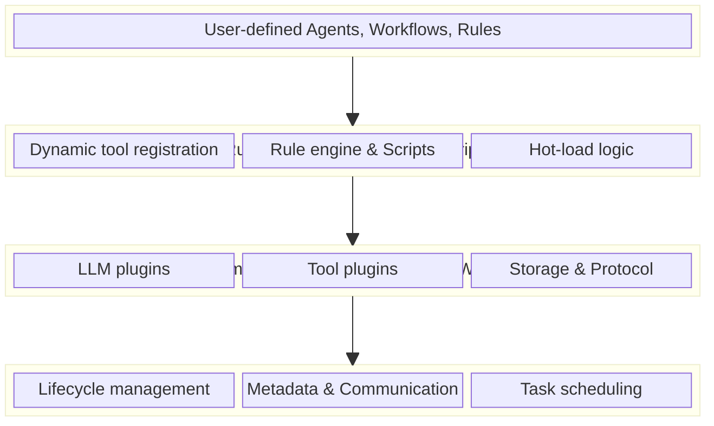

# MoFA Agent Framework

[English](README.md) | [简体中文](README_cn.md)

<p align="center">
    
</p>


<div align="center">
  <a href="https://crates.io/crates/mofa-sdk">
    
  </a>
  <a href="https://pypi.org/project/mofa-core/">
    
  </a>
  <a href="https://github.com/mofa-org/mofa/blob/main/LICENSE">
    
  </a>
  <a href="https://docs.rs/mofa-sdk">
    
  </a>
  <a href="https://github.com/mofa-org/mofa/stargazers">
    
  </a>
  <a href="https://discord.com/invite/hKJZzDMMm9">
    
  </a>
  <a href="https://docs.rs/mofa-sdk">
    
  </a>
</div>

<h2 align="center">
  <a href="https://mofa.ai/">Website</a>
  |
  <a href="https://mofa.ai/docs/0overview/">Quick Start</a>
  |
  <a href="https://github.com/mofa-org/mofa">GitHub</a>
  |
  <a href="https://hackathon.mofa.ai/">Hackathon</a>
  |
  <a href="https://discord.com/invite/hKJZzDMMm9">Community</a>
</h2>

<p align="center">
 
 
 
 
</p>

## 📋 Table of Contents

- [Overview](#overview)
- [Why MoFA?](#why-mofa)
- [Core Architecture](#core-architecture)
- [Core Features](#core-features)
- [Quick Start](#quick-start)
- [Roadmap](#roadmap)
- [Ecosystem & Related Repos](#-ecosystem--related-repos)
- [Documentation](#documentation)
- [Security](#security)
- [Contributing](#contributing)
- [Community](#community)
- [License](#license)

## Overview
MoFA (Modular Framework for Agents) is not just another entry in the crowded agent framework landscape.
It is the first production-grade framework to achieve **"write once, run everywhere"** across languages, built for **extreme performance, boundless extensibility, and runtime programmability**.
Through its revolutionary microkernel architecture and innovative **dual-layer plugin system** (compile-time + runtime), MoFA strikes the elusive balance between raw performance and dynamic flexibility.

What Sets MoFA Apart:</br>
✅ **Rust Core + UniFFI**: Blazing performance with native multi-language interoperability</br>
✅ **Dual-Layer Plugins**: Zero-cost compile-time extensions meet hot-swappable runtime scripts</br>
✅ **Microkernel Architecture**: Clean separation of concerns, effortless to extend</br>
✅ **Cloud-Native by Design**: First-class support for distributed and edge deployments</br>

## Why MoFA?

### **Performance**

- Zero-cost abstractions in Rust
- Memory safety without garbage collection
- Orders of magnitude faster than Python-based frameworks

### **Polyglot by Design**

- Auto-generated bindings for Python, Java, Go, Kotlin, Swift via UniFFI
- Call Rust core logic natively from any supported language
- Near-zero overhead compared to traditional FFI

### **Runtime Programmability**

- Embedded Rhai scripting engine
- Hot-reload business logic without recompilation
- Runtime configuration and rule adjustments
- User-defined extensions on the fly

### **Dual-Layer Plugin Architecture**

- **Compile-time plugins**: Extreme performance, native integration
- **Runtime plugins**: Dynamic loading, instant effect
- Support plugin hot loading and version management

### **Distributed by Nature**

- Built on Dora-rs for distributed dataflow
- Seamless cross-process, cross-machine agent communication
- Edge computing ready

### **Actor-Model Concurrency**

- Isolated agent processes via Ractor
- Message-passing architecture
- Battle-tested for high-concurrency workloads

## Core Architecture

### Microkernel + Dual-Layer Plugin System

MoFA adopts a **layered microkernel architecture**, achieving extreme extensibility through a **dual-layer plugin system**:



#### Advantages of Dual-Layer Plugin System

**Compile-time Plugins (Rust/WASM)**

- Extreme performance, zero runtime overhead
- Type safety, compile-time error checking
- Support complex system calls and native integration
- WASM sandbox provides secure isolation

**Runtime Plugins (Rhai Scripts)**

- No recompilation needed, instant effect
- Business logic hot updates
- User-defined extensions
- Secure sandbox execution with configurable resource limits

**Combined Power**

- Use Rust plugins for performance-critical paths (e.g., LLM inference, data processing)
- Use Rhai scripts for business logic (e.g., rule engines, workflow orchestration)
- Seamless interoperability between both, covering 99% of extension scenarios

## Core Features

### 1. Microkernel Architecture
MoFA adopts a **layered microkernel architecture** with `mofa-kernel` at its core. All other features (including plugin system, LLM capabilities, multi-agent collaboration, etc.) are built as modular components on top of the microkernel.

#### Core Design Principles
- **Core Simplicity**: The microkernel contains only the most basic functions: agent lifecycle management, metadata system, and dynamic management
- **High Extensibility**: All advanced features are extended through modular components and plugins, keeping the kernel stable
- **Loose Coupling**: Components communicate through standardized interfaces, easy to replace and upgrade

#### Integration with Plugin System
- The plugin system is developed based on the `Plugin` interface of the microkernel. All plugins (including LLM plugins, tool plugins, etc.) are integrated through the `AgentPlugin` standard interface
- The microkernel provides plugin registration center and lifecycle management, supporting plugin hot loading and version control
- LLM capabilities are implemented through `LLMPlugin`, encapsulating LLM providers as plugins compliant with microkernel specifications

#### Integration with LLM
- LLM exists as a plugin component of the microkernel, providing standard LLM access capabilities through the `LLMCapability` interface
- All agent collaboration patterns (chain, parallel, debate, etc.) are built on the microkernel's workflow engine and interact with LLMs through standardized LLM plugin interfaces
- Secretary mode is also implemented based on the microkernel's A2A communication protocol and task scheduling system

### 2. Dual-Layer Plugins
- **Compile-time plugins**: Extreme performance, native integration
- **Runtime plugins**: Dynamic loading, instant effect
- Seamless collaboration between both, covering all scenarios

### 3. Agent Coordination
- **Priority Scheduling**: Task scheduling system based on priority levels
- **Communication Bus**: Built-in inter-agent communication bus
- **Workflow Engine**: Visual workflow builder and executor

### 4. LLM and AI Capabilities
- **LLM Abstraction Layer**: Standardized LLM integration interface
- **OpenAI Support**: Built-in OpenAI API integration
- **ReAct Pattern**: Agent framework based on reasoning and action
- **Multi-Agent Collaboration**: LLM-driven agent coordination, supporting multiple collaboration modes:
  - **Request-Response**: One-to-one deterministic tasks with synchronous replies
  - **Publish-Subscribe**: One-to-many broadcast tasks with multiple receivers
  - **Consensus**: Multi-round negotiation and voting for decision-making
  - **Debate**: Agents alternate speaking to iteratively refine results
  - **Parallel**: Simultaneous execution with automatic result aggregation
  - **Sequential**: Pipeline execution where output flows to the next agent
  - **Custom**: User-defined modes interpreted by the LLM
- **Secretary Mode**: Provides end-to-end task closed-loop management, including 5 core phases: receive ideas → record todos, clarify requirements → convert to project documents, schedule dispatch → call execution agents, monitor feedback → push key decisions to humans, acceptance report → update todos
  </br>**Features**:
    - 🧠 Autonomous task planning and decomposition
    - 🔄 Intelligent agent scheduling and orchestration
    - 👤 Human intervention at key nodes
    - 📊 Full process observability and traceability
    - 🔁 Closed-loop feedback and continuous optimization

### 5. Persistence Layer
- **Multiple Backends**: Support PostgreSQL, MySQL, and SQLite
- **Session Management**: Persistent agent session storage
- **Memory System**: Stateful agent memory management

### 6. Monitoring & Observability
- **Dashboard**: Built-in web dashboard with real-time metrics
- **Metrics System**: Prometheus-compatible metrics system
- **Tracing Framework**: Distributed tracing system

### 7. Rhai Script Engine

MoFA integrates the [Rhai](https://github.com/rhaiscript/rhai) embedded scripting language, providing **runtime programmability** without recompilation.

#### Script Engine Core
- **Safe Sandbox Execution**: Configurable operation limits, call stack depth, loop control
- **Script Compilation Cache**: Pre-compile scripts for improved repeated execution performance
- **Rich Built-in Functions**: String manipulation, math functions, JSON processing, time utilities
- **Bidirectional JSON Conversion**: Seamless conversion between JSON and Rhai Dynamic types

#### Scripted Workflow Nodes
- **Script Task Nodes**: Execute business logic via scripts
- **Script Condition Nodes**: Dynamic branch decisions
- **Script Transform Nodes**: Data format transformation
- **YAML/JSON Workflow Loading**: Define workflows through configuration files

#### Dynamic Tool System
- **Script-based Tool Definition**: Register tools at runtime
- **Parameter Validation**: Type checking, range validation, enum constraints
- **Auto JSON Schema Generation**: Compatible with LLM Function Calling
- **Hot Loading**: Dynamically load tools from directories

#### Rule Engine
- **Priority Rules**: Critical > High > Normal > Low
- **Multiple Match Modes**: First match, all match, ordered match
- **Composite Actions**: Set variables, trigger events, goto rules
- **Rule Group Management**: Support default fallback actions

#### Typical Application Scenarios
| Scenario | Description |
|----------|-------------|
| **Dynamic Business Rules** | Discount strategies, content moderation rules, no redeployment needed |
| **Configurable Workflows** | User-defined data processing pipelines |
| **LLM Tool Extensions** | Register new tools at runtime for LLM calls |
| **A/B Testing** | Control experiment logic through scripts |
| **Expression Evaluation** | Dynamic condition checking, formula calculation |

## Roadmap

### Short-term Goals
- [ ] Dora-rs runtime support for distributed dataflow
- [ ] Complete distributed tracing implementation
- [ ] Python binding generation
- [ ] More LLM provider integrations

### Long-term Goals
- [ ] Visual workflow designer UI
- [ ] Cloud-native deployment support
- [ ] Advanced agent coordination algorithms
- [ ] Agent platform
- [ ] Cross-process/cross-machine distributed agent collaboration
- [ ] Multi-agent collaboration standard protocol
- [ ] Cross-platform mobile support
- [ ] Evolve into agent operating system

## Quick Start

### Installation

Add MoFA to your Cargo.toml:

```toml
[dependencies]
mofa-sdk = "0.1.0"
```

See [Quick Start](/docs/QuickStart.md) for the full guide!

The runtime mode is most suitable for scenarios that require building complete agent workflows, specifically including:

  ---
1. Multi-agent collaboration scenarios

The runtime provides a message bus (SimpleMessageBus/DoraChannel) and agent registration system, supporting communication between agents:
- Point-to-point communication (send_to_agent)
- Broadcast messages (broadcast)
- Topic pub/sub (publish_to_topic/subscribe_topic)
- Role management (get_agents_by_role)

When you need multiple agents to collaborate on complex tasks (such as master-slave architecture, division of labor), the runtime's communication mechanism can significantly simplify development.

  ---
2. Event-driven agent applications

The runtime has a built-in event loop (run_with_receiver/run_event_loop) and interrupt handling system, automatically managing:
- Event reception and dispatch
- Agent state lifecycle
- Timeout and interrupt handling

Suitable for building applications that need to respond to external events or timers (such as real-time dialogue systems, event response robots).

  ---
3. Distributed agent systems

When the dora feature is enabled, the runtime provides Dora adapters (DoraAgentNode/DoraDataflow), supporting:
- Distributed node deployment
- Cross-node agent communication
- Data flow management

Suitable for production scenarios requiring large-scale deployment and low-latency communication.

  ---
4. Structured agent building

The runtime provides AgentBuilder fluent API, simplifying agent:
- Configuration management
- Plugin integration
- Capability declaration
- Port configuration

Suitable for scenarios where you need to quickly build standardized agents, especially when you need to uniformly manage multiple agent configurations.

  ---
5. Production-grade applications

The runtime provides comprehensive:
- Health checks and state management
- Logging and monitoring integration
- Error handling mechanisms

Suitable for building production applications that need stable operation, rather than simple plugin testing or prototype development.

## CLI Production Smoke Example

To verify CLI production readiness from a user perspective, MoFA includes a
black-box smoke example:

- Path: `examples/cli_production_smoke`
- Runner: invokes the built `mofa` binary in isolated `XDG_*` directories
- Validation: exit codes + stable output tokens (no brittle full snapshots)

Coverage in this smoke run:

- Top-level commands: `info`, `config path`, `config list`
- Agent commands: `start`, `status`, `list`, `restart`, `stop`
- Session commands: `list`, `show`, `export`, `delete`
- Plugin commands: `list`, `info`, `uninstall`
- Tool commands: `list`, `info`

Run it:

```bash
# repo root
cargo build -p mofa-cli

# examples workspace
cd examples
cargo run -p cli_production_smoke
cargo test -p cli_production_smoke
```

Optional binary override:

```bash
export MOFA_BIN=/absolute/path/to/mofa
```

Limitations:

- This smoke flow is manually run (not CI-gated in this PR).
- Assertions focus on behavior and persistence effects, not exact formatting.

## Documentation

- [API Documentation](https://docs.rs/mofa-sdk)
- [Security Guide](docs/security.md) - Comprehensive security documentation
- [GitHub Repository](https://github.com/mofa-org/mofa)
- [Examples](examples/)

## Security

MoFA is designed with security-first principles. Key security features include:

- **WASM Sandboxing**: Strong isolation for compile-time plugins
- **Rhai Script Limits**: Configurable resource limits for runtime scripts (memory, CPU, operations)
- **Type Safety**: Rust's memory safety and type system prevent entire classes of vulnerabilities
- **Credential Management**: Environment variable support for secure credential handling
- **Plugin Verification**: Version tracking and integrity checks for plugins

For comprehensive security documentation, including:
- Credential management best practices
- Runtime scripting security configuration
- Plugin security guidelines
- Production deployment security checklist
- Threat model and attack surface analysis

Please see our [Security Guide](docs/security.md) and [Security Policy](SECURITY.md).

**Reporting Vulnerabilities**: If you discover a security vulnerability, please report it privately through our [Security Policy](SECURITY.md).

## Contributing

We welcome contributions! Please check out our [contributing guide](CONTRIBUTING.md) for more details.

We ❤️ first-time contributors! Check out our [`good-first-issue`](https://github.com/mofa-org/mofa/issues?q=is%3Aissue+is%3Aopen+label%3A%22good+first+issue%22) labels to get started.

## 🌐 Ecosystem & Related Repos

| Repository | Description | Status |
|---|---|---|
| [mofa-studio](https://github.com/mofa-org/mofa-studio) | GPU-accelerated desktop voice-chat & model management app (Makepad) | 🚧 Prototype |
| [GSoC](https://github.com/mofa-org/GSoC) | Google Summer of Code 2026 ideas & proposal guide | ✅ Active |
| [mofa-input](https://github.com/mofa-org/mofa-input) | High-performance local AI voice input | ✅ Active |
| [mofa-local-llm](https://github.com/mofa-org/mofa-local-llm) | Local LLM inference prototype for edge | 🚧 Experimental |
| [makepad-chart](https://github.com/mofa-org/makepad-chart) | GPU-accelerated chart widgets for Makepad | ✅ Active |
| [makepad-flow](https://github.com/mofa-org/makepad-flow) | Flow chart widget for visual workflow editing | ✅ Active |
| [makepad-d3](https://github.com/mofa-org/makepad-d3) | D3-style data visualization for Makepad | ✅ Active |
| [dora](https://github.com/mofa-org/dora) | Distributed dataflow middleware (fork of dora-rs) | ✅ Active |

## 🎓 GSoC 2026

MoFA is participating in **Google Summer of Code 2026** as a first-time organization! We have **6 exciting project ideas** covering plugin systems, observability dashboards, edge orchestrators, time-travel debuggers, and more.

👉 **[Check out our GSoC Ideas List](https://github.com/mofa-org/GSoC/blob/main/ideas-list.md)**

## Community

- GitHub Discussions: [https://github.com/mofa-org/mofa/discussions](https://github.com/mofa-org/mofa/discussions)
- Discord: [https://discord.com/invite/hKJZzDMMm9](https://discord.com/invite/hKJZzDMMm9)

## Star History

[](https://www.star-history.com/#mofa-org/mofa&Date)

## 🙏 Acknowledgments

MoFA stands on the shoulders of giants:

- [Rust](https://www.rust-lang.org/) - Perfect combination of performance and safety
- [UniFFI](https://mozilla.github.io/uniffi-rs/) - Mozilla's multi-language binding magic
- [Rhai](https://rhai.rs/) - Powerful embedded scripting engine
- [Tokio](https://tokio.rs/) - Async runtime cornerstone
- [Ractor](https://github.com/slawlor/ractor) - Actor model concurrency framework
- [Dora](https://github.com/dora-rs/dora) - Distributed dataflow runtime
- [Wasmtime](https://wasmtime.dev/) - WebAssembly runtime

## Support

源起之道支持｜Supported by Upstream Labs

## License

[Apache License 2.0](./LICENSE)
