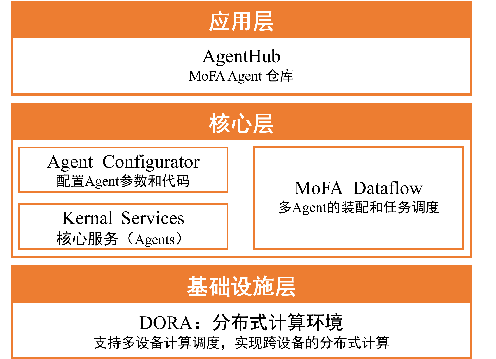
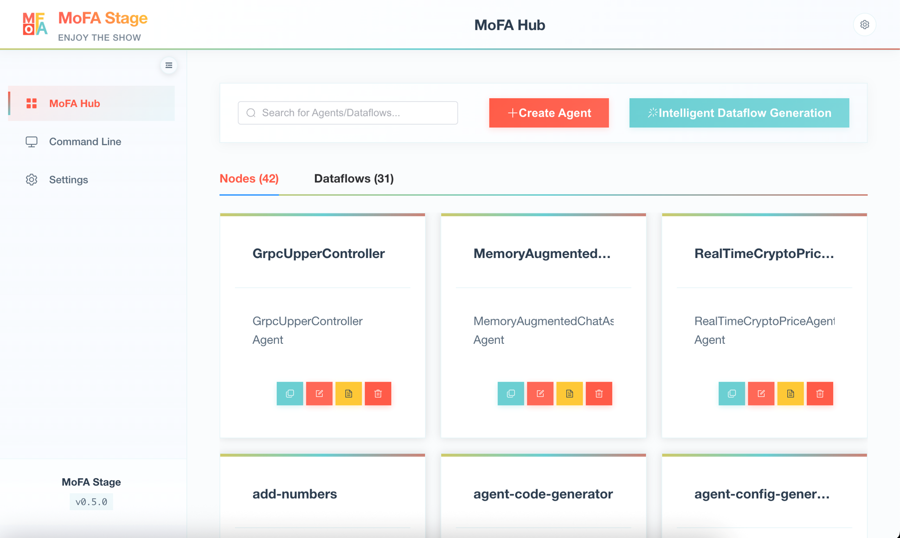
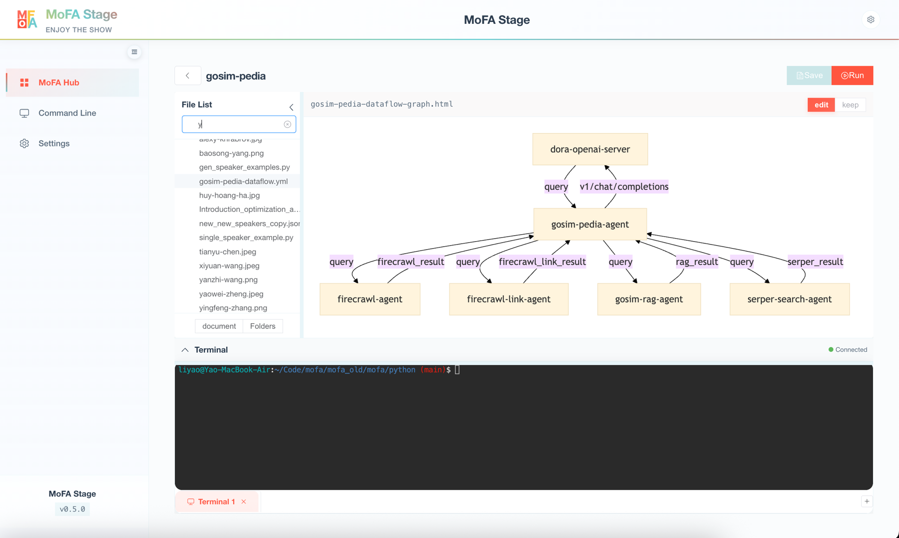

# MoFA Development Framework

[English](README_en.md) | [简体中文](README.md)

<p align="center">
    
</p>

<div align="center">
  <a href="https://pypi.org/project/mofa-core/">
    
  </a>
  <a href="https://github.com/mofa-org/mofa/blob/main/LICENSE">
    
  </a>
  <a href="https://github.com/mofa-org/mofa/stargazers">
    
  </a>
</div>

<h2 align="center">
  <a href="https://mofa.ai/">Official Site</a>
  |
  <a href="https://mofa.ai/docs/0overview/">Quick Start</a>
  |
  <a href="https://github.com/mofa-org/mofa">GitHub</a>
  |
  <a href="https://hackathon.mofa.ai/">Hackathon</a>
  |
  <a href="https://discord.com/invite/hKJZzDMMm9">Community</a>
</h2>

---

## 1. Design Philosophy

MoFA is a software framework for building composable AI agents. With MoFA, developers can create agents through templates and combine them in a stacking manner to form more powerful super agents.

### 1.1 Core Design Philosophy

- **Empowering Everyone to Do Extraordinary Things**: AI should not be exclusive to elites. MoFA enables everyone to develop and apply AI, turning the impossible into possible.
- **Composable AI**: Inspired by Unix philosophy, with "composition" as the core, build and connect agents and tools like building blocks, making AI simple, flexible, and powerful.
- **Everything is an Agent**: In the MoFA ecosystem, agents are the application carriers of the AI era—not only large language models, but also code, scripts, APIs, and even MoFA itself.
- **Data Flow Driven**: Abandoning complex workflows in favor of a more intuitive data flow pattern, enabling agents to be freely combined, decomposed, and reused.

### 1.2 Technical Architecture

<p align="center">
  
</p>

---

## 2. Core Features

- **Composable AI Architecture**: Quickly build complex agent systems through modular agent stacking and composition, supporting multi-model and multi-tool collaboration.
- **Data Flow Driven**: Adopts an intuitive DataFlow pattern to replace traditional Workflow, achieving flexible decoupling and dynamic recombination between agents.
- **Full-Stack Python Support**: Provides Python-friendly interfaces from agent development to data flow configuration, while supporting high-performance Rust node extensions.
- **Rich Node Ecosystem**: Built-in foundational nodes for terminal interaction, LLM calls, tool integration, etc., with support for quick integration of custom nodes.
- **Multi-Framework Compatibility**: Built on Dora-rs runtime, seamlessly integrating with systems like ROS2 and OpenTelemetry.
- **MoFA Stage Visualization Tool**: Provides a graphical interface supporting visual creation, management, and debugging of Dataflows and Nodes.

---

## 3. Support Matrix

| Feature | Support Level |
|---------|---------------|
| **API Support** | Python 3.10+ [Fully Supported] <br> Rust Extension [Experimental] |
| **Operating Systems** | Linux (Ubuntu 22.04) [Fully Supported] <br> macOS (ARM/x86) [Fully Supported] <br> WSL2 [Fully Supported] <br> Windows [Not Supported] |
| **Communication Methods** | Shared Memory (Local) [Fully Supported] <br> TCP Network (Distributed) [Experimental] |
| **Message Formats** | JSON [Fully Supported] <br> Apache Arrow [Experimental] |
| **LLM Integration** | OpenAI Series [Fully Supported] <br> Qwen Series [Fully Supported] <br> Local Models (llama.cpp) [Experimental] |
| **Configuration Methods** | YAML Dataflow Definition [Fully Supported] <br> Python Code Generation [Experimental] <br> MoFA Stage Graphical Configuration [Fully Supported] |
| **Package Management** | pip (Python Nodes) [Fully Supported] <br> cargo (Rust Nodes) [Experimental] |

> Legend:
> - [Fully Supported] = Stable and production-ready
> - [Experimental] = Experimental support (contributions welcome)
> - [Not Supported] = Not yet supported

---

## 4. Quick Start

### 4.1 Environment Requirements

**Required Environment**:
- Python 3.10 or 3.11
- Operating System: WSL (Ubuntu 22.04), macOS, Linux
- Windows is not currently supported

**Optional Environment** (for Rust node development):
- Rust toolchain (rustc, cargo)

### 4.2 Installing MoFA

#### Option 1: Install with pip

```bash
# Create a virtual environment (recommended)
python3 -m venv .mofa
source .mofa/bin/activate

# Install from PyPI
pip install mofa-core

# Verify installation
mofa --help
```

#### Option 2: Install with uv (faster)

```bash
# Install in a virtual environment
uv venv .mofa
source .mofa/bin/activate
uv pip install mofa-core

# Or install globally as a standalone tool
uv tool install mofa-core

# Verify installation
mofa --help
```

> **Tip**: uv is a faster Python package manager. Installation instructions: [github.com/astral-sh/uv](https://github.com/astral-sh/uv)

#### Option 3: Install from source

```bash
pip install git+https://github.com/mofa-org/mofa.git
```

### 4.3 Run the Hello World Example

```bash
# Clone the repository
git clone https://github.com/mofa-org/mofa.git
cd mofa/dataflows/hello_world

# Run the dataflow
mofa run-flow hello_world_dataflow.yml
```

**Example Output**:
```
Send Your Task: 你好
-------------hello_world_result---------------
你好
```

### 4.4 Optional: Install Rust Environment

If you need to develop or use Rust nodes:

```bash
# Install Rust toolchain
curl --proto '=https' --tlsv1.2 -sSf https://sh.rustup.rs | sh
# Keep the default configuration during installation (press Enter)

# Verify installation
rustc --version
cargo --version
```

---

## 5. MoFA Stage Visualization Tool

MoFA Stage is the graphical control center of the MoFA ecosystem, supporting quick creation, management, and debugging of Dataflows and Nodes in a visual interface.

### 5.1 Core Functionality

- **Node/Dataflow Template Library**: Provides rich agent templates for one-click node project generation
- **Visual Dataflow Creation**: Define data flows through drag-and-drop interface, intuitively configure message passing relationships between nodes
- **Node Management**: Unified management of custom and official nodes, supporting quick integration of new features
- **Agent Lifecycle Management**: Start, stop, and monitor agent runtime status in the graphical interface

### 5.2 Interface Preview

<p align="center">
  
  <br/>
  <i>Node Hub Interface</i>
</p>

<p align="center">
  
  <br/>
  <i>Dataflow Interface</i>
</p>

---

## 6. Development Guide

### 6.1 Quick Development Guide

Refer to the [6-Minute Development Guide](https://mofa.ai/docs/2-getting-started/your-first-application/) to quickly build agents based on large language models, including the full process of environment variable configuration, project initialization, logic implementation, and data flow definition.

### 6.2 Examples and Documentation

| Type | Name | Description | Last Updated |
|------|------|-------------|--------------|
| Tutorial | [Hello World](https://github.com/mofa-org/mofa/tree/main/dataflows/hello_world) | Basic dataflow interaction example |  |
| LLM | [Qwen Agent](https://github.com/nanana2002/mofa-node-hub/tree/main/node-hub/QwenAgent) | Conversational agent using Qwen API |  |
| Tool Integration | [Weather Query](https://github.com/nanana2002/mofa-node-hub/tree/main/node-hub/WeatherForecastNode) | Agent for querying weather by IP location |  |

For more documentation, please refer to [MoFA Official Documentation](https://docs.mofa-org.com).

---

## 7. Frequently Asked Questions

### 7.1 Command 'mofa' not found

**Problem Description**: After installing mofa-core, running the `mofa` command shows "command not found".

```bash
$ mofa --help
Command 'mofa' not found
```

**Root Cause**: When using `pip install --user` or system Python for user-level installation, the executable is installed to the `~/.local/bin` directory, which may not be in the system's PATH environment variable.

**Solutions**:

#### Solution 1: Add ~/.local/bin to PATH (Recommended)

For Bash users:
```bash
echo 'export PATH="$HOME/.local/bin:$PATH"' >> ~/.bashrc
source ~/.bashrc
```

For Zsh users:
```bash
echo 'export PATH="$HOME/.local/bin:$PATH"' >> ~/.zshrc
source ~/.zshrc
```

#### Solution 2: Run with full path

```bash
~/.local/bin/mofa --help
```

#### Solution 3: Install in a virtual environment (Recommended)

Using venv:
```bash
python3 -m venv .mofa
source .mofa/bin/activate
pip install mofa-core
mofa --help
```

Using uv (faster):
```bash
uv venv .mofa
source .mofa/bin/activate
uv pip install mofa-core
mofa --help
```

#### Verify PATH Configuration

```bash
# Check if ~/.local/bin is in PATH
echo $PATH | grep ".local/bin"

# Confirm mofa installation location
which mofa
```

### 7.2 Slow Dependency Installation

**Problem Description**: `pip install mofa-core` downloads very slowly or times out.

**Solutions**:

Use domestic mirror sources to speed up installation:
```bash
# Use Tsinghua mirror
pip install -i https://pypi.tuna.tsinghua.edu.cn/simple mofa-core

# Or use Alibaba Cloud mirror
pip install -i https://mirrors.aliyun.com/pypi/simple/ mofa-core
```

Configure mirror source permanently:
```bash
pip config set global.index-url https://pypi.tuna.tsinghua.edu.cn/simple
```

---

## 8. Contribution Guidelines

We welcome all developers to contribute, regardless of your experience level. Please refer to the [Contribution Guide](https://github.com/mofa-org/mofa/tree/main/documents) to learn how to participate in project development.

---

## 9. Community

- [GitHub Discussions](https://github.com/mofa-org/mofa/discussions)
- [Discord Server](https://discord.com/invite/hKJZzDMMm9)

---

## 10. License

This project is licensed under the Apache-2.0 License. See [LICENSE](LICENSE) for details.

---

## 11. Related Resources

- [Dora-rs Documentation](https://dora-rs.ai/docs/guides/)

---

## 12. Star History

[](https://www.star-history.com/#mofa-org/mofa&Date)
