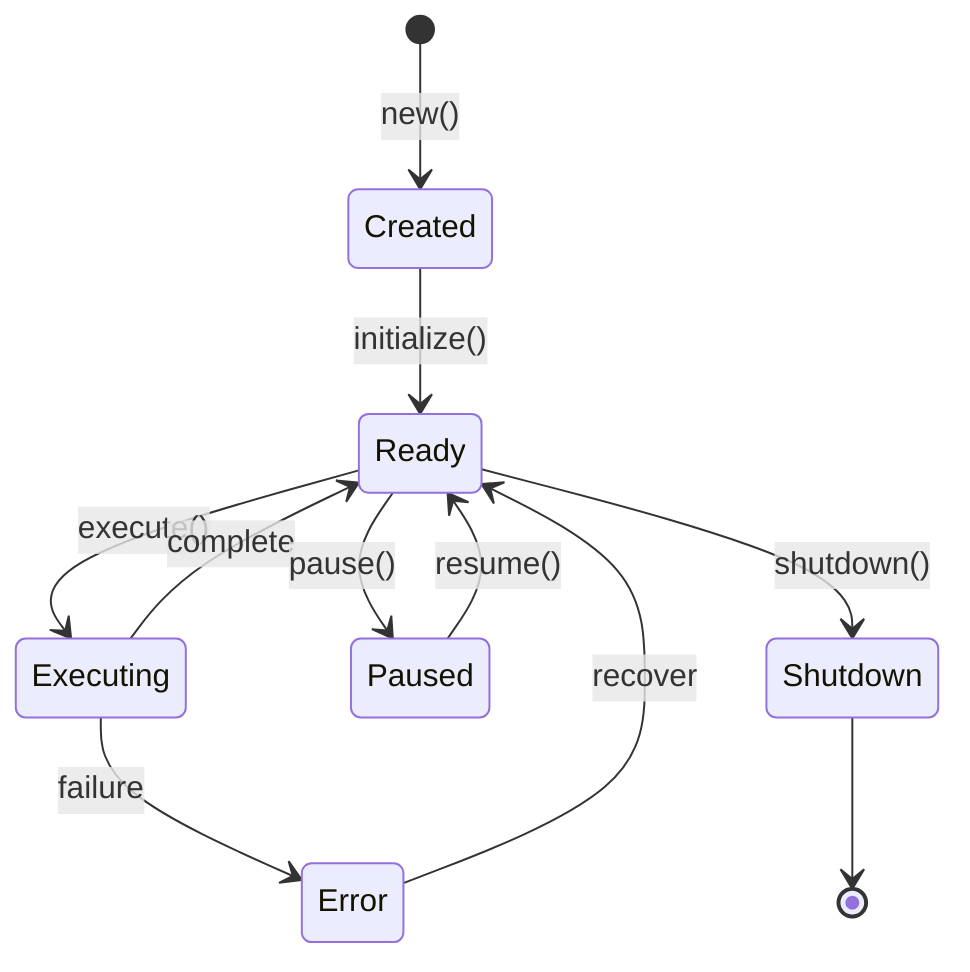

# Agents

Agents are the core building blocks of MoFA applications. This page explains how agents work and how to build them.

## The MoFAAgent Trait

Every agent implements the `MoFAAgent` trait, which defines the fundamental agent interface:

```rust
#[async_trait]
pub trait MoFAAgent: Send + Sync {
    // Identity
    fn id(&self) -> &str;
    fn name(&self) -> &str;
    fn capabilities(&self) -> &AgentCapabilities;
    fn state(&self) -> AgentState;

    // Lifecycle
    async fn initialize(&mut self, ctx: &AgentContext) -> AgentResult<()>;
    async fn execute(&mut self, input: AgentInput, ctx: &AgentContext) -> AgentResult<AgentOutput>;
    async fn shutdown(&mut self) -> AgentResult<()>;

    // Optional lifecycle hooks
    async fn pause(&mut self) -> AgentResult<()> { Ok(()) }
    async fn resume(&mut self) -> AgentResult<()> { Ok(()) }
}
```

## Agent Lifecycle



### States

| State | Description |
|-------|-------------|
| `Created` | Agent has been constructed but not initialized |
| `Ready` | Agent is ready to process tasks |
| `Executing` | Agent is currently processing a task |
| `Paused` | Agent is temporarily suspended |
| `Error` | Agent encountered an error |
| `Shutdown` | Agent has been shut down |

### Lifecycle Methods

#### initialize

Called once when the agent starts. Use this to:
- Set up connections (database, API clients)
- Load configuration
- Warm up caches

```rust
async fn initialize(&mut self, _ctx: &AgentContext) -> AgentResult<()> {
    // Connect to database
    self.db.connect().await?;
    // Load prompts
    self.load_prompts().await?;
    self.state = AgentState::Ready;
    Ok(())
}
```

#### execute

Called for each task. This is where your agent's main logic lives.

```rust
async fn execute(&mut self, input: AgentInput, ctx: &AgentContext) -> AgentResult<AgentOutput> {
    self.state = AgentState::Executing;

    // Your agent logic here
    let result = self.process(input).await?;

    self.state = AgentState::Ready;
    Ok(result)
}
```

#### shutdown

Called when the agent stops. Use this to:
- Close connections
- Flush buffers
- Release resources

```rust
async fn shutdown(&mut self) -> AgentResult<()> {
    self.db.close().await?;
    self.state = AgentState::Shutdown;
    Ok(())
}
```

## Agent Capabilities

Capabilities describe what an agent can do:

```rust
let capabilities = AgentCapabilities::builder()
    .tag("llm")           // Tags for routing
    .tag("qa")
    .input_type(InputType::Text)     // Accepts text input
    .output_type(OutputType::Text)   // Produces text output
    .max_concurrency(10)             // Can handle 10 concurrent tasks
    .supports_streaming(true)        // Supports streaming output
    .build();
```

### Capability Fields

| Field | Type | Description |
|-------|------|-------------|
| `tags` | `Vec<String>` | Tags for agent discovery and routing |
| `input_type` | `InputType` | Expected input format |
| `output_type` | `OutputType` | Output format produced |
| `max_concurrency` | `usize` | Maximum concurrent executions |
| `supports_streaming` | `bool` | Whether streaming is supported |

## Input and Output

### AgentInput

Wraps the input data with metadata:

```rust
// Text input
let input = AgentInput::text("What is Rust?");

// Structured input
let input = AgentInput::json(json!({
    "query": "search term",
    "limit": 10
}));

// With metadata
let input = AgentInput::text("Hello")
    .with_session_id("session-123")
    .with_metadata("source", "web");
```

### AgentOutput

Wraps the output data with metadata:

```rust
// Text output
let output = AgentOutput::text("Hello, world!");

// Structured output
let output = AgentOutput::json(json!({
    "answer": "42",
    "confidence": 0.95
}));

// With metadata
let output = AgentOutput::text("Response")
    .with_tokens_used(150)
    .with_latency_ms(250);
```

## Agent Context

The `AgentContext` provides execution context:

```rust
async fn execute(&mut self, input: AgentInput, ctx: &AgentContext) -> AgentResult<AgentOutput> {
    // Get execution ID
    let exec_id = ctx.execution_id();

    // Get session ID (if any)
    let session = ctx.session_id();

    // Store data for later
    ctx.set("last_query", input.to_text()).await;

    // Retrieve stored data
    let previous: Option<String> = ctx.get("last_query").await;

    // Access agent metadata
    let metadata = ctx.metadata();

    Ok(AgentOutput::text("Done"))
}
```

## Built-in Agent Types

### LLMAgent

An agent powered by an LLM:

```rust
use mofa_sdk::llm::{LLMAgentBuilder, openai_from_env};

let agent = LLMAgentBuilder::from_env()?
    .with_id("assistant")
    .with_name("AI Assistant")
    .with_system_prompt("You are a helpful assistant.")
    .with_sliding_window(10)  // Remember last 10 messages
    .build_async()
    .await;
```

### ReActAgent

Reasoning + Acting agent with tools:

```rust
use mofa_sdk::react::ReActAgent;

let agent = ReActAgent::builder()
    .with_llm(client)
    .with_tools(vec![
        Arc::new(CalculatorTool),
        Arc::new(WeatherTool),
    ])
    .with_max_iterations(5)
    .build();
```

### SecretaryAgent

Human-in-the-loop workflow management:

```rust
use mofa_sdk::secretary::SecretaryAgent;

let agent = SecretaryAgent::builder()
    .with_llm(client)
    .with_human_feedback(true)
    .with_delegation_targets(vec!["researcher", "writer"])
    .build();
```

## Using AgentRunner

For production use, wrap your agent with `AgentRunner`:

```rust
use mofa_sdk::runtime::AgentRunner;

#[tokio::main]
async fn main() -> Result<(), Box<dyn std::error::Error>> {
    let agent = MyAgent::new();
    let mut runner = AgentRunner::new(agent).await?;

    // Execute multiple tasks
    for task in tasks {
        let output = runner.execute(AgentInput::text(task)).await?;
        println!("{}", output.as_text().unwrap());
    }

    runner.shutdown().await?;
    Ok(())
}
```

### With Context

```rust
let ctx = AgentContext::with_session("exec-001", "session-123");
ctx.set("user_id", "user-456").await;

let mut runner = AgentRunner::with_context(agent, ctx).await?;
```

## Error Handling

```rust
async fn execute(&mut self, input: AgentInput, ctx: &AgentContext) -> AgentResult<AgentOutput> {
    // Different error types
    let result = self.llm.ask(&input.to_text()).await
        .map_err(|e| AgentError::ExecutionFailed(e.to_string()))?;

    if result.is_empty() {
        return Err(AgentError::NoOutput);
    }

    if self.rate_limited() {
        return Err(AgentError::RateLimited { retry_after: 60 });
    }

    Ok(AgentOutput::text(result))
}
```

### Error Types

| Error | Description |
|-------|-------------|
| `ExecutionFailed` | General execution error |
| `NoOutput` | Agent produced no output |
| `RateLimited` | Rate limit exceeded |
| `Timeout` | Execution timed out |
| `InvalidInput` | Input validation failed |
| `ResourceExhausted` | Resources unavailable |

## See Also

- [Tools](tools.md) — Adding function calling capabilities
- [Workflows](workflows.md) — Orchestrating multiple agents
- [API Reference: Agent](../api-reference/kernel/agent.md) — Detailed API docs
