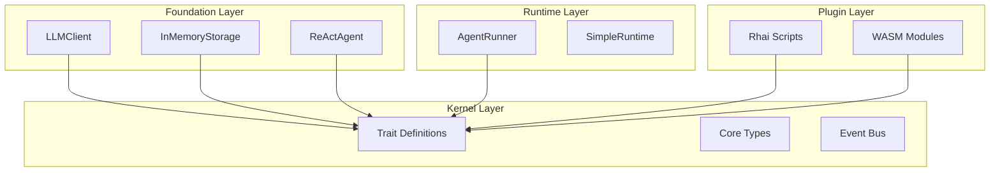

# Microkernel Design

MoFA's microkernel architecture provides a minimal core with maximum extensibility. This page explains the design principles and how they apply to MoFA.

## What is a Microkernel?

A microkernel is a minimal software layer that provides only the most essential services. All other functionality is provided by external components (plugins, services) that communicate through well-defined interfaces.

### Benefits

- **Minimal Core**: Smaller attack surface, easier to verify
- **Flexibility**: Components can be added, removed, or replaced
- **Isolation**: Failures in plugins don't crash the core
- **Extensibility**: New features without modifying the core

## MoFA's Microkernel: mofa-kernel

The `mofa-kernel` crate is MoFA's microkernel. It provides:

### Core Traits

```rust
// The fundamental agent interface
pub trait MoFAAgent: Send + Sync {
    fn id(&self) -> &str;
    fn name(&self) -> &str;
    fn capabilities(&self) -> &AgentCapabilities;
    fn state(&self) -> AgentState;

    async fn initialize(&mut self, ctx: &AgentContext) -> AgentResult<()>;
    async fn execute(&mut self, input: AgentInput, ctx: &AgentContext) -> AgentResult<AgentOutput>;
    async fn shutdown(&mut self) -> AgentResult<()>;
}

// Tool interface for function calling
pub trait Tool: Send + Sync {
    fn name(&self) -> &str;
    fn description(&self) -> &str;
    fn parameters_schema(&self) -> Option<Value>;
    async fn execute(&self, params: Value) -> Result<Value, ToolError>;
}

// Memory interface for persistence
pub trait Memory: Send + Sync {
    async fn store(&mut self, key: &str, value: &str) -> Result<(), MemoryError>;
    async fn retrieve(&self, key: &str) -> Result<Option<String>, MemoryError>;
}
```

### Core Types

```rust
pub struct AgentContext { /* ... */ }
pub struct AgentInput { /* ... */ }
pub struct AgentOutput { /* ... */ }
pub struct AgentState { /* ... */ }
pub struct AgentCapabilities { /* ... */ }
pub struct AgentError { /* ... */ }
```

### Core Infrastructure

- **Event Bus**: Message passing between components
- **Plugin Interface**: How plugins connect to the kernel
- **Lifecycle Management**: State transitions and hooks

## Architecture Layers



## Key Design Principles

### 1. Separation of Definition and Implementation

**Kernel defines**: `Tool` trait
**Foundation implements**: `SimpleToolRegistry`, `EchoTool`

```rust
// kernel: Just the interface
pub trait ToolRegistry: Send + Sync {
    fn register(&mut self, tool: Arc<dyn Tool>) -> AgentResult<()>;
    fn get(&self, name: &str) -> Option<Arc<dyn Tool>>;
}

// foundation: Concrete implementation
pub struct SimpleToolRegistry {
    tools: HashMap<String, Arc<dyn Tool>>,
}

impl ToolRegistry for SimpleToolRegistry {
    fn register(&mut self, tool: Arc<dyn Tool>) -> AgentResult<()> {
        self.tools.insert(tool.name().to_string(), tool);
        Ok(())
    }
    // ...
}
```

### 2. Dependency Inversion

High-level modules don't depend on low-level modules. Both depend on abstractions.

```rust
// Foundation depends on kernel abstraction, not concrete implementation
pub struct LLMAgent {
    client: Arc<dyn LLMProvider>,  // Abstraction
    // NOT: client: OpenAIProvider  // Concrete
}
```

### 3. Single Responsibility

Each crate has one clear purpose:

| Crate | Single Responsibility |
|-------|----------------------|
| `mofa-kernel` | Define core interfaces |
| `mofa-foundation` | Implement business logic |
| `mofa-runtime` | Manage agent lifecycle |
| `mofa-plugins` | Plugin infrastructure |

### 4. Interface Segregation

Traits are small and focused:

```rust
// NOT: One giant trait
pub trait Agent {
    fn execute(&self, input: AgentInput) -> AgentOutput;
    fn store_memory(&self, key: &str, value: &str);
    fn send_message(&self, msg: Message);
    fn load_plugin(&self, plugin: Plugin);
}

// INSTEAD: Focused traits
pub trait MoFAAgent { /* ... */ }
pub trait AgentMessaging { /* ... */ }
pub trait AgentPluginSupport { /* ... */ }
```

## Plugin System

The microkernel architecture enables MoFA's dual-layer plugin system:

### Compile-Time Plugins (Rust/WASM)

- Zero-cost abstraction
- Performance-critical paths
- Type-safe interfaces

```rust
pub struct MyToolPlugin;

impl Tool for MyToolPlugin {
    fn name(&self) -> &str { "my_tool" }
    async fn execute(&self, params: Value) -> Result<Value, ToolError> {
        // High-performance implementation
    }
}
```

### Runtime Plugins (Rhai)

- Hot-reloadable
- Business logic extension
- Dynamic configuration

```rhai
// scripts/my_plugin.rhai
fn process(input) {
    let result = call_llm(input);
    transform(result)
}
```

## Common Patterns

### Facade Pattern (SDK Layer)

The SDK acts as a facade, simplifying access to all layers:

```rust
// Users only need to import from SDK
use mofa_sdk::kernel::MoFAAgent;
use mofa_sdk::runtime::AgentRunner;
use mofa_sdk::llm::LLMClient;

// SDK re-exports from multiple crates
pub use mofa_kernel::agent::*;
pub use mofa_runtime::*;
pub use mofa_foundation::llm::*;
```

### Builder Pattern

Complex objects are constructed step-by-step:

```rust
let agent = LLMAgentBuilder::from_env()?
    .with_id("my-agent")
    .with_name("My Agent")
    .with_system_prompt("You are helpful.")
    .with_sliding_window(10)
    .build_async()
    .await;
```

### Strategy Pattern

Different implementations of the same interface:

```rust
// Switch LLM providers without changing code
let provider: Arc<dyn LLMProvider> = match config.provider {
    "openai" => Arc::new(OpenAIProvider::from_env()?),
    "anthropic" => Arc::new(AnthropicProvider::from_env()?),
    "ollama" => Arc::new(OllamaProvider::new()?),
};
```

## Anti-Patterns to Avoid

### ❌ Re-defining Kernel Traits in Foundation

```rust
// WRONG: Duplicate trait definition
// foundation/src/agent.rs
pub trait Tool { /* ... */ }  // Already defined in kernel!
```

### ❌ Concrete Implementations in Kernel

```rust
// WRONG: Implementation in kernel
// kernel/src/storage.rs
pub struct InMemoryStorage { /* ... */ }  // Should be in foundation!
```

### ❌ Circular Dependencies

```rust
// WRONG: Kernel depending on foundation
// kernel/Cargo.toml
[dependencies]
mofa-foundation = { path = "../foundation" }  // Creates cycle!
```

## See Also

- [Architecture Overview](architecture.md) — Full architecture documentation
- [Agents](agents.md) — The MoFAAgent trait
- [Plugins](plugins.md) — Dual-layer plugin system
