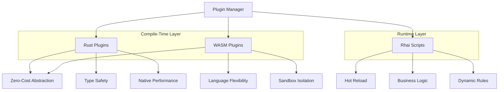
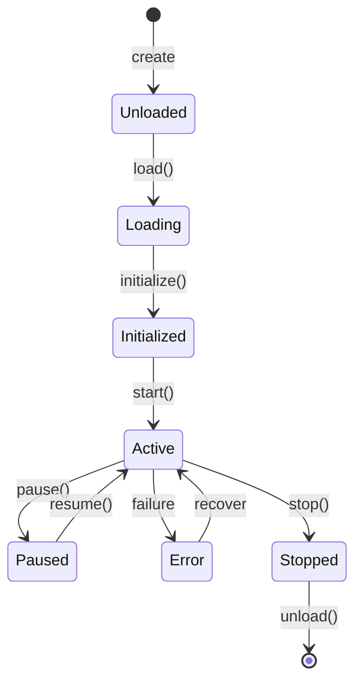

# Plugins

MoFA's dual-layer plugin system enables unlimited extensibility through both compile-time and runtime extensions.

## Dual-Layer Architecture



| Layer | Technology | Use Case |
|-------|------------|----------|
| **Compile-Time** | Rust / WASM | Performance-critical, type-safe |
| **Runtime** | Rhai Scripts | Business logic, hot-reloadable |

## Compile-Time Plugins

### Rust Plugins

Create plugins directly in Rust for maximum performance:

```rust
use mofa_sdk::kernel::plugin::{AgentPlugin, PluginContext, PluginResult};
use async_trait::async_trait;

pub struct LLMPlugin {
    name: String,
    version: String,
}

impl LLMPlugin {
    pub fn new() -> Self {
        Self {
            name: "llm-plugin".to_string(),
            version: "1.0.0".to_string(),
        }
    }
}

#[async_trait]
impl AgentPlugin for LLMPlugin {
    fn name(&self) -> &str {
        &self.name
    }

    fn version(&self) -> &str {
        &self.version
    }

    async fn initialize(&mut self, _ctx: &PluginContext) -> PluginResult<()> {
        // Initialize plugin resources
        Ok(())
    }

    async fn on_agent_execute(
        &self,
        input: &AgentInput,
        output: &mut AgentOutput,
    ) -> PluginResult<()> {
        // Modify or augment agent execution
        Ok(())
    }

    async fn shutdown(&mut self) -> PluginResult<()> {
        // Cleanup resources
        Ok(())
    }
}
```

### WASM Plugins

For language flexibility with sandboxing:

```rust
// In your WASM module (Rust)
use wasm_bindgen::prelude::*;

#[wasm_bindgen]
pub fn process_input(input: &str) -> String {
    // Process input and return result
    format!("Processed: {}", input)
}
```

Load WASM plugin:

```rust
use mofa_sdk::plugins::WasmPlugin;

let plugin = WasmPlugin::load("./plugins/my_plugin.wasm").await?;
plugin_manager.register(plugin).await?;
```

## Runtime Plugins (Rhai)

Rhai is a scripting language embedded in Rust, perfect for hot-reloadable business logic.

### Basic Rhai Script

```rhai
// plugins/content_filter.rhai

fn process(input) {
    let text = input.to_string();

    // Check for prohibited content
    let prohibited = ["spam", "inappropriate"];

    for word in prohibited {
        if text.contains(word) {
            return error("Prohibited content detected");
        }
    }

    // Transform content
    let result = text.to_upper_case();
    result
}

fn on_init() {
    print("Content filter plugin loaded!");
}
```

### Loading Rhai Plugins

```rust
use mofa_sdk::plugins::{RhaiPluginManager, RhaiPlugin};

let mut manager = RhaiPluginManager::new();

// Load plugin from file
let plugin = RhaiPlugin::from_file("./plugins/content_filter.rhai").await?;
manager.register(plugin).await?;

// Call plugin function
let result = manager.call("process", &input).await?;
```

### Hot Reloading

Rhai plugins can be hot-reloaded without restarting:

```rust
use mofa_sdk::plugins::HotReloadWatcher;

// Watch for file changes
let watcher = HotReloadWatcher::new("./plugins/")?;

watcher.on_change(|path| async move {
    println!("Reloading plugin: {:?}", path);
    manager.reload(path).await?;
    Ok(())
});
```

### Rhai Script API

Rhai scripts have access to:

```rhai
// JSON operations
let data = json::parse(input);
let value = data["key"];
let output = json::stringify(data);

// String operations
let upper = text.to_upper_case();
let parts = text.split(",");
let trimmed = text.trim();

// Collections
let list = [];
list.push(item);
let first = list[0];

// HTTP calls (when enabled)
let response = http::get("https://api.example.com/data");

// Logging
print("Debug message");
```

## Plugin Lifecycle



## Plugin Manager

The plugin manager handles plugin lifecycle:

```rust
use mofa_sdk::plugins::PluginManager;

let mut manager = PluginManager::new()?;

// Register plugins
manager.register(Arc::new(LLMPlugin::new())).await?;
manager.register(Arc::new(RhaiPlugin::from_file("./rules.rhai")?)).await?;

// Initialize all plugins
manager.initialize_all(&ctx).await?;

// Execute plugin hooks
manager.on_before_execute(&input).await?;
let output = agent.execute(input, &ctx).await?;
manager.on_after_execute(&output).await?;

// Shutdown
manager.shutdown_all().await?;
```

## Plugin Hooks

Plugins can hook into various points in the agent lifecycle:

| Hook | Description |
|------|-------------|
| `on_initialize` | Called when agent initializes |
| `on_before_execute` | Called before agent execution |
| `on_after_execute` | Called after agent execution |
| `on_error` | Called when an error occurs |
| `on_shutdown` | Called when agent shuts down |

```rust
#[async_trait]
impl AgentPlugin for MyPlugin {
    async fn on_before_execute(&self, input: &AgentInput) -> PluginResult<()> {
        // Validate or transform input
        Ok(())
    }

    async fn on_after_execute(&self, output: &mut AgentOutput) -> PluginResult<()> {
        // Modify or augment output
        Ok(())
    }
}
```

## Plugin Categories

### LLM Plugins

Extend LLM functionality:

```rust
pub struct PromptTemplatePlugin {
    templates: HashMap<String, String>,
}

impl PromptTemplatePlugin {
    pub fn render(&self, name: &str, vars: HashMap<&str, &str>) -> String {
        let template = self.templates.get(name).unwrap();
        // Replace variables in template
        // ...
    }
}
```

### Tool Plugins

Wrap external tools:

```rust
pub struct ToolPluginAdapter {
    tool: Arc<dyn Tool>,
}

impl AgentPlugin for ToolPluginAdapter {
    async fn on_before_execute(&self, input: &AgentInput) -> PluginResult<()> {
        // Check if tool should be invoked
        Ok(())
    }
}
```

### Persistence Plugins

Add persistence capabilities:

```rust
pub struct PersistencePlugin {
    store: Arc<dyn Storage>,
}

impl PersistencePlugin {
    pub async fn save_session(&self, session: &Session) -> Result<()> {
        self.store.save(session).await
    }
}
```

## Best Practices

1. **Separation of Concerns**: Each plugin should have one responsibility
2. **Error Handling**: Plugins should handle errors gracefully
3. **Documentation**: Document plugin interfaces and expected behavior
4. **Testing**: Write unit tests for plugins
5. **Versioning**: Use semantic versioning for plugins

## See Also

- [Rhai Scripting Guide](../api-reference/plugins/rhai.md) — Detailed Rhai documentation
- [WASM Plugins](../api-reference/plugins/wasm.md) — WASM plugin development
- [Examples: Plugins](../examples/plugins.md) — Plugin examples
