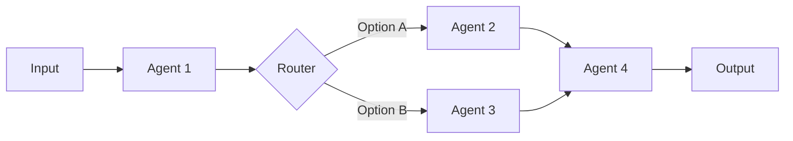

# Workflows

Workflows orchestrate multiple agents into complex, coordinated processes. MoFA provides powerful workflow abstractions for building sophisticated AI systems.

## Workflow Overview

A workflow is a directed graph where:
- **Nodes** are agents or operations
- **Edges** define the flow of data and control



## StateGraph

The `StateGraph` is MoFA's core workflow abstraction:

```rust
use mofa_sdk::workflow::{StateGraph, State, Transition};

// Create a workflow graph
let mut graph = StateGraph::new();

// Define states (nodes)
graph.add_state(State::new("start", start_handler));
graph.add_state(State::new("process", process_handler));
graph.add_state(State::new("end", end_handler));

// Define transitions (edges)
graph.add_transition("start", "process");
graph.add_transition("process", "end");

// Set entry point
graph.set_entry("start");
```

## Multi-Agent Coordination Patterns

MoFA supports 7 built-in coordination patterns:

### 1. Request-Response

One-to-one deterministic communication:

```rust
use mofa_sdk::coordination::RequestResponse;

let pattern = RequestResponse::new(agent_a, agent_b);

let response = pattern
    .send(AgentInput::text("What is AI?"))
    .await?;
```

### 2. Publish-Subscribe

One-to-many broadcast:

```rust
use mofa_sdk::coordination::PubSub;

let mut pubsub = PubSub::new();

// Subscribe agents
pubsub.subscribe("news", agent_a);
pubsub.subscribe("news", agent_b);
pubsub.subscribe("news", agent_c);

// Broadcast message
pubsub.publish("news", AgentInput::text("Breaking news!")).await?;
```

### 3. Consensus

Multi-round negotiation for decision making:

```rust
use mofa_sdk::coordination::Consensus;

let consensus = Consensus::new()
    .with_agents(vec![agent_a, agent_b, agent_c])
    .with_threshold(0.6)  // 60% agreement needed
    .with_max_rounds(5);

let decision = consensus.decide(&proposal).await?;
```

### 4. Debate

Alternating discussion for quality improvement:

```rust
use mofa_sdk::coordination::Debate;

let debate = Debate::new()
    .with_proposer(agent_a)
    .with_opponent(agent_b)
    .with_judge(agent_c)
    .with_rounds(3);

let result = debate.debide(&topic).await?;
```

### 5. Parallel

Simultaneous execution with result aggregation:

```rust
use mofa_sdk::coordination::Parallel;

let parallel = Parallel::new()
    .with_agents(vec![agent_a, agent_b, agent_c])
    .with_aggregation(Aggregation::TakeBest);

let results = parallel.execute(input).await?;
```

### 6. Sequential

Pipeline execution:

```rust
use mofa_sdk::coordination::Sequential;

let pipeline = Sequential::new()
    .add_step(agent_a)  // Research
    .add_step(agent_b)  // Analysis
    .add_step(agent_c); // Summary

let result = pipeline.execute(input).await?;
// Output of each step becomes input of next
```

### 7. Custom

User-defined patterns:

```rust
use mofa_sdk::coordination::CustomPattern;

struct MyCustomPattern {
    // Your custom logic
}

impl CoordinationPattern for MyCustomPattern {
    async fn execute(&self, input: AgentInput) -> AgentResult<AgentOutput> {
        // Your custom coordination logic
    }
}
```

## Building Workflows

### Example: Customer Support Workflow

```rust
use mofa_sdk::workflow::{StateGraph, State, WorkflowContext};

// Define state handlers
async fn triage(input: AgentInput, ctx: &mut WorkflowContext) -> Result<String, WorkflowError> {
    let intent = ctx.call_agent("classifier", input.clone()).await?;

    match intent.as_text().unwrap_or("") {
        "technical" => Ok("technical_support"),
        "billing" => Ok("billing_support"),
        _ => Ok("general_support"),
    }
}

async fn technical_support(input: AgentInput, ctx: &mut WorkflowContext) -> Result<String, WorkflowError> {
    let response = ctx.call_agent("tech_agent", input).await?;
    ctx.set("response", response);
    Ok("satisfaction_check")
}

async fn billing_support(input: AgentInput, ctx: &mut WorkflowContext) -> Result<String, WorkflowError> {
    let response = ctx.call_agent("billing_agent", input).await?;
    ctx.set("response", response);
    Ok("satisfaction_check")
}

async fn satisfaction_check(input: AgentInput, ctx: &mut WorkflowContext) -> Result<String, WorkflowError> {
    let response = ctx.get::<AgentOutput>("response").unwrap();
    println!("Response: {}", response.as_text().unwrap());
    Ok("end")
}

// Build the workflow
let mut workflow = StateGraph::new();

workflow.add_state(State::async_handler("triage", triage));
workflow.add_state(State::async_handler("technical_support", technical_support));
workflow.add_state(State::async_handler("billing_support", billing_support));
workflow.add_state(State::async_handler("general_support", general_support));
workflow.add_state(State::async_handler("satisfaction_check", satisfaction_check));
workflow.add_state(State::terminal("end"));

workflow.add_transition("triage", "technical_support");
workflow.add_transition("triage", "billing_support");
workflow.add_transition("triage", "general_support");
workflow.add_transition("technical_support", "satisfaction_check");
workflow.add_transition("billing_support", "satisfaction_check");
workflow.add_transition("general_support", "satisfaction_check");
workflow.add_transition("satisfaction_check", "end");

workflow.set_entry("triage");
```

### Running the Workflow

```rust
let ctx = WorkflowContext::new()
    .with_agent("classifier", classifier_agent)
    .with_agent("tech_agent", tech_agent)
    .with_agent("billing_agent", billing_agent);

let result = workflow.run(AgentInput::text("I can't login to my account"), ctx).await?;
```

## Workflow DSL

MoFA provides a DSL for defining workflows:

```rust
use mofa_sdk::workflow_dsl::WorkflowBuilder;

let workflow = WorkflowBuilder::new("customer_support")
    .start("triage")
    .agent("triage", classifier_agent)
        .route("technical", "tech_agent")
        .route("billing", "billing_agent")
        .default("general_agent")
    .agent("tech_agent", tech_agent)
        .then("satisfaction")
    .agent("billing_agent", billing_agent)
        .then("satisfaction")
    .agent("general_agent", general_agent)
        .then("satisfaction")
    .end("satisfaction")
    .build();
```

## Conditional Transitions

```rust
// Conditional routing
workflow.add_conditional_transition("triage", |ctx| {
    let intent = ctx.get::<String>("intent").unwrap();

    match intent.as_str() {
        "technical" => "technical_support",
        "billing" => "billing_support",
        _ => "general_support",
    }
});
```

## Error Handling in Workflows

```rust
// Error recovery states
workflow.add_state(State::new("error_handler", error_handler));
workflow.add_transition("error", "error_handler");
workflow.add_transition("error_handler", "retry");
workflow.add_transition("error_handler", "end");
```

## Workflow Visualization

Export workflows to various formats:

```rust
// Export to Mermaid diagram
let mermaid = workflow.to_mermaid();
println!("{}", mermaid);

// Export to DOT (Graphviz)
let dot = workflow.to_dot();
```

## Best Practices

1. **Keep States Simple**: Each state should do one thing well
2. **Use Meaningful Names**: State names should describe their purpose
3. **Handle Errors**: Always have error recovery paths
4. **Log Transitions**: Log state transitions for debugging
5. **Test Paths**: Test all possible paths through the workflow

## See Also

- [Multi-Agent Guide](../guides/multi-agent.md) — Detailed coordination guide
- [Secretary Agent](../guides/secretary-agent.md) — Human-in-the-loop workflows
- [Examples: Workflows](../examples/core-agents.md) — Workflow examples
