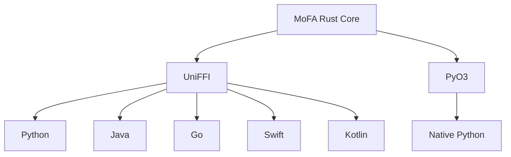

# Cross-Language Bindings

MoFA provides bindings for multiple programming languages through UniFFI and PyO3.

## Supported Languages

| Language | Method | Status |
|----------|--------|--------|
| Python | UniFFI / PyO3 | Stable |
| Java | UniFFI | Beta |
| Go | UniFFI | Beta |
| Swift | UniFFI | Beta |
| Kotlin | UniFFI | Beta |

## Architecture



## Choosing a Binding

### UniFFI (Python, Java, Go, Swift, Kotlin)

**Pros:**
- Consistent API across languages
- Generated from Rust definitions
- Type-safe

**Cons:**
- Some Rust patterns don't translate well
- Additional binary required

### PyO3 (Python Native)

**Pros:**
- Native Python feel
- Better integration with Python ecosystem
- Async support

**Cons:**
- Python-specific
- Requires Python development headers

## Installation

### Python (UniFFI)

```bash
pip install mofa
```

### Python (PyO3)

```bash
pip install mofa-native
```

### Java (Maven)

```xml
<dependency>
    <groupId>org.mofa</groupId>
    <artifactId>mofa-java</artifactId>
    <version>0.1.0</version>
</dependency>
```

### Go

```bash
go get github.com/mofa-org/mofa-go
```

## Feature Flags

Enable the `uniffi` or `python` feature when building:

```toml
[dependencies]
mofa-ffi = { version = "0.1", features = ["uniffi"] }
```

## See Also

- [Python](python.md) — Python bindings
- [Java](java.md) — Java bindings
- [Go](go.md) — Go bindings
