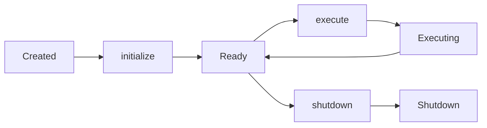

# Your First Agent

Build your first MoFA agent from scratch in this step-by-step guide.

## Prerequisites

- [MoFA installed](installation.md)
- [LLM configured](llm-setup.md)

## Overview

In this guide, you'll build a minimal LLM-powered agent that:

1. Implements the `MoFAAgent` trait
2. Uses an LLM provider to generate responses
3. Handles input and output through the standard MoFA types

## Project Setup

Create a new Rust project:

```bash
cargo new my-first-agent
cd my-first-agent
```

Add dependencies to `Cargo.toml`:

```toml
[dependencies]
mofa-sdk = { path = "../mofa/crates/mofa-sdk" }
tokio = { version = "1", features = ["full"] }
dotenvy = "0.15"
async-trait = "0.1"
```

## The MoFAAgent Trait

Every MoFA agent implements the `MoFAAgent` trait, which defines the core agent interface:

```rust
#[async_trait]
pub trait MoFAAgent: Send + Sync {
    fn id(&self) -> &str;
    fn name(&self) -> &str;
    fn capabilities(&self) -> &AgentCapabilities;
    fn state(&self) -> AgentState;

    async fn initialize(&mut self, ctx: &AgentContext) -> AgentResult<()>;
    async fn execute(&mut self, input: AgentInput, ctx: &AgentContext) -> AgentResult<AgentOutput>;
    async fn shutdown(&mut self) -> AgentResult<()>;
}
```

## Implementing Your Agent

Replace `src/main.rs` with:

```rust
//! Minimal MoFA agent that answers a question with an LLM.

use std::sync::Arc;
use dotenvy::dotenv;
use mofa_sdk::kernel::agent::prelude::*;
use mofa_sdk::llm::{LLMClient, openai_from_env};

struct LLMAgent {
    id: String,
    name: String,
    capabilities: AgentCapabilities,
    state: AgentState,
    client: LLMClient,
}

impl LLMAgent {
    fn new(client: LLMClient) -> Self {
        Self {
            id: "llm-agent-1".to_string(),
            name: "LLM Agent".to_string(),
            capabilities: AgentCapabilities::builder()
                .tag("llm").tag("qa")
                .input_type(InputType::Text)
                .output_type(OutputType::Text)
                .build(),
            state: AgentState::Created,
            client,
        }
    }
}

#[async_trait]
impl MoFAAgent for LLMAgent {
    fn id(&self)           -> &str               { &self.id }
    fn name(&self)         -> &str               { &self.name }
    fn capabilities(&self) -> &AgentCapabilities { &self.capabilities }
    fn state(&self)        -> AgentState         { self.state.clone() }

    async fn initialize(&mut self, _ctx: &AgentContext) -> AgentResult<()> {
        self.state = AgentState::Ready;
        Ok(())
    }

    async fn execute(&mut self, input: AgentInput, _ctx: &AgentContext) -> AgentResult<AgentOutput> {
        self.state = AgentState::Executing;
        let answer = self.client
            .ask_with_system("You are a helpful Rust expert.", &input.to_text())
            .await
            .map_err(|e| AgentError::ExecutionFailed(e.to_string()))?;
        self.state = AgentState::Ready;
        Ok(AgentOutput::text(answer))
    }

    async fn shutdown(&mut self) -> AgentResult<()> {
        self.state = AgentState::Shutdown;
        Ok(())
    }
}

#[tokio::main]
async fn main() -> Result<(), Box<dyn std::error::Error>> {
    dotenv().ok();   // IMPORTANT: loads .env

    let provider = openai_from_env()?;
    let client   = LLMClient::new(Arc::new(provider));

    let mut agent = LLMAgent::new(client);
    let ctx       = AgentContext::new("exec-001");

    agent.initialize(&ctx).await?;

    let output = agent.execute(
        AgentInput::text("What is the borrow checker in Rust?"),
        &ctx,
    ).await?;

    println!("{}", output.as_text().unwrap_or("(no answer)"));
    agent.shutdown().await?;
    Ok(())
}
```

## Running Your Agent

```bash
cargo run
```

You should see output like:

```
The borrow checker is a core component of Rust's compiler...
```

## Understanding the Code

### Agent Structure

Your agent has several key components:

| Field | Purpose |
|-------|---------|
| `id` | Unique identifier for the agent |
| `name` | Human-readable name |
| `capabilities` | Describes what the agent can do |
| `state` | Current lifecycle state |
| `client` | LLM client for generating responses |

### Lifecycle Methods



1. **`initialize`**: Called once when the agent starts. Set up resources here.
2. **`execute`**: Called for each task. This is where your agent's main logic lives.
3. **`shutdown`**: Called when the agent stops. Clean up resources here.

### Input and Output

- **`AgentInput`**: Wraps the input data (text, structured data, etc.)
- **`AgentOutput`**: Wraps the output data with metadata

## Using AgentRunner

For production use, wrap your agent with `AgentRunner`:

```rust
use mofa_sdk::runtime::AgentRunner;

#[tokio::main]
async fn main() -> Result<(), Box<dyn std::error::Error>> {
    dotenv().ok();

    let provider = openai_from_env()?;
    let client = LLMClient::new(Arc::new(provider));
    let agent = LLMAgent::new(client);

    let mut runner = AgentRunner::new(agent).await?;

    let output = runner.execute(
        AgentInput::text("Explain async/await in Rust"),
    ).await?;

    println!("{}", output.as_text().unwrap_or("(no answer)"));
    runner.shutdown().await?;

    Ok(())
}
```

## What's Next?

Now that you have a working agent, explore these topics:

- **[Core Concepts](../concepts/architecture.md)** — Understand MoFA's architecture
- **[Tutorial](../tutorial/README.md)** — Comprehensive step-by-step guide
- **[Tools](../concepts/tools.md)** — Add function calling to your agent
- **[Multi-Agent](../guides/multi-agent.md)** — Coordinate multiple agents

## Troubleshooting

### "OPENAI_API_KEY not found"

Make sure you've:
1. Created a `.env` file in the project root
2. Added your API key: `OPENAI_API_KEY=sk-...`
3. Called `dotenv().ok()` at the start of `main()`

### Compilation Errors

- Ensure Rust version is 1.85+
- Run `cargo clean` and rebuild
- Check that all dependencies are correctly specified

### Empty Responses

- Check your API key is valid
- Verify the model name is correct
- Check for rate limiting or quota issues
