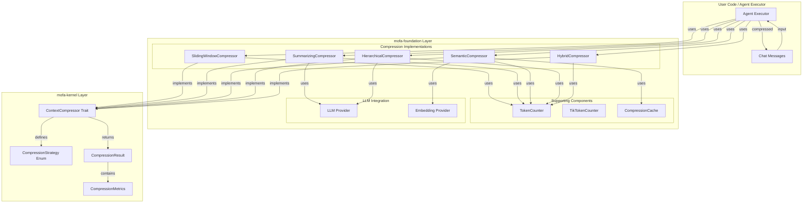
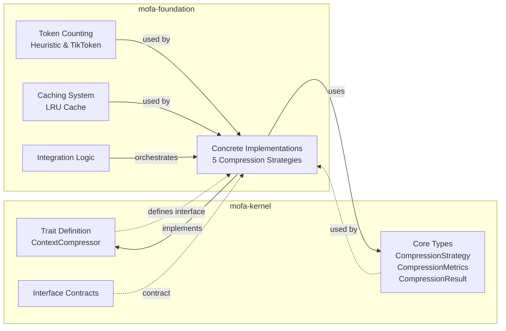
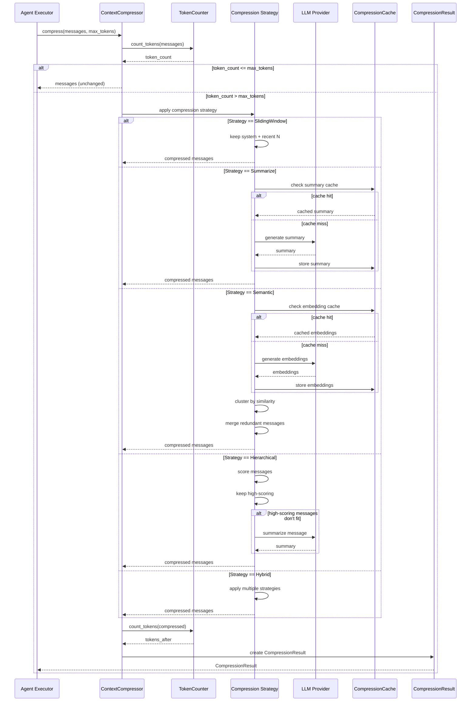
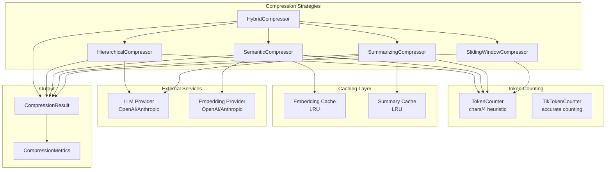
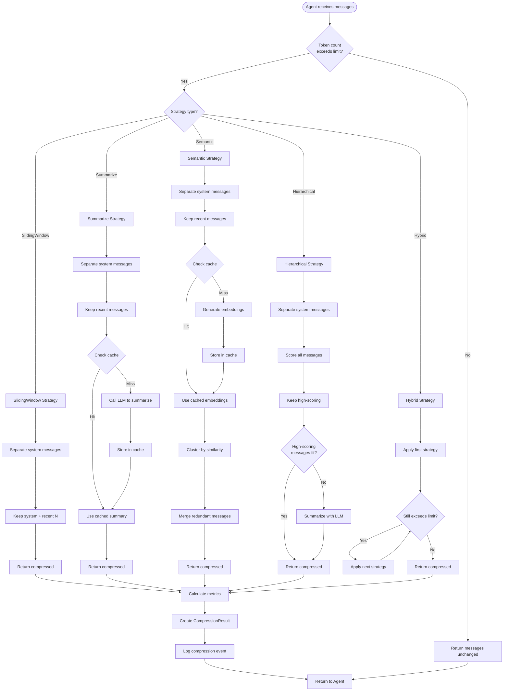
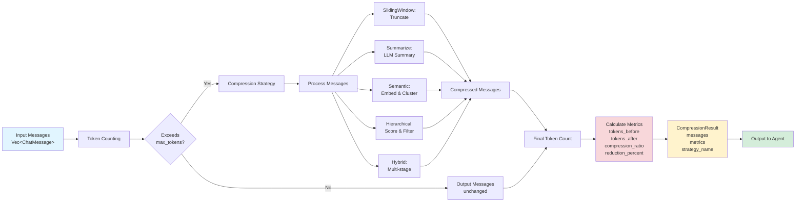
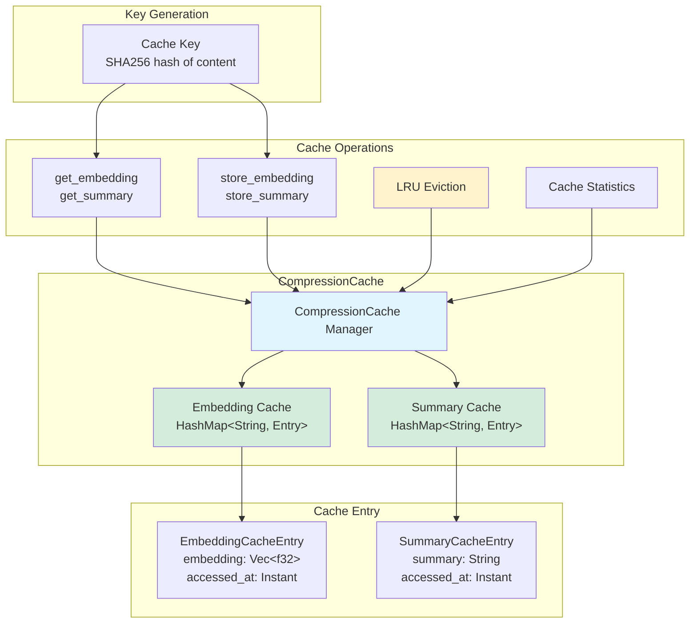
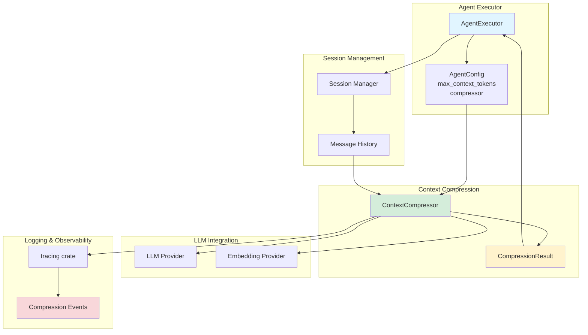

# context compression architecture

architecture diagrams for mofa's context compression system - how components interact, data flows, and the layered design.

## table of contents

1. [system architecture overview](#system-architecture-overview)
2. [layer responsibilities](#layer-responsibilities)
3. [compression flow](#compression-flow)
4. [component interactions](#component-interactions)
5. [strategy selection flow](#strategy-selection-flow)
6. [data flow diagram](#data-flow-diagram)
7. [caching architecture](#caching-architecture)
8. [integration points](#integration-points)

## system architecture overview

the context compression system follows mofa's microkernel architecture - trait definitions live in the kernel layer, concrete implementations in the foundation layer.

## layer responsibilities

**key principles:**
- **kernel layer**: defines abstractions only, no implementations
- **foundation layer**: provides all concrete implementations
- **dependency direction**: foundation → kernel (never reverse)

## compression flow

end-to-end compression process from agent execution to compressed output.

## component interactions

how different compression components interact with each other and external systems.

## strategy selection flow

decision-making process for choosing and applying compression strategies.

## data flow diagram

how data flows through the compression system, from input messages to compressed output with metrics.

## caching architecture

the compression system includes an optional LRU cache for embeddings and summaries to improve performance and reduce API costs.

**cache features:**
- **lru eviction**: automatically evicts oldest entries when capacity is reached
- **separate caches**: embeddings and summaries cached independently
- **sha256 keys**: content-based cache keys for deduplication
- **thread-safe**: uses `Arc<RwLock<>>` for concurrent access
- **statistics**: tracks cache size and capacity

## integration points

how the compression system integrates with other mofa components.

**integration details:**

1. **agent executor integration**:
   - checks token count before each LLM call
   - automatically compresses if limit exceeded
   - preserves system prompts and recent messages

2. **session management**:
   - works with persistent session storage
   - compresses historical messages while keeping recent context

3. **llm provider integration**:
   - uses LLM for summarization (SummarizingCompressor, HierarchicalCompressor)
   - uses embedding API for semantic compression (SemanticCompressor)

4. **observability**:
   - structured logging with `tracing`
   - compression events logged with metrics
   - cache statistics available for monitoring

## architecture principles

### 1. separation of concerns

- **kernel layer**: defines `what` (interfaces and contracts)
- **foundation layer**: defines `how` (concrete implementations)

### 2. extensibility

- new compression strategies can be added by implementing `ContextCompressor`
- token counting can be customized via trait methods
- caching is optional and feature-gated

### 3. performance

- fast strategies (SlidingWindow) for low-latency scenarios
- caching reduces API calls and improves throughput
- parallel processing available via feature flags

### 4. observability

- comprehensive metrics for every compression operation
- structured logging for debugging and monitoring
- cache statistics for performance analysis

### 5. backward compatibility

- default `compress()` method for existing code
- optional `compress_with_metrics()` for new code
- feature flags for optional dependencies

## future enhancements (phase 3)

the architecture is designed to support future enhancements:

1. **adaptive strategy selection**: automatically choose the best strategy based on conversation characteristics
2. **compression profiles**: pre-configured presets (fast, balanced, quality, cost-optimized)
3. **quality evaluation**: measure semantic preservation, not just token reduction
4. **configuration management**: yaml/toml configs for reusable settings
5. **cost tracking**: monitor and optimize API costs for compression operations

these enhancements will build on the existing architecture without requiring breaking changes.
