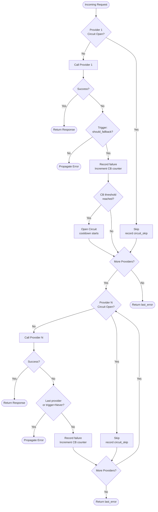
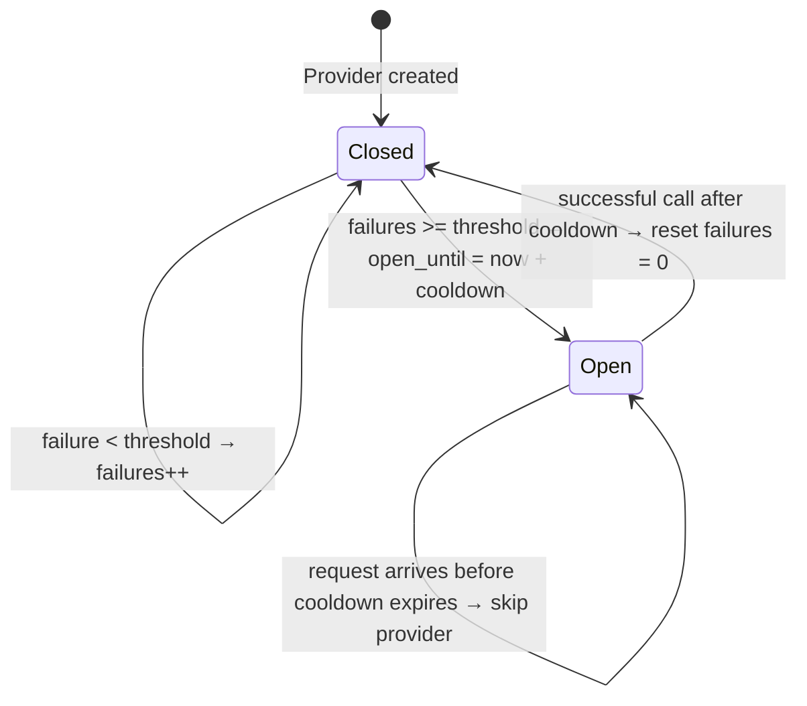

# LLM Providers

MoFA supports multiple LLM providers with a unified interface. This guide covers configuration and usage.

## Supported Providers

| Provider | Environment Variables | Features |
|----------|----------------------|----------|
| OpenAI | `OPENAI_API_KEY`, `OPENAI_MODEL` | Streaming, Function Calling |
| Anthropic | `ANTHROPIC_API_KEY`, `ANTHROPIC_MODEL` | Streaming, Extended Context |
| Ollama | `OPENAI_BASE_URL` | Local Inference, Free |
| OpenRouter | `OPENAI_API_KEY`, `OPENAI_BASE_URL` | Multiple Models |
| vLLM | `OPENAI_BASE_URL` | High Performance |

## OpenAI

### Configuration

```env
OPENAI_API_KEY=sk-...
OPENAI_MODEL=gpt-4o           # optional
OPENAI_BASE_URL=...           # optional, for proxies
```

### Usage

```rust
use mofa_sdk::llm::{LLMClient, openai_from_env};

let provider = openai_from_env()?;
let client = LLMClient::new(Arc::new(provider));

// Simple query
let response = client.ask("What is Rust?").await?;

// With system prompt
let response = client
    .ask_with_system("You are a Rust expert.", "Explain ownership")
    .await?;

// Streaming
let mut stream = client.stream().system("You are helpful.").user("Tell a story").start().await?;
while let Some(chunk) = stream.next().await {
    print!("{}", chunk?);
}
```

### Available Models

| Model | Description | Context Length |
|-------|-------------|----------------|
| `gpt-4o` | Latest flagship (default) | 128K |
| `gpt-4-turbo` | High performance | 128K |
| `gpt-3.5-turbo` | Fast, economical | 16K |

## Anthropic

### Configuration

```env
ANTHROPIC_API_KEY=sk-ant-...
ANTHROPIC_MODEL=claude-sonnet-4-5-latest  # optional
```

### Usage

```rust
use mofa_sdk::llm::{LLMClient, anthropic_from_env};

let provider = anthropic_from_env()?;
let client = LLMClient::new(Arc::new(provider));

let response = client
    .ask_with_system("You are Claude, a helpful AI.", "Hello!")
    .await?;
```

### Available Models

| Model | Description | Context Length |
|-------|-------------|----------------|
| `claude-sonnet-4-5-latest` | Balanced (default) | 200K |
| `claude-opus-4-latest` | Most capable | 200K |
| `claude-haiku-3-5-latest` | Fastest | 200K |

## Ollama (Local)

### Setup

1. Install Ollama: `curl -fsSL https://ollama.ai/install.sh | sh`
2. Pull a model: `ollama pull llama3.2`
3. Run Ollama: `ollama serve`

### Configuration

```env
OPENAI_API_KEY=ollama
OPENAI_BASE_URL=http://localhost:11434/v1
OPENAI_MODEL=llama3.2
```

### Usage

Same as OpenAI (uses OpenAI-compatible API):

```rust
let provider = openai_from_env()?;
let client = LLMClient::new(Arc::new(provider));
```

### Recommended Models

| Model | Size | Best For |
|-------|------|----------|
| `llama3.2` | 3B | General purpose |
| `llama3.1:8b` | 8B | Better quality |
| `mistral` | 7B | Fast responses |
| `codellama` | 7B | Code generation |

## OpenRouter

### Configuration

```env
OPENAI_API_KEY=sk-or-...
OPENAI_BASE_URL=https://openrouter.ai/api/v1
OPENAI_MODEL=google/gemini-2.0-flash-001
```

### Usage

```rust
let provider = openai_from_env()?;  // Uses OPENAI_BASE_URL
let client = LLMClient::new(Arc::new(provider));
```

### Popular Models

| Model | Provider | Notes |
|-------|----------|-------|
| `google/gemini-2.0-flash-001` | Google | Fast, capable |
| `meta-llama/llama-3.1-70b-instruct` | Meta | Open source |
| `mistralai/mistral-large` | Mistral | European AI |

## vLLM

### Setup

```bash
pip install vllm
python -m vllm.entrypoints.openai.api_server --model meta-llama/Llama-2-7b-chat-hf
```

### Configuration

```env
OPENAI_API_KEY=unused
OPENAI_BASE_URL=http://localhost:8000/v1
OPENAI_MODEL=meta-llama/Llama-2-7b-chat-hf
```

## Custom Provider

Implement the `LLMProvider` trait:

```rust
use mofa_sdk::llm::{LLMProvider, LLMResponse, LLMError};
use async_trait::async_trait;

pub struct MyCustomProvider {
    api_key: String,
    endpoint: String,
}

#[async_trait]
impl LLMProvider for MyCustomProvider {
    async fn complete(&self, prompt: &str) -> Result<String, LLMError> {
        // Your implementation
    }

    async fn complete_with_system(
        &self,
        system: &str,
        prompt: &str,
    ) -> Result<String, LLMError> {
        // Your implementation
    }

    async fn stream_complete(
        &self,
        system: &str,
        prompt: &str,
    ) -> Result<impl Stream<Item = Result<String, LLMError>>, LLMError> {
        // Optional streaming implementation
    }
}
```

## Fallback Chain

`FallbackChain` wraps multiple providers in priority order. When the active provider fails with a qualifying error (rate-limit, quota, network, timeout, auth), the next provider is tried automatically. It implements `LLMProvider`, so it is a transparent drop-in replacement everywhere a single provider is accepted.

### Request Flow



### Circuit Breaker State Machine



### Code Usage

```rust
use mofa_foundation::llm::{
    FallbackChain, FallbackTrigger, FallbackCondition, CircuitBreakerConfig,
};
use std::sync::Arc;

let chain = FallbackChain::builder()
    .with_circuit_breaker(CircuitBreakerConfig::default()) // 3 failures → 30s cooldown
    .add(openai_provider)                                  // primary
    .add_with_trigger(
        anthropic_provider,
        FallbackTrigger::on_conditions(vec![
            FallbackCondition::RateLimited,
            FallbackCondition::QuotaExceeded,
        ]),
    )
    .add_last(ollama_provider)                             // last resort
    .build();

let client = LLMClient::new(Arc::new(chain));
```

### YAML Configuration

```yaml
name: production-chain
circuit_breaker:
  failure_threshold: 3
  cooldown_secs: 30
providers:
  - provider: openai
    api_key: "sk-..."
  - provider: anthropic
    api_key: "sk-ant-..."
    trigger: any_error
  - provider: ollama
    base_url: "http://localhost:11434"
    trigger: never
```

```rust
let config: FallbackChainConfig = serde_yaml::from_str(yaml)?;
let chain = config.build(&registry).await?;
```

### Observability

```rust
let snap = chain.metrics();
println!("requests:  {}", snap.requests_total);
println!("fallbacks: {}", snap.fallbacks_total);

for provider in &snap.providers {
    println!(
        "{}: {} ok / {} fallbacks / {} cb-skips",
        provider.name,
        provider.successes,
        provider.fallback_failures,
        provider.circuit_breaker_skips,
    );
}
```

### Fallback Conditions

| Condition | Triggers on |
|-----------|-------------|
| `RateLimited` | HTTP 429 / rate-limit response |
| `QuotaExceeded` | Billing / quota error |
| `NetworkError` | TCP/TLS/DNS failure |
| `Timeout` | Request exceeded deadline |
| `AuthError` | Invalid API key |
| `ProviderUnavailable` | Provider does not support the model/feature |
| `ContextLengthExceeded` | Prompt too long for context window |
| `ModelNotFound` | Model does not exist on this provider |

The default trigger uses `RateLimited`, `QuotaExceeded`, `NetworkError`, `Timeout`, and `AuthError`.

---

## Best Practices

### API Key Security

```rust
// NEVER hardcode API keys
// BAD:
let key = "sk-...";

// GOOD: Use environment variables
dotenvy::dotenv().ok();
let key = std::env::var("OPENAI_API_KEY")?;
```

### Error Handling

```rust
use mofa_sdk::llm::LLMError;

match client.ask(prompt).await {
    Ok(response) => println!("{}", response),
    Err(LLMError::RateLimited { retry_after }) => {
        tokio::time::sleep(Duration::from_secs(retry_after)).await;
        // Retry
    }
    Err(LLMError::InvalidApiKey) => {
        eprintln!("Check your API key configuration");
    }
    Err(e) => {
        eprintln!("Error: {}", e);
    }
}
```

### Token Management

```rust
// Use sliding window to manage context
let agent = LLMAgentBuilder::from_env()?
    .with_sliding_window(10)  // Keep last 10 messages
    .build_async()
    .await;

// Or manual token counting
let tokens = client.count_tokens(&prompt).await?;
if tokens > 4000 {
    // Truncate or summarize
}
```

## See Also

- [LLM Setup](../getting-started/llm-setup.md) — Initial configuration
- [Streaming](../guides/monitoring.md) — Streaming responses
- [API Reference](../api-reference/foundation/llm.md) — LLM API docs
