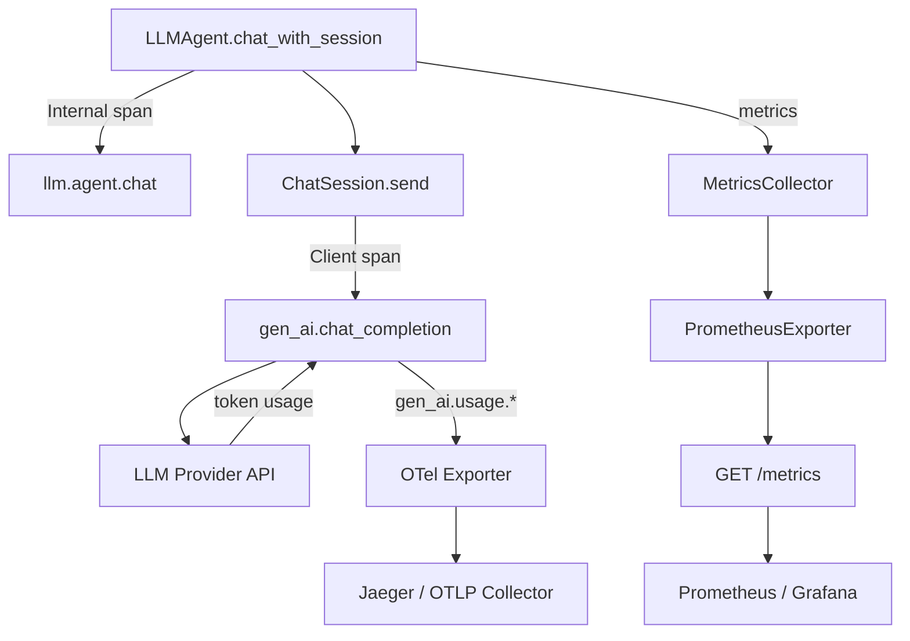
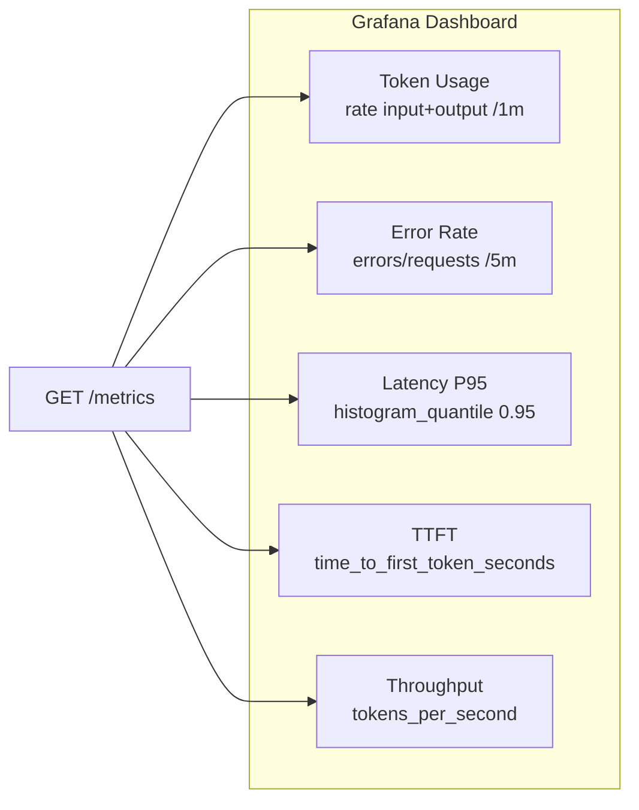
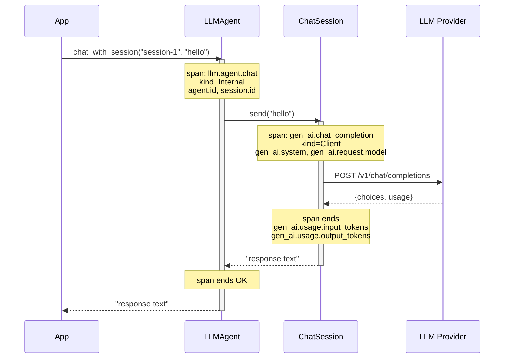

# Monitoring & Observability

Production observability for MoFA applications — Prometheus metrics, OpenTelemetry
distributed tracing, and structured logging.

---

## Architecture Overview



---

## Part 1 — Prometheus Metrics

### Quickstart

Start the monitoring dashboard and scrape `/metrics`:

```bash
# Run the monitoring dashboard
cargo run -p mofa-monitoring

# Scrape metrics
curl -s http://localhost:9090/metrics | grep mofa_llm
```

Expected output for LLM metrics:

```
# HELP mofa_llm_requests_total Total LLM requests
# TYPE mofa_llm_requests_total counter
mofa_llm_requests_total{provider="openai",model="gpt-4o"} 142

# HELP mofa_llm_input_tokens_total Cumulative prompt tokens sent to the LLM provider
# TYPE mofa_llm_input_tokens_total counter
mofa_llm_input_tokens_total{provider="openai",model="gpt-4o"} 89340

# HELP mofa_llm_output_tokens_total Cumulative completion tokens received from the LLM provider
# TYPE mofa_llm_output_tokens_total counter
mofa_llm_output_tokens_total{provider="openai",model="gpt-4o"} 21056

# HELP mofa_llm_latency_seconds Average LLM request latency in seconds
# TYPE mofa_llm_latency_seconds gauge
mofa_llm_latency_seconds{provider="openai",model="gpt-4o"} 1.24

# HELP mofa_llm_time_to_first_token_seconds Time to first token for streaming requests in seconds
# TYPE mofa_llm_time_to_first_token_seconds gauge
mofa_llm_time_to_first_token_seconds{provider="openai",model="gpt-4o"} 0.31
```

---

### Full LLM Metrics Reference

| Metric | Type | Labels | Description |
|--------|------|--------|-------------|
| `mofa_llm_requests_total` | counter | `provider`, `model` | Total requests sent |
| `mofa_llm_errors_total` | counter | `provider`, `model` | Failed requests |
| `mofa_llm_input_tokens_total` | counter | `provider`, `model` | Cumulative prompt tokens |
| `mofa_llm_output_tokens_total` | counter | `provider`, `model` | Cumulative completion tokens |
| `mofa_llm_tokens_per_second` | gauge | `provider`, `model` | Generation throughput |
| `mofa_llm_latency_seconds` | gauge | `provider`, `model` | Average request latency |
| `mofa_llm_time_to_first_token_seconds` | gauge | `provider`, `model` | Streaming TTFT |
| `mofa_llm_request_duration_seconds` | histogram | `provider`, `model` | Latency distribution |

---

### Prometheus Scrape Config

Add to your `prometheus.yml`:

```yaml
scrape_configs:
  - job_name: mofa
    static_configs:
      - targets: ["localhost:9090"]
    scrape_interval: 15s
```

---

### Practical PromQL Queries

**Cost estimation — tokens consumed per model per minute:**

```promql
rate(mofa_llm_input_tokens_total[1m])  +  rate(mofa_llm_output_tokens_total[1m])
```

**Input/output token ratio (measures response verbosity):**

```promql
rate(mofa_llm_output_tokens_total[5m])
  /
rate(mofa_llm_input_tokens_total[5m])
```

**Error rate per model:**

```promql
rate(mofa_llm_errors_total[5m])
  /
rate(mofa_llm_requests_total[5m])
```

**P95 latency across all models (from histogram):**

```promql
histogram_quantile(0.95, rate(mofa_llm_request_duration_seconds_bucket[5m]))
```

**Streaming time-to-first-token by provider:**

```promql
mofa_llm_time_to_first_token_seconds
```

---

### Grafana Dashboard

Import the following panel definitions into Grafana to visualise LLM health at a glance.



**Suggested alert rules:**

```yaml
# Alert when error rate exceeds 5% for 2 minutes
- alert: MoFALLMHighErrorRate
  expr: |
    rate(mofa_llm_errors_total[2m])
    / rate(mofa_llm_requests_total[2m]) > 0.05
  for: 2m
  labels:
    severity: warning
  annotations:
    summary: "LLM error rate above 5% on {{ $labels.model }}"

# Alert when input token rate spikes (cost runaway)
- alert: MoFATokenBudgetSpike
  expr: rate(mofa_llm_input_tokens_total[5m]) > 10000
  for: 1m
  labels:
    severity: warning
  annotations:
    summary: "High token consumption on {{ $labels.provider }}/{{ $labels.model }}"
```

---

## Part 2 — OpenTelemetry Distributed Tracing

### How It Works



### Enable the Feature

```toml
# Cargo.toml
[dependencies]
mofa-foundation = { version = "0.1", features = ["otel-tracing"] }
```

### Span Attributes Reference

| Attribute | Span | Description |
|-----------|------|-------------|
| `agent.id` | `llm.agent.chat` | Agent identifier |
| `session.id` | `llm.agent.chat`, `gen_ai.chat_completion` | Session identifier |
| `gen_ai.system` | `gen_ai.chat_completion` | Provider name (`"openai"`, `"anthropic"`) |
| `gen_ai.request.model` | `gen_ai.chat_completion` | Model requested |
| `gen_ai.response.model` | `gen_ai.chat_completion` | Model that responded |
| `gen_ai.usage.input_tokens` | `gen_ai.chat_completion` | Prompt tokens used |
| `gen_ai.usage.output_tokens` | `gen_ai.chat_completion` | Completion tokens used |
| `llm.streaming` | `llm.agent.chat_stream` | `true` for streaming requests |

---

### Console Exporter (Development)

See spans printed to stdout — no infrastructure required:

```rust
use opentelemetry_sdk::trace::TracerProvider;
use opentelemetry::global;

fn init_tracing() {
    let exporter = opentelemetry_stdout::SpanExporter::default();
    let provider = TracerProvider::builder()
        .with_simple_exporter(exporter)
        .build();
    global::set_tracer_provider(provider);
}
```

Example console output for a single `chat_with_session` call:

```
SpanData {
  name: "llm.agent.chat",
  kind: Internal,
  status: Ok,
  attributes: [
    agent.id = "secretary-agent",
    session.id = "01936b2f-1234-7abc-8def-000000000001"
  ]
}
SpanData {
  name: "gen_ai.chat_completion",
  kind: Client,
  status: Ok,
  attributes: [
    gen_ai.system = "openai",
    gen_ai.request.model = "gpt-4o",
    gen_ai.response.model = "gpt-4o",
    gen_ai.usage.input_tokens = 312,
    gen_ai.usage.output_tokens = 78
  ]
}
```

---

### Jaeger Exporter (Recommended for Local Dev)

```bash
# Start Jaeger all-in-one
docker run -d --name jaeger \
  -p 16686:16686 \
  -p 4317:4317 \
  jaegertracing/all-in-one:latest
```

```rust
use opentelemetry_otlp::WithExportConfig;
use opentelemetry_sdk::trace::TracerProvider;
use opentelemetry::global;

fn init_tracing() -> anyhow::Result<()> {
    let exporter = opentelemetry_otlp::SpanExporter::builder()
        .with_tonic()
        .with_endpoint("http://localhost:4317")
        .build()?;

    let provider = TracerProvider::builder()
        .with_batch_exporter(exporter, opentelemetry_sdk::runtime::Tokio)
        .build();

    global::set_tracer_provider(provider);
    Ok(())
}

#[tokio::main]
async fn main() -> anyhow::Result<()> {
    init_tracing()?;

    let agent = LLMAgentBuilder::from_env()?
        .with_id("demo-agent")
        .build();

    let session = agent.create_session().await;
    let reply = agent.chat_with_session(&session, "What is Rust?").await?;
    println!("{reply}");

    // Flush spans before exit
    global::shutdown_tracer_provider();
    Ok(())
}
```

Open Jaeger UI at `http://localhost:16686` and select service `mofa-foundation`.

---

### OTLP / Grafana Tempo (Production)

```bash
# Set via environment (no code change needed)
export OTEL_EXPORTER_OTLP_ENDPOINT=http://tempo:4317
export OTEL_SERVICE_NAME=mofa-production
```

```rust
use opentelemetry_otlp::WithExportConfig;
use opentelemetry_sdk::trace::TracerProvider;
use opentelemetry::global;

fn init_tracing() -> anyhow::Result<()> {
    let endpoint = std::env::var("OTEL_EXPORTER_OTLP_ENDPOINT")
        .unwrap_or_else(|_| "http://localhost:4317".to_string());

    let exporter = opentelemetry_otlp::SpanExporter::builder()
        .with_tonic()
        .with_endpoint(endpoint)
        .build()?;

    let provider = TracerProvider::builder()
        .with_batch_exporter(exporter, opentelemetry_sdk::runtime::Tokio)
        .build();

    global::set_tracer_provider(provider);
    Ok(())
}
```

---

### Full Working Example

```rust
use mofa_foundation::llm::LLMAgentBuilder;
use opentelemetry::{global, KeyValue};
use opentelemetry_otlp::WithExportConfig;
use opentelemetry_sdk::trace::TracerProvider;

fn init_tracing() -> anyhow::Result<()> {
    let exporter = opentelemetry_otlp::SpanExporter::builder()
        .with_tonic()
        .with_endpoint("http://localhost:4317")
        .build()?;

    let provider = TracerProvider::builder()
        .with_batch_exporter(exporter, opentelemetry_sdk::runtime::Tokio)
        .with_resource(opentelemetry_sdk::Resource::new(vec![
            KeyValue::new("service.name", "my-mofa-app"),
            KeyValue::new("deployment.environment", "production"),
        ]))
        .build();

    global::set_tracer_provider(provider);
    Ok(())
}

#[tokio::main]
async fn main() -> anyhow::Result<()> {
    // 1. Init tracing — must happen before any agent calls
    init_tracing()?;

    // 2. Build agent (otel-tracing feature auto-instruments all calls)
    let agent = LLMAgentBuilder::from_env()?
        .with_id("support-agent")
        .with_system_prompt("You are a helpful assistant.")
        .build();

    // 3. Multi-turn conversation — every call emits two spans
    let session = agent.create_session().await;

    let r1 = agent.chat_with_session(&session, "What is MoFA?").await?;
    println!("Turn 1: {r1}");

    let r2 = agent.chat_with_session(&session, "Give me a code example.").await?;
    println!("Turn 2: {r2}");

    // 4. Flush before exit
    global::shutdown_tracer_provider();
    Ok(())
}
```

Each call to `chat_with_session` emits two spans — an outer `llm.agent.chat`
(Internal) and an inner `gen_ai.chat_completion` (Client) — visible as a
parent-child pair in Jaeger/Tempo.

---

## Part 3 — Logging

Configure via `RUST_LOG`:

```bash
export RUST_LOG=mofa_foundation=debug,mofa_runtime=info
```

### Structured Log Fields

```rust
use tracing::{info, debug, instrument};

#[instrument(skip(input))]
async fn execute(&mut self, input: AgentInput) -> AgentResult<AgentOutput> {
    debug!(input_len = input.to_text().len(), "Processing input");
    let result = self.process(input).await?;
    info!(output_len = result.as_text().map(|s| s.len()), "Execution complete");
    Ok(result)
}
```

---

## Part 4 — Health Checks

```rust
use mofa_sdk::monitoring::HealthCheck;

let health = HealthCheck::new()
    .with_database_check(|| async { store.health().await })
    .with_llm_check(|| async { llm.health().await });

// GET /health
let status = health.check().await;
```

---

## Part 5 — Dashboard

MoFA includes a built-in monitoring dashboard:

```bash
cargo run -p mofa-monitoring
```

Access at `http://localhost:3000` — shows live agent metrics, LLM token usage,
latency histograms, and system resources.

---

## See Also

- [LLM Providers](llm-providers.md) — Token budget and cost control
- [Production Deployment](../advanced/production.md) — Production setup
- [Configuration](../appendix/configuration.md) — Monitoring config
