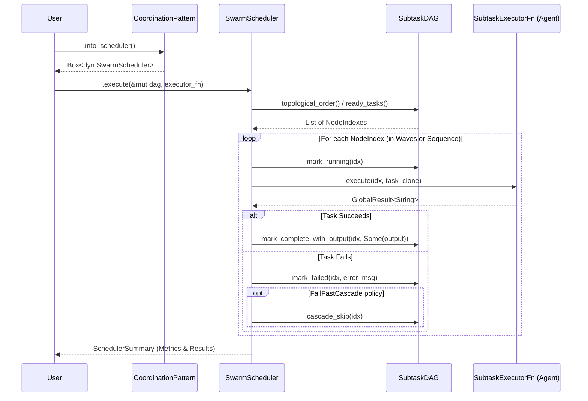

# Multi-Agent Systems

Guide to building systems with multiple coordinated agents.

## Overview

Multi-agent systems enable:
- **Specialization** — Different agents for different tasks
- **Parallelism** — Concurrent processing
- **Collaboration** — Agents working together
- **Robustness** — Fallback and redundancy

## Swarm DAG Orchestrator

The Swarm Orchestrator executes directed acyclic graph (DAG) pipelines via a dedicated **SwarmScheduler** engine. Crucially, the scheduler retains exclusive ownership of DAG state mutations (e.g., `mark_running`, `mark_complete_with_output`, `mark_failed`, `cascade_skip`), while the Subtask Executor (`SubtaskExecutorFn`) remains a pure function returning a `GlobalResult<String>`.



## Coordination Patterns

### Sequential Pipeline

```rust,ignore
use mofa_foundation::swarm::{CoordinationPattern, SubtaskDAG, SwarmSubtask};

let mut dag = SubtaskDAG::new("research-pipeline");
let idx_research = dag.add_task(SwarmSubtask::new("research", "Research topic"));
let idx_analysis = dag.add_task(SwarmSubtask::new("analysis", "Analyze data"));
let idx_writer   = dag.add_task(SwarmSubtask::new("writer", "Write report"));

// Enforce sequential dependency: research -> analysis -> writer
dag.add_dependency(idx_research, idx_analysis).unwrap();
dag.add_dependency(idx_analysis, idx_writer).unwrap();

let scheduler = CoordinationPattern::Sequential.into_scheduler();
let summary = scheduler.execute(&mut dag, executor_fn).await?;
```

### Parallel Execution

```rust,ignore
use mofa_foundation::swarm::{CoordinationPattern, SubtaskDAG, SwarmSubtask};
use mofa_foundation::swarm::{SwarmSchedulerConfig, FailurePolicy, ParallelScheduler};

let mut dag = SubtaskDAG::new("parallel-search");
let idx_a = dag.add_task(SwarmSubtask::new("A", "Search Source A"));
let idx_b = dag.add_task(SwarmSubtask::new("B", "Search Source B"));
let idx_c = dag.add_task(SwarmSubtask::new("C", "Search Source C"));

// Optional: Configure strict limits and failure cascades
let mut config = SwarmSchedulerConfig::default();
config.concurrency_limit = Some(2); // Only execute 2 queries concurrently
config.failure_policy = FailurePolicy::FailFastCascade;

let scheduler = ParallelScheduler::with_config(config);
let summary = scheduler.execute(&mut dag, executor_fn).await?;
```

### Consensus

```rust
use mofa_sdk::coordination::Consensus;

let consensus = Consensus::new()
    .with_agents(vec![expert_a, expert_b, expert_c])
    .with_threshold(0.6);

let decision = consensus.decide(&proposal).await?;
```

### Debate

```rust
use mofa_sdk::coordination::Debate;

let debate = Debate::new()
    .with_proposer(pro_agent)
    .with_opponent(con_agent)
    .with_judge(judge_agent);

let result = debate.debide(&topic).await?;
```

## Best Practices

1. **Clear Responsibilities** — Each agent should have one job
2. **Well-Defined Interfaces** — Use consistent input/output types
3. **Error Handling** — Plan for agent failures
4. **Timeouts** — Set appropriate timeouts
5. **Logging** — Log inter-agent communication

## See Also

- [Workflows](../concepts/workflows.md) — Workflow concepts
- [Examples](../examples/multi-agent-coordination.md) — Examples

## Capability Registry

`SwarmCapabilityRegistry` maps agents to capabilities and answers two questions before execution starts:
- which agents can handle a given task?
- does this DAG have tasks that no registered agent can run?

### basic usage

```rust,ignore
use mofa_foundation::swarm::{AgentSpec, SwarmCapabilityRegistry};

let registry = SwarmCapabilityRegistry::new()
    .register(AgentSpec { id: "summarizer".into(), capabilities: vec!["summarize".into()], .. })
    .register(AgentSpec { id: "translator".into(), capabilities: vec!["translate".into()], .. });

// find all agents that satisfy every required capability of a task
let candidates = registry.find_for_task(&task);

// find all agents advertising a single capability
let summarizers = registry.find_by_capability("summarize");
```

### pre-execution gap analysis

```rust,ignore
let report = registry.coverage_report(&dag);

if !report.is_fully_covered() {
    // report.uncovered: tasks with zero capable agents (will fail at dispatch)
    // report.partial:   tasks with exactly one capable agent (single point of failure)
    // report.gaps:      capability names no agent has registered
}
```

the `coverage_report` runs in O(tasks * agents) and should be called before handing the DAG to any scheduler. once `SwarmAdmissionGate` is merged, a `CoveragePolicy` will wrap this check as a denial policy so uncovered DAGs are rejected before a single task runs.
