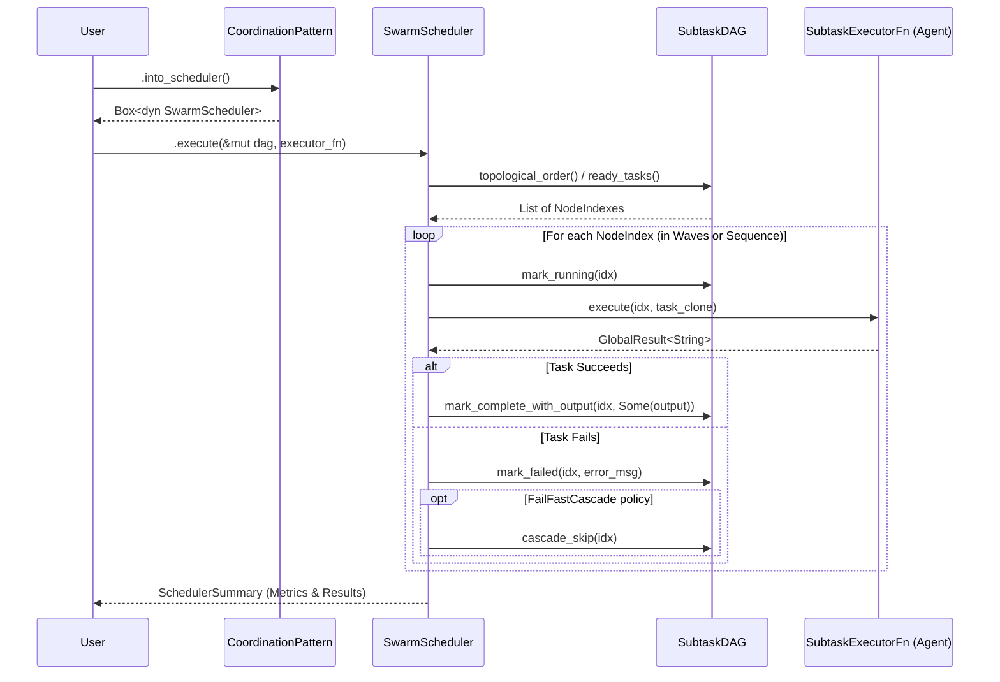

# Multi-Agent Systems

Guide to building systems with multiple coordinated agents.

## Overview

Multi-agent systems enable:
- **Specialization** — Different agents for different tasks
- **Parallelism** — Concurrent processing
- **Collaboration** — Agents working together
- **Robustness** — Fallback and redundancy

## Swarm DAG Orchestrator

The Swarm Orchestrator executes directed acyclic graph (DAG) pipelines via a dedicated **SwarmScheduler** engine. Crucially, the scheduler retains exclusive ownership of DAG state mutations (e.g., `mark_running`, `mark_complete_with_output`, `mark_failed`, `cascade_skip`), while the Subtask Executor (`SubtaskExecutorFn`) remains a pure function returning a `GlobalResult<String>`.



## Coordination Patterns

### Sequential Pipeline

```rust,ignore
use mofa_foundation::swarm::{CoordinationPattern, SubtaskDAG, SwarmSubtask};

let mut dag = SubtaskDAG::new("research-pipeline");
let idx_research = dag.add_task(SwarmSubtask::new("research", "Research topic"));
let idx_analysis = dag.add_task(SwarmSubtask::new("analysis", "Analyze data"));
let idx_writer   = dag.add_task(SwarmSubtask::new("writer", "Write report"));

// Enforce sequential dependency: research -> analysis -> writer
dag.add_dependency(idx_research, idx_analysis).unwrap();
dag.add_dependency(idx_analysis, idx_writer).unwrap();

let scheduler = CoordinationPattern::Sequential.into_scheduler();
let summary = scheduler.execute(&mut dag, executor_fn).await?;
```

### Parallel Execution

```rust,ignore
use mofa_foundation::swarm::{CoordinationPattern, SubtaskDAG, SwarmSubtask};
use mofa_foundation::swarm::{SwarmSchedulerConfig, FailurePolicy, ParallelScheduler};

let mut dag = SubtaskDAG::new("parallel-search");
let idx_a = dag.add_task(SwarmSubtask::new("A", "Search Source A"));
let idx_b = dag.add_task(SwarmSubtask::new("B", "Search Source B"));
let idx_c = dag.add_task(SwarmSubtask::new("C", "Search Source C"));

// Optional: Configure strict limits and failure cascades
let mut config = SwarmSchedulerConfig::default();
config.concurrency_limit = Some(2); // Only execute 2 queries concurrently
config.failure_policy = FailurePolicy::FailFastCascade;

let scheduler = ParallelScheduler::with_config(config);
let summary = scheduler.execute(&mut dag, executor_fn).await?;
```

### Consensus

```rust
use mofa_sdk::coordination::Consensus;

let consensus = Consensus::new()
    .with_agents(vec![expert_a, expert_b, expert_c])
    .with_threshold(0.6);

let decision = consensus.decide(&proposal).await?;
```

### Debate

```rust
use mofa_sdk::coordination::Debate;

let debate = Debate::new()
    .with_proposer(pro_agent)
    .with_opponent(con_agent)
    .with_judge(judge_agent);

let result = debate.debide(&topic).await?;
```

## Risk-Aware Swarm Orchestration

Every `SwarmSubtask` carries a `RiskLevel` (Low / Medium / High / Critical) that drives two capabilities: automatic HITL routing and critical-path scheduling.

### Risk Classification

Use `TaskAnalyzer::analyze_offline_with_risk()` for instant, no-API-key decomposition with keyword-based risk heuristics:

```rust,ignore
use mofa_foundation::swarm::TaskAnalyzer;

let analysis = TaskAnalyzer::analyze_offline_with_risk(
    "fetch customer records then charge payment card then send email"
);

println!("critical path: {:?}", analysis.critical_path);
println!("hitl required: {:?}", analysis.hitl_required_tasks);
println!("critical tasks: {}", analysis.risk_summary.critical);
```

Risk levels are inferred from keywords in the task description:

| Keyword examples | Assigned level |
|-----------------|---------------|
| `delete`, `pay`, `deploy`, `destroy` | Critical |
| `write`, `create`, `post`, `send`, `update` | High |
| `read`, `search`, `fetch`, `list` | Low |

Or use `analyze_with_risk()` for full LLM decomposition — the enhanced prompt asks the model to justify each risk assignment.

### Critical Path

`RiskAwareAnalysis` exposes the longest-duration execution chain before a single task runs:

```rust,ignore
// Forward-pass DP over topological order
println!("bottleneck: {:?}", analysis.critical_path);
println!("min wall time: {}s", analysis.critical_path_duration_secs);
```

This lets callers set tighter concurrency limits or escalate high-duration paths before committing to a run.

---

## HITL Gate

`SwarmHITLGate` wraps any `SubtaskExecutorFn` and routes High / Critical tasks through the production `ReviewManager` for human approval before they execute. It is a drop-in wrapper — no scheduler changes required.

```rust,ignore
use mofa_foundation::swarm::{SwarmHITLGate, HITLMode, ParallelScheduler, SwarmSchedulerConfig};
use mofa_foundation::hitl::manager::{ReviewManager, ReviewManagerConfig};
use mofa_foundation::hitl::notifier::ReviewNotifier;
use mofa_foundation::hitl::policy_engine::ReviewPolicyEngine;
use mofa_foundation::hitl::store::InMemoryReviewStore;
use std::sync::Arc;

let store = Arc::new(InMemoryReviewStore::new());
let notifier = Arc::new(ReviewNotifier::default());
let policy = Arc::new(ReviewPolicyEngine::default());
let manager = Arc::new(ReviewManager::new(store, notifier, policy, None, ReviewManagerConfig::default()));

let gate = Arc::new(SwarmHITLGate::new(
    Arc::clone(&manager),
    HITLMode::Optional,   // only intercept hitl_required or risk >= High
    analysis.dag.id.clone(),
));

let gated_executor = gate.wrap_executor(inner_executor);
let summary = ParallelScheduler::default()
    .execute(&mut analysis.dag, gated_executor)
    .await?;
```

### HITLMode

| Mode | Behaviour |
|------|-----------|
| `None` | All tasks bypass the gate — no reviews submitted |
| `Required` | Every task is intercepted regardless of risk |
| `Optional` | Only tasks where `hitl_required == true` or `risk_level >= threshold`; timeout auto-approves |

### Custom Interception Predicate

`with_intercept_when` replaces the built-in risk threshold with any predicate over the task:

```rust,ignore
let gate = Arc::new(
    SwarmHITLGate::new(manager, HITLMode::Optional, "exec-1")
        .with_intercept_when(|task| {
            // Intercept tasks that touch payment or require a specific capability,
            // regardless of their assigned risk level.
            task.description.to_lowercase().contains("pay")
                || task.required_capabilities.contains(&"write_production_db".to_string())
        }),
);
```

### HITLGateMetrics

Call `gate.enrich_summary(summary)` after the scheduler returns to embed a metrics snapshot in the `SchedulerSummary`:

```rust,ignore
let summary = scheduler.execute(&mut dag, gated_executor).await?;
let summary = gate.enrich_summary(summary);

if let Some(m) = &summary.hitl_stats {
    println!("intercepted: {}", m.intercepted);
    println!("approved: {}  modified: {}  rejected: {}", m.approved, m.modified, m.rejected);
    println!("auto-approved on timeout: {}", m.auto_approved_timeout);
    println!("avg review latency: {} ms", m.avg_review_latency_ms());
}
```

Fields tracked: `intercepted`, `approved`, `modified`, `rejected`, `auto_approved_timeout`, `total_review_latency_ms`. Uses `AtomicU64` internally so parallel tasks never contend on a lock.

### HITLNotifier

Attach an observer to fan out gate events to any secondary sink — Slack, PagerDuty, a CLI prompt — without changing the approval flow:

```rust,ignore
use mofa_foundation::swarm::{HITLDecision, HITLNotifier, SwarmSubtask};

struct SlackNotifier { webhook_url: String }

impl HITLNotifier for SlackNotifier {
    fn on_intercepted(&self, task: &SwarmSubtask) {
        // post "task X is awaiting review" to Slack
    }

    fn on_decision(&self, task: &SwarmSubtask, decision: HITLDecision, latency_ms: u64) {
        // post "task X was approved/rejected in N ms" to Slack
    }
}

let gate = SwarmHITLGate::new(manager, HITLMode::Optional, "exec-1")
    .with_notifier(Arc::new(SlackNotifier { webhook_url: "...".into() }));
```

`HITLDecision` variants: `Approved`, `Modified`, `Rejected`, `AutoApprovedTimeout`.

### Full Pipeline

```text
analyze_offline_with_risk()         ← risk classification
        │
        ▼  RiskAwareAnalysis
SwarmHITLGate::wrap_executor()      ← intercepts tasks (risk threshold or custom predicate)
        │   with_intercept_when()   ← swap what gets intercepted
        │   with_notifier()         ← fan out events to Slack / PagerDuty / CLI
        │                              submits ReviewRequest → ReviewManager
        │                              waits for Approved / Rejected / ChangesRequested
        ▼
ParallelScheduler::execute()        ← runs DAG concurrently
        │
        ▼  SchedulerSummary
gate.enrich_summary()               ← attach HITLGateMetrics to summary
```

The gate plugs directly into `ReviewManager`, giving swarm tasks access to audit trail, webhook notifications, and the REST review API out of the box.

---

## Best Practices

1. **Clear Responsibilities** — Each agent should have one job
2. **Well-Defined Interfaces** — Use consistent input/output types
3. **Error Handling** — Plan for agent failures
4. **Timeouts** — Set appropriate timeouts for both tasks and HITL reviews
5. **Logging** — Log inter-agent communication
6. **Risk tagging** — Use `with_risk_level()` on hand-built subtasks; use `analyze_offline_with_risk()` for LLM-free decomposition

## mofa swarm run

the `mofa swarm run` command executes a swarm DAG through a five-stage pipeline:
coverage check, admission, pattern selection, scheduled execution, and results.

```bash
mofa swarm run examples/swarm_demo.yaml
mofa swarm run examples/swarm_demo.yaml --dry-run
mofa swarm run examples/swarm_demo.yaml --metrics
mofa swarm run examples/swarm_demo.yaml --pattern parallel --timeout 60
```

### YAML format

```yaml
name: document review pipeline
pattern: Sequential
agents:
  - id: reader-a
    capabilities: [extract]
  - id: analyst
    capabilities: [review, extract]
sla:
  max_duration_secs: 300
  max_cost_tokens: 10000
tasks:
  - id: extract
    description: extract key facts
    capabilities: [extract]
    complexity: 0.3
  - id: review
    description: review extracted content
    capabilities: [review]
    complexity: 0.4
    depends_on: [extract]
```

### pipeline stages

| stage | what it does |
|-------|-------------|
| coverage check | verifies each task has at least one capable agent |
| admission | validates SLA constraints before any work starts |
| pattern selection | auto-upgrades Sequential to Parallel when all tasks are independent |
| execute | runs via SequentialScheduler or ParallelScheduler |
| results | prints summary table, audit trail, and optional Prometheus output |

`--dry-run` stops after stage 3 with no execution. `--metrics` appends Prometheus text to stdout after the summary.

## See Also

- [Workflows](../concepts/workflows.md) — Workflow concepts
- [Examples](../examples/multi-agent-coordination.md) — Examples

## Audit Logging

`SwarmAuditLog` captures every significant event across the swarm pipeline into a single thread-safe, queryable record. it is designed to be cloned and passed into multiple components — all clones share the same underlying log.

### basic usage

```rust,ignore
use mofa_foundation::swarm::{SwarmAuditLog, AuditEvent, AuditEventKind};

let log = SwarmAuditLog::new();

// pass clones to any component
let log_for_scheduler = log.clone();
let log_for_gate = log.clone();

// record an event
log.record(
    AuditEvent::new(AuditEventKind::SchedulerStarted, "sequential scheduler starting")
        .with_data(serde_json::json!({ "task_count": 5 })),
);

// query
let started = log.entries_by_kind(&AuditEventKind::SubtaskStarted);
let recent  = log.entries_since(checkpoint);

// export to SwarmResult
result.audit_events = log.to_audit_events();
```

### real-time observer

implement `SwarmAuditor` to receive every entry the moment it is recorded:

```rust,ignore
use mofa_foundation::swarm::{AuditEntry, SwarmAuditor, SwarmAuditLog};

struct SlackAuditor { webhook: String }

impl SwarmAuditor for SlackAuditor {
    fn on_entry(&self, entry: &AuditEntry) {
        // post to slack, stream to observatory, write to file, etc.
        println!("[{}] {:?}", entry.event.timestamp, entry.event.kind);
    }
}

let log = SwarmAuditLog::new().with_auditor(SlackAuditor { webhook: url });
```

### AuditEventKind reference

| kind | when |
|------|------|
| `SwarmStarted` / `SwarmCompleted` | swarm lifecycle |
| `SubtaskStarted` / `SubtaskCompleted` / `SubtaskFailed` | task lifecycle |
| `HITLRequested` / `HITLDecision` | human review interception |
| `PatternSelected` | pattern selector chose a coordination pattern |
| `AdmissionChecked` | admission gate allowed the DAG |
| `AdmissionDenied` | admission gate rejected the DAG |
| `SchedulerStarted` / `SchedulerCompleted` | scheduler lifecycle |
| `SLAWarning` / `SLABreach` | SLA constraint events |
| `AgentAssigned` / `AgentReassigned` | agent assignment changes |
