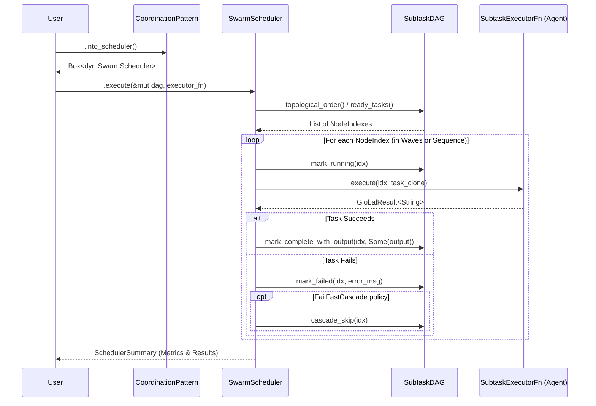

# Multi-Agent Systems

Guide to building systems with multiple coordinated agents.

## Overview

Multi-agent systems enable:
- **Specialization** — Different agents for different tasks
- **Parallelism** — Concurrent processing
- **Collaboration** — Agents working together
- **Robustness** — Fallback and redundancy

## Swarm DAG Orchestrator

The Swarm Orchestrator executes directed acyclic graph (DAG) pipelines via a dedicated **SwarmScheduler** engine. Crucially, the scheduler retains exclusive ownership of DAG state mutations (e.g., `mark_running`, `mark_complete_with_output`, `mark_failed`, `cascade_skip`), while the Subtask Executor (`SubtaskExecutorFn`) remains a pure function returning a `GlobalResult<String>`.



## Coordination Patterns

### Sequential Pipeline

```rust,ignore
use mofa_foundation::swarm::{CoordinationPattern, SubtaskDAG, SwarmSubtask};

let mut dag = SubtaskDAG::new("research-pipeline");
let idx_research = dag.add_task(SwarmSubtask::new("research", "Research topic"));
let idx_analysis = dag.add_task(SwarmSubtask::new("analysis", "Analyze data"));
let idx_writer   = dag.add_task(SwarmSubtask::new("writer", "Write report"));

// Enforce sequential dependency: research -> analysis -> writer
dag.add_dependency(idx_research, idx_analysis).unwrap();
dag.add_dependency(idx_analysis, idx_writer).unwrap();

let scheduler = CoordinationPattern::Sequential.into_scheduler();
let summary = scheduler.execute(&mut dag, executor_fn).await?;
```

### Parallel Execution

```rust,ignore
use mofa_foundation::swarm::{CoordinationPattern, SubtaskDAG, SwarmSubtask};
use mofa_foundation::swarm::{SwarmSchedulerConfig, FailurePolicy, ParallelScheduler};

let mut dag = SubtaskDAG::new("parallel-search");
let idx_a = dag.add_task(SwarmSubtask::new("A", "Search Source A"));
let idx_b = dag.add_task(SwarmSubtask::new("B", "Search Source B"));
let idx_c = dag.add_task(SwarmSubtask::new("C", "Search Source C"));

// Optional: Configure strict limits and failure cascades
let mut config = SwarmSchedulerConfig::default();
config.concurrency_limit = Some(2); // Only execute 2 queries concurrently
config.failure_policy = FailurePolicy::FailFastCascade;

let scheduler = ParallelScheduler::with_config(config);
let summary = scheduler.execute(&mut dag, executor_fn).await?;
```

### Consensus

```rust
use mofa_sdk::coordination::Consensus;

let consensus = Consensus::new()
    .with_agents(vec![expert_a, expert_b, expert_c])
    .with_threshold(0.6);

let decision = consensus.decide(&proposal).await?;
```

### Debate

```rust
use mofa_sdk::coordination::Debate;

let debate = Debate::new()
    .with_proposer(pro_agent)
    .with_opponent(con_agent)
    .with_judge(judge_agent);

let result = debate.debide(&topic).await?;
```

## Best Practices

1. **Clear Responsibilities** — Each agent should have one job
2. **Well-Defined Interfaces** — Use consistent input/output types
3. **Error Handling** — Plan for agent failures
4. **Timeouts** — Set appropriate timeouts
5. **Logging** — Log inter-agent communication

## SwarmMetricsExporter

`SwarmMetricsExporter` collects per-pattern counters and duration histograms from
every scheduler run and renders them as valid Prometheus text-format output.
No external dependency is required. the exposition format is produced with `std::fmt`.

### Recording runs

```rust
let exporter = SwarmMetricsExporter::new();

// after each scheduler execution
exporter.record_scheduler_run(&summary);

// after each swarm result (for HITL and token counts)
exporter.record_swarm_result(&metrics);
```

### Exported metrics

| metric | type | labels |
|--------|------|--------|
| `mofa_swarm_scheduler_runs_total` | counter | `pattern` |
| `mofa_swarm_tasks_total` | counter | `pattern`, `status` (succeeded/failed/skipped) |
| `mofa_swarm_scheduler_duration_seconds` | histogram | `pattern`, `le` |
| `mofa_swarm_hitl_interventions_total` | counter | none |
| `mofa_swarm_tokens_total` | counter | none |

### Rendering

```rust
// serve from a /metrics endpoint or print for debugging
let text = exporter.render();
```

`render()` returns an empty string until at least one run is recorded.
patterns are emitted in sorted order so the output is deterministic.

### Example

`examples/swarm_metrics_exporter/` simulates four runs across three patterns and
prints the full Prometheus exposition, including histogram buckets at
`[0.1, 0.5, 1.0, 2.5, 5.0, 10.0, 30.0, 60.0, 120.0]` seconds.

## See Also

- [Workflows](../concepts/workflows.md) — Workflow concepts
- [Examples](../examples/multi-agent-coordination.md) — Examples
