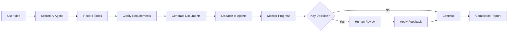

# Secretary Agent

The Secretary Agent pattern enables human-in-the-loop workflows where AI manages tasks while keeping humans in control of key decisions.

## Overview

The Secretary Agent acts as an intelligent coordinator that:

1. **Receives Ideas** — Records tasks and todos
2. **Clarifies Requirements** — Generates project documents
3. **Schedules Dispatch** — Calls execution agents
4. **Monitors Feedback** — Pushes key decisions to humans
5. **Acceptance Report** — Updates todos and status



## Basic Usage

### Creating a Secretary Agent

```rust
use mofa_sdk::secretary::{SecretaryAgent, SecretaryConfig};
use mofa_sdk::llm::openai_from_env;

let config = SecretaryConfig {
    human_feedback_enabled: true,
    max_delegations: 5,
    check_interval: Duration::from_secs(30),
};

let secretary = SecretaryAgent::builder()
    .with_llm(openai_from_env()?)
    .with_config(config)
    .with_delegation_target("researcher", researcher_agent)
    .with_delegation_target("writer", writer_agent)
    .build();
```

### Processing Tasks

```rust
use mofa_sdk::kernel::{AgentInput, AgentContext};

let ctx = AgentContext::new("exec-001");
let mut secretary = secretary.await?;

// Initialize
secretary.initialize(&ctx).await?;

// Process a task
let input = AgentInput::text("I want to build a web scraper for news articles");
let output = secretary.execute(input, &ctx).await?;

println!("{}", output.as_text().unwrap());

// Shutdown
secretary.shutdown().await?;
```

## The Five Phases

### Phase 1: Receive Ideas

The secretary records incoming ideas and creates a todo list:

```rust
// User input
let idea = "Build a CLI tool that summarizes GitHub issues";

// Secretary creates todos
// - [ ] Research existing solutions
// - [ ] Design CLI interface
// - [ ] Implement core functionality
// - [ ] Add tests
// - [ ] Document usage
```

### Phase 2: Clarify Requirements

The secretary generates clarifying questions:

```rust
let questions = secretary.clarify_requirements(&idea).await?;

// Questions might include:
// - What programming language?
// - Which LLM provider for summarization?
// - Should it handle private repos?
```

### Phase 3: Schedule Dispatch

Tasks are delegated to specialized agents:

```rust
// Secretary decides which agent to use
let dispatch = secretary.schedule_dispatch(&todos).await?;

// {
//   "research": ["Research existing solutions"],
//   "developer": ["Implement core functionality"],
//   "writer": ["Document usage"]
// }
```

### Phase 4: Monitor Feedback

The secretary monitors progress and flags important decisions:

```rust
// Set up feedback handler
secretary.on_decision(|decision| {
    println!("Decision needed: {}", decision.question);
    // Present to human
    let choice = prompt_human(&decision.options);
    async move { choice }
}).await;

// Secretary will pause and wait for human input on key decisions
```

### Phase 5: Acceptance Report

Final status and todo updates:

```rust
let report = secretary.generate_report().await?;

// {
//   "completed": ["Research", "Core implementation"],
//   "in_progress": ["Documentation"],
//   "blocked": [],
//   "next_steps": ["Add error handling"]
// }
```

## Human Feedback Integration

### Sync Mode (Blocking)

```rust
use mofa_sdk::secretary::HumanFeedback;

let feedback = HumanFeedback::sync(|decision| {
    print!("{} [y/n]: ", decision.question);
    let mut input = String::new();
    std::io::stdin().read_line(&mut input).unwrap();
    input.trim() == "y"
});

secretary.with_human_feedback(feedback);
```

### Async Mode (Non-blocking)

```rust
use mofa_sdk::secretary::AsyncFeedback;

let feedback = AsyncFeedback::new()
    .with_webhook("https://your-app.com/approve")
    .with_timeout(Duration::from_minutes(30));

secretary.with_async_feedback(feedback);
```

### File-based Feedback

```rust
use mofa_sdk::secretary::FileFeedback;

let feedback = FileFeedback::new("./feedback_queue/")
    .with_poll_interval(Duration::from_secs(5));

// Secretary writes decisions to ./feedback_queue/pending/
// Human writes responses to ./feedback_queue/resolved/
```

## Delegation

### Registering Agents

```rust
secretary
    .with_delegation_target("researcher", ResearcherAgent::new())
    .with_delegation_target("coder", CoderAgent::new())
    .with_delegation_target("reviewer", ReviewerAgent::new());
```

### Delegation Rules

```rust
use mofa_sdk::secretary::DelegationRule;

let rule = DelegationRule::new()
    .when_tag("code", delegate_to("coder"))
    .when_tag("research", delegate_to("researcher"))
    .when_complexity_gt(0.8, require_human_approval())
    .default(delegate_to("general"));

secretary.with_delegation_rules(rule);
```

## Configuration

```rust
pub struct SecretaryConfig {
    /// Enable human feedback loop
    pub human_feedback_enabled: bool,

    /// Maximum delegations before requiring approval
    pub max_delegations: usize,

    /// How often to check for feedback
    pub check_interval: Duration,

    /// Auto-approve low-risk decisions
    pub auto_approve_threshold: f32,

    /// Keep context size manageable
    pub context_window: usize,
}
```

## Examples

See the complete example in `examples/secretary_agent/`:

```bash
cargo run -p secretary_agent
```

## See Also

- [Workflows](../concepts/workflows.md) — Workflow orchestration
- [Multi-Agent Systems](multi-agent.md) — Coordination patterns
- [Tutorial Chapter 6](../tutorial/06-multi-agent.md) — Multi-agent tutorial
