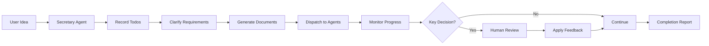

# Secretary Agent

The Secretary Agent pattern enables human-in-the-loop workflows where AI manages tasks while keeping humans in control of key decisions.

## Overview

The current Secretary API is event-loop based:

1. Build behavior with `DefaultSecretaryBuilder`
2. Start runtime with `SecretaryCore`
3. Exchange messages through `DefaultInput` and `DefaultOutput`

This pattern maps to the five work phases:

1. Receive ideas
2. Clarify requirements
3. Schedule dispatch
4. Monitor feedback and decisions
5. Generate acceptance reports


```mermaid
graph LR
    A[User Idea] --> B[Secretary Agent]
    B --> C[Record Todos]
    C --> D[Clarify Requirements]
    D --> E[Generate Documents]
    E --> F[Dispatch to Agents]
    F --> G[Monitor Progress]
    G --> H{Key Decision?}
    H -->|Yes| I[Human Review]
    H -->|No| J[Continue]
    I --> K[Apply Feedback]
    K --> J
    J --> L[Completion Report]
```

## Basic Usage

```rust
use mofa_sdk::secretary::{
    AgentInfo,
    ChannelConnection,
    DefaultInput,
    DefaultOutput,
    DefaultSecretaryBuilder,
    SecretaryCommand,
    SecretaryCore,
    TodoPriority,
};

#[tokio::main]
async fn main() -> Result<(), Box<dyn std::error::Error>> {
    // 1) Register executors
    let mut backend = AgentInfo::new("backend_agent", "Backend Agent");
    backend.capabilities = vec!["backend".to_string(), "api".to_string()];
    backend.available = true;
    backend.performance_score = 0.9;

    // 2) Build secretary behavior
    let behavior = DefaultSecretaryBuilder::new()
        .with_name("Project Secretary")
        .with_auto_clarify(true)
        .with_auto_dispatch(true)
        .with_executor(backend)
        .build();

    // 3) Start core loop
    let (conn, input_tx, mut output_rx) = ChannelConnection::new_pair(32);
    let (handle, join_handle) = SecretaryCore::new(behavior).start(conn).await;

    // Phase 1: Receive idea
    input_tx
        .send(DefaultInput::Idea {
            content: "Build a GitHub issue summarizer CLI".to_string(),
            priority: Some(TodoPriority::High),
            metadata: None,
        })
        .await?;

    // Phase 2 and 3: Trigger clarify and dispatch for a specific todo
    input_tx
        .send(DefaultInput::Command(SecretaryCommand::Clarify {
            todo_id: "todo_1".to_string(),
        }))
        .await?;
    input_tx
        .send(DefaultInput::Command(SecretaryCommand::Dispatch {
            todo_id: "todo_1".to_string(),
        }))
        .await?;

    // Phase 4 and 5: Handle feedback, decisions, and reports
    while let Some(output) = output_rx.recv().await {
        match output {
            DefaultOutput::Acknowledgment { message } => {
                println!("ack: {}", message);
            }
            DefaultOutput::DecisionRequired { decision } => {
                println!("decision required: {}", decision.description);

                // Human responds by sending a Decision input
                input_tx
                    .send(DefaultInput::Decision {
                        decision_id: decision.id,
                        selected_option: 0,
                        comment: Some("approved".to_string()),
                    })
                    .await?;
            }
            DefaultOutput::StatusUpdate { todo_id, status } => {
                println!("{} => {:?}", todo_id, status);
            }
            DefaultOutput::TaskCompleted { todo_id, result } => {
                println!("completed {}: {}", todo_id, result.summary);
            }
            DefaultOutput::Report { report } => {
                println!("report: {}", report.content);
                break;
            }
            DefaultOutput::Error { message } => {
                eprintln!("error: {}", message);
            }
            DefaultOutput::Message { content } => {
                println!("message: {}", content);
            }
        }
    }

    handle.stop().await;
    join_handle.abort();
    Ok(())
}
```

## The Five Phases in API Terms

### Phase 1: Receive Ideas

Use `DefaultInput::Idea` to submit user tasks.

### Phase 2: Clarify Requirements

Use `DefaultInput::Command(SecretaryCommand::Clarify { .. })`.

### Phase 3: Schedule Dispatch

Use `DefaultInput::Command(SecretaryCommand::Dispatch { .. })`.

### Phase 4: Monitor Feedback

Handle `DefaultOutput::DecisionRequired` and send back `DefaultInput::Decision`.

### Phase 5: Acceptance Report

Use `DefaultInput::Command(SecretaryCommand::GenerateReport { .. })` and consume `DefaultOutput::Report`.

## Human Feedback Integration

Human feedback is handled through message exchange:

1. Receive `DefaultOutput::DecisionRequired`
2. Ask a human for choice
3. Send `DefaultInput::Decision`

```rust
if let DefaultOutput::DecisionRequired { decision } = output {
    let selected_option = 0; // Replace with real human input

    input_tx
        .send(DefaultInput::Decision {
            decision_id: decision.id,
            selected_option,
            comment: Some("approved by operator".to_string()),
        })
        .await?;
}
```

## Delegation

Register executors through the builder and let dispatch commands route tasks:

```rust
use mofa_sdk::secretary::{AgentInfo, DefaultSecretaryBuilder, DispatchStrategy};

let mut researcher = AgentInfo::new("researcher", "Research Agent");
researcher.capabilities = vec!["research".to_string()];
researcher.available = true;
researcher.performance_score = 0.85;

let mut writer = AgentInfo::new("writer", "Writer Agent");
writer.capabilities = vec!["writing".to_string()];
writer.available = true;
writer.performance_score = 0.9;

let behavior = DefaultSecretaryBuilder::new()
    .with_dispatch_strategy(DispatchStrategy::CapabilityFirst)
    .with_executor(researcher)
    .with_executor(writer)
    .build();
```

## Configuration

Use builder methods instead of a standalone config struct:

- `.with_name(...)`
- `.with_llm(...)`
- `.with_auto_clarify(...)`
- `.with_auto_dispatch(...)`
- `.with_dispatch_strategy(...)`
- `.with_executor(...)`

## Examples

See the complete runtime example in `examples/secretary_agent/`:

```bash
cargo run -p secretary_agent
```

## See Also

- [Workflows](../concepts/workflows.md) - Workflow orchestration
- [Multi-Agent Systems](multi-agent.md) - Coordination patterns
- [Tutorial Chapter 6](../tutorial/06-multi-agent.md) - Multi-agent tutorial
