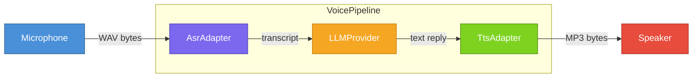

# Voice Integration Guide

MoFA ships a production-ready voice pipeline that connects automatic speech recognition (ASR), a large language model (LLM), and text-to-speech synthesis (TTS) in a single API call. Cloud adapters for Deepgram, ElevenLabs, and OpenAI (Whisper + TTS-1) are included out of the box.

---

## Architecture



The pipeline is fully decoupled — swap any adapter without touching the other two.

---

## Quick Start

### 1. Add dependencies

```toml
# Cargo.toml
[dependencies]
mofa-sdk          = { path = "../../crates/mofa-sdk" }
mofa-integrations = { path = "../../crates/mofa-integrations", features = ["deepgram", "elevenlabs"] }
tokio             = { workspace = true, features = ["full"] }
```

### 2. Set environment variables

```bash
export OPENAI_API_KEY=sk-...        # LLM
export DEEPGRAM_API_KEY=...         # ASR
export ELEVENLABS_API_KEY=...       # TTS
```

### 3. Wire the pipeline

```rust,ignore
use mofa_sdk::voice::{VoicePipeline, VoicePipelineConfig};
use mofa_sdk::llm::openai_from_env;
use mofa_integrations::speech::{
    deepgram::{DeepgramAsrAdapter, DeepgramConfig},
    elevenlabs::{ElevenLabsTtsAdapter, ElevenLabsConfig},
};
use std::sync::Arc;

#[tokio::main]
async fn main() -> anyhow::Result<()> {
    let asr = Arc::new(DeepgramAsrAdapter::new(DeepgramConfig::from_env()));
    let llm = Arc::new(openai_from_env()?);
    let tts = Arc::new(ElevenLabsTtsAdapter::new(ElevenLabsConfig::from_env()));

    let config = VoicePipelineConfig::new()
        .with_voice("Rachel")
        .with_system_prompt("You are a concise voice assistant.");

    let pipeline = VoicePipeline::new(asr, llm, tts, config);

    // wav_bytes: &[u8] captured from the microphone
    let result = pipeline.process(&wav_bytes).await?;
    println!("You:   {}", result.transcription.text);
    println!("Agent: {}", result.llm_reply);
    // play result.audio_output.data (MP3) via rodio or platform audio API
    Ok(())
}
```

See [`examples/voice_agent/`](../../../examples/voice_agent/) for a complete runnable demo including microphone capture (`cpal` + `hound`) and audio playback (`rodio`).

---

## Pipeline API

### `VoicePipeline::new`

```rust,ignore
pub fn new(
    asr: Arc<dyn AsrAdapter>,
    llm: Arc<dyn LLMProvider>,
    tts: Arc<dyn TtsAdapter>,
    config: VoicePipelineConfig,
) -> Self
```

### `VoicePipelineConfig` builder

| Method | Default | Description |
|--------|---------|-------------|
| `.with_voice(name)` | `"alloy"` | TTS voice name (provider-specific) |
| `.with_system_prompt(prompt)` | `""` | Injected as the system message for the LLM |
| `.with_tts_config(cfg)` | `TtsConfig::default()` | Audio format, speed, etc. |
| `.with_asr_config(cfg)` | `AsrConfig::default()` | Language hints, punctuation, etc. |

### `VoicePipelineResult`

| Field | Type | Description |
|-------|------|-------------|
| `transcription` | `TranscriptionResult` | ASR output (`.text`, `.segments`, `.language`, `.confidence`) |
| `llm_reply` | `String` | Raw LLM text response |
| `audio_output` | `AudioOutput` | TTS output (`.data: Vec<u8>`, `.format: AudioFormat`) |

---

## Adapter Selection

### ASR adapters

| Adapter | Feature flag | Notes |
|---------|-------------|-------|
| `DeepgramAsrAdapter` | `deepgram` | `nova-2` model, word-level timestamps |
| `OpenAiAsrAdapter` | `openai-speech` | Whisper, 100+ languages |

### TTS adapters

| Adapter | Feature flag | Notes |
|---------|-------------|-------|
| `ElevenLabsTtsAdapter` | `elevenlabs` | Dynamic voice listing, stability controls |
| `OpenAiTtsAdapter` | `openai-speech` | TTS-1 / TTS-1-HD, 6 voices |

### Swapping adapters at runtime

```rust,ignore
// Use OpenAI Whisper instead of Deepgram:
use mofa_integrations::speech::openai::{OpenAiAsrAdapter, OpenAIConfig};
let asr = Arc::new(OpenAiAsrAdapter::new(OpenAIConfig::from_env()));
```

---

## Runtime Registry

`SpeechAdapterRegistry` allows registering multiple adapters and selecting them by name at runtime — useful for multi-tenant or configurable deployments.

```rust,ignore
use mofa_sdk::voice::SpeechAdapterRegistry;

let mut registry = SpeechAdapterRegistry::new();
registry.register_asr("deepgram", Arc::new(deepgram_adapter));
registry.register_asr("whisper", Arc::new(openai_asr_adapter));
registry.set_default_asr("deepgram");

let asr = registry.default_asr().expect("no default ASR");
```

---

## Feature Flags

All three cloud adapters are behind optional feature flags in `mofa-integrations`:

```toml
[dependencies]
mofa-integrations = { path = "...", features = ["deepgram", "elevenlabs", "openai-speech"] }
```

| Flag | Enables |
|------|---------|
| `deepgram` | `DeepgramAsrAdapter` |
| `elevenlabs` | `ElevenLabsTtsAdapter` |
| `openai-speech` | `OpenAiTtsAdapter` + `OpenAiAsrAdapter` |

Compile with only the flags you need — unused adapters produce zero binary overhead.

---

## Runnable Example

```bash
cd examples/voice_agent
export OPENAI_API_KEY=sk-...
export DEEPGRAM_API_KEY=...
export ELEVENLABS_API_KEY=...
cargo run
# Press Enter → speak for 5 seconds → transcript + LLM reply printed → audio plays
```
