# Introduction

<div class="hero">
<h1>MoFA</h1>
<p>A production-grade AI agent framework built in Rust, designed for extreme performance, unlimited extensibility, and runtime programmability.</p>
<div class="cta-buttons">
<a href="getting-started/installation.html" class="btn btn-primary">Get Started →</a>
<a href="concepts/architecture.html" class="btn btn-secondary">Architecture</a>
</div>
</div>

## What is MoFA?

MoFA (Modular Framework for Agents) implements a **microkernel + dual-layer plugin system** architecture that enables you to build sophisticated AI agents with:

<div class="feature-grid">
<div class="feature-card">
<h3>🚀 Extreme Performance</h3>
<p>Rust core with zero-cost abstractions, async runtime, and efficient memory management.</p>
</div>
<div class="feature-card">
<h3>🔧 Unlimited Extensibility</h3>
<p>Dual-layer plugins: compile-time (Rust/WASM) for performance + runtime (Rhai scripts) for flexibility.</p>
</div>
<div class="feature-card">
<h3>🌐 Multi-Language Support</h3>
<p>Python, Java, Swift, Kotlin, Go bindings via UniFFI and PyO3.</p>
</div>
<div class="feature-card">
<h3>🏭 Production Ready</h3>
<p>Built-in persistence, monitoring, distributed support, and human-in-the-loop workflows.</p>
</div>
</div>

## Architecture

MoFA follows strict microkernel design principles:

```mermaid
graph TB
    subgraph "User Layer"
        U[Your Agents]
    end

    subgraph "SDK Layer"
        SDK[mofa-sdk]
    end

    subgraph "Business Layer"
        F[mofa-foundation<br/>LLM • Patterns • Persistence]
    end

    subgraph "Runtime Layer"
        R[mofa-runtime<br/>Lifecycle • Events • Plugins]
    end

    subgraph "Kernel Layer"
        K[mofa-kernel<br/>Traits • Types • Core]
    end

    subgraph "Plugin Layer"
        P[mofa-plugins<br/>Rust/WASM • Rhai]
    end

    U --> SDK
    SDK --> F
    SDK --> R
    F --> K
    R --> K
    R --> P
```



## Key Features

### Multi-Agent Coordination

MoFA supports 7 LLM-driven collaboration modes:

| Mode | Description | Use Case |
|------|-------------|----------|
| Request-Response | One-to-one deterministic tasks | Simple Q&A |
| Publish-Subscribe | One-to-many broadcast | Event notification |
| Consensus | Multi-round negotiation | Decision making |
| Debate | Alternating discussion | Quality improvement |
| Parallel | Simultaneous execution | Batch processing |
| Sequential | Pipeline execution | Data transformation |
| Custom | User-defined modes | Special workflows |

### Secretary Agent Pattern

Human-in-the-loop workflow management with 5 phases:

1. **Receive Ideas** → Record todos
2. **Clarify Requirements** → Project documents
3. **Schedule Dispatch** → Call execution agents
4. **Monitor Feedback** → Push key decisions to humans
5. **Acceptance Report** → Update todos

### Dual-Layer Plugin System

- **Compile-time Plugins**: Rust/WASM for performance-critical paths
- **Runtime Plugins**: Rhai scripts for dynamic business logic with hot-reload

## Quick Example

```rust
use mofa_sdk::kernel::prelude::*;
use mofa_sdk::llm::{LLMClient, openai_from_env};

struct MyAgent {
    client: LLMClient,
}

#[async_trait]
impl MoFAAgent for MyAgent {
    fn id(&self) -> &str { "my-agent" }
    fn name(&self) -> &str { "My Agent" }

    async fn execute(&mut self, input: AgentInput, _ctx: &AgentContext) -> AgentResult<AgentOutput> {
        let response = self.client.ask(&input.to_text()).await
            .map_err(|e| AgentError::ExecutionFailed(e.to_string()))?;
        Ok(AgentOutput::text(response))
    }
}

#[tokio::main]
async fn main() -> Result<(), Box<dyn std::error::Error>> {
    let client = LLMClient::new(Arc::new(openai_from_env()?));
    let mut agent = MyAgent { client };
    let ctx = AgentContext::new("exec-001");

    let output = agent.execute(AgentInput::text("Hello!"), &ctx).await?;
    println!("{}", output.as_text().unwrap());

    Ok(())
}
```

## Getting Started

| Goal | Where to go |
|------|-------------|
| Get running in 10 minutes | [Installation](getting-started/installation.md) |
| Configure your LLM | [LLM Setup](getting-started/llm-setup.md) |
| Build your first agent | [Your First Agent](getting-started/first-agent.md) |
| Learn step by step | [Tutorial](tutorial/README.md) |
| Understand the design | [Architecture](concepts/architecture.md) |

## Who Should Use MoFA?

- **AI Engineers** building production AI agents
- **Platform Teams** needing extensible agent infrastructure
- **Researchers** experimenting with multi-agent systems
- **Developers** who want type-safe, high-performance agent frameworks

## Community & Support

- [GitHub Discussions](https://github.com/mofa-org/mofa/discussions) — Ask questions
- [Discord](https://discord.com/invite/hKJZzDMMm9) — Chat with the community
- [Contributing](appendix/contributing.md) — Help improve MoFA

## License

MoFA is licensed under the [Apache License 2.0](https://github.com/mofa-org/mofa/blob/main/LICENSE).

---

<div class="callout info">
<strong>📖 Documentation Languages:</strong> This documentation is available in <a href="introduction.html">English</a> and <a href="zh/introduction.html">简体中文</a>.
</div>
