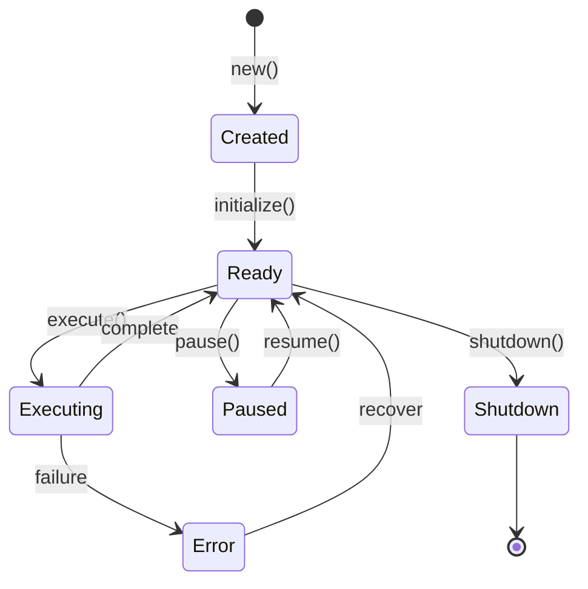

# 智能体

智能体是 MoFA 应用的核心构建块。本页解释智能体的工作原理以及如何构建它们。

## MoFAAgent Trait

每个智能体都实现 `MoFAAgent` trait，它定义了基本的智能体接口:

```rust
#[async_trait]
pub trait MoFAAgent: Send + Sync {
    // 身份
    fn id(&self) -> &str;
    fn name(&self) -> &str;
    fn capabilities(&self) -> &AgentCapabilities;
    fn state(&self) -> AgentState;

    // 生命周期
    async fn initialize(&mut self, ctx: &AgentContext) -> AgentResult<()>;
    async fn execute(&mut self, input: AgentInput, ctx: &AgentContext) -> AgentResult<AgentOutput>;
    async fn shutdown(&mut self) -> AgentResult<()>;

    // 可选的生命周期钩子
    async fn pause(&mut self) -> AgentResult<()> { Ok(()) }
    async fn resume(&mut self) -> AgentResult<()> { Ok(()) }
}
```

## 智能体生命周期



### 状态

| 状态 | 描述 |
|-------|-------------|
| `Created` | 智能体已构建但尚未初始化 |
| `Ready` | 智能体准备好处理任务 |
| `Executing` | 智能体正在处理任务 |
| `Paused` | 智能体暂时挂起 |
| `Error` | 智能体遇到错误 |
| `Shutdown` | 智能体已关闭 |

### 生命周期方法

#### initialize

智能体启动时调用一次。用于:
- 建立连接（数据库、API 客户端）
- 加载配置
- 预热缓存

```rust
async fn initialize(&mut self, _ctx: &AgentContext) -> AgentResult<()> {
    // 连接数据库
    self.db.connect().await?;
    // 加载提示词
    self.load_prompts().await?;
    self.state = AgentState::Ready;
    Ok(())
}
```

#### execute

每个任务调用。这是智能体主要逻辑所在。

```rust
async fn execute(&mut self, input: AgentInput, ctx: &AgentContext) -> AgentResult<AgentOutput> {
    self.state = AgentState::Executing;

    // 您的智能体逻辑
    let result = self.process(input).await?;

    self.state = AgentState::Ready;
    Ok(result)
}
```

#### shutdown

智能体停止时调用。用于:
- 关闭连接
- 刷新缓冲区
- 释放资源

```rust
async fn shutdown(&mut self) -> AgentResult<()> {
    self.db.close().await?;
    self.state = AgentState::Shutdown;
    Ok(())
}
```

## 智能体能力

能力描述智能体能做什么:

```rust
let capabilities = AgentCapabilities::builder()
    .tag("llm")           // 用于路由的标签
    .tag("qa")
    .input_type(InputType::Text)     // 接受文本输入
    .output_type(OutputType::Text)   // 产生文本输出
    .max_concurrency(10)             // 可处理 10 个并发任务
    .supports_streaming(true)        // 支持流式输出
    .build();
```

### 能力字段

| 字段 | 类型 | 描述 |
|-------|------|-------------|
| `tags` | `Vec<String>` | 用于智能体发现和路由的标签 |
| `input_type` | `InputType` | 期望的输入格式 |
| `output_type` | `OutputType` | 产生的输出格式 |
| `max_concurrency` | `usize` | 最大并发执行数 |
| `supports_streaming` | `bool` | 是否支持流式传输 |

## 输入和输出

### AgentInput

包装带有元数据的输入数据:

```rust
// 文本输入
let input = AgentInput::text("What is Rust?");

// 结构化输入
let input = AgentInput::json(json!({
    "query": "search term",
    "limit": 10
}));

// 带元数据
let input = AgentInput::text("Hello")
    .with_session_id("session-123")
    .with_metadata("source", "web");
```

### AgentOutput

包装带有元数据的输出数据:

```rust
// 文本输出
let output = AgentOutput::text("Hello, world!");

// 结构化输出
let output = AgentOutput::json(json!({
    "answer": "42",
    "confidence": 0.95
}));

// 带元数据
let output = AgentOutput::text("Response")
    .with_tokens_used(150)
    .with_latency_ms(250);
```

## 智能体上下文

`AgentContext` 提供执行上下文:

```rust
async fn execute(&mut self, input: AgentInput, ctx: &AgentContext) -> AgentResult<AgentOutput> {
    // 获取执行 ID
    let exec_id = ctx.execution_id();

    // 获取会话 ID（如果有）
    let session = ctx.session_id();

    // 存储数据供后续使用
    ctx.set("last_query", input.to_text()).await;

    // 检索存储的数据
    let previous: Option<String> = ctx.get("last_query").await;

    // 访问智能体元数据
    let metadata = ctx.metadata();

    Ok(AgentOutput::text("Done"))
}
```

## 内置智能体类型

### LLMAgent

由 LLM 驱动的智能体:

```rust
use mofa_sdk::llm::{LLMAgentBuilder, openai_from_env};

let agent = LLMAgentBuilder::from_env()?
    .with_id("assistant")
    .with_name("AI Assistant")
    .with_system_prompt("You are a helpful assistant.")
    .with_sliding_window(10)  // 记住最近 10 条消息
    .build_async()
    .await;
```

### ReActAgent

带工具的推理 + 行动智能体:

```rust
use mofa_sdk::react::ReActAgent;

let agent = ReActAgent::builder()
    .with_llm(client)
    .with_tools(vec![
        Arc::new(CalculatorTool),
        Arc::new(WeatherTool),
    ])
    .with_max_iterations(5)
    .build();
```

### SecretaryAgent

人在回路的工作流管理:

```rust
use mofa_sdk::secretary::SecretaryAgent;

let agent = SecretaryAgent::builder()
    .with_llm(client)
    .with_human_feedback(true)
    .with_delegation_targets(vec!["researcher", "writer"])
    .build();
```

## 使用 AgentRunner

对于生产环境使用，用 `AgentRunner` 包装您的智能体:

```rust
use mofa_sdk::runtime::AgentRunner;

#[tokio::main]
async fn main() -> Result<(), Box<dyn std::error::Error>> {
    let agent = MyAgent::new();
    let mut runner = AgentRunner::new(agent).await?;

    // 执行多个任务
    for task in tasks {
        let output = runner.execute(AgentInput::text(task)).await?;
        println!("{}", output.as_text().unwrap());
    }

    runner.shutdown().await?;
    Ok(())
}
```

### 带上下文

```rust
let ctx = AgentContext::with_session("exec-001", "session-123");
ctx.set("user_id", "user-456").await;

let mut runner = AgentRunner::with_context(agent, ctx).await?;
```

## 错误处理

```rust
async fn execute(&mut self, input: AgentInput, ctx: &AgentContext) -> AgentResult<AgentOutput> {
    // 不同错误类型
    let result = self.llm.ask(&input.to_text()).await
        .map_err(|e| AgentError::ExecutionFailed(e.to_string()))?;

    if result.is_empty() {
        return Err(AgentError::NoOutput);
    }

    if self.rate_limited() {
        return Err(AgentError::RateLimited { retry_after: 60 });
    }

    Ok(AgentOutput::text(result))
}
```

### 错误类型

| 错误 | 描述 |
|-------|-------------|
| `ExecutionFailed` | 一般执行错误 |
| `NoOutput` | 智能体未产生输出 |
| `RateLimited` | 超过速率限制 |
| `Timeout` | 执行超时 |
| `InvalidInput` | 输入验证失败 |
| `ResourceExhausted` | 资源不可用 |

## 另见

- [工具](tools.md) — 添加函数调用能力
- [工作流](workflows.md) — 编排多个智能体
- [API 参考: 智能体](../api-reference/kernel/agent.md) — 详细 API 文档
