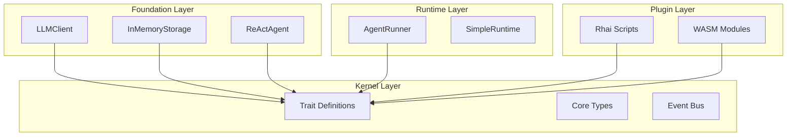

# 微内核设计

MoFA 的微内核架构提供了最小化的核心和最大的可扩展性。本页解释设计原则及其在 MoFA 中的应用。

## 什么是微内核?

微内核是一个最小化的软件层，仅提供最基本的服务。所有其他功能由通过明确定义的接口进行通信的外部组件（插件、服务）提供。

### 优势

- **最小化核心**: 更小的攻击面，更容易验证
- **灵活性**: 组件可以添加、删除或替换
- **隔离性**: 插件故障不会导致核心崩溃
- **可扩展性**: 无需修改核心即可添加新功能

## MoFA 的微内核: mofa-kernel

`mofa-kernel` crate 是 MoFA 的微内核。它提供:

### 核心 Trait

```rust
// 基本的智能体接口
pub trait MoFAAgent: Send + Sync {
    fn id(&self) -> &str;
    fn name(&self) -> &str;
    fn capabilities(&self) -> &AgentCapabilities;
    fn state(&self) -> AgentState;

    async fn initialize(&mut self, ctx: &AgentContext) -> AgentResult<()>;
    async fn execute(&mut self, input: AgentInput, ctx: &AgentContext) -> AgentResult<AgentOutput>;
    async fn shutdown(&mut self) -> AgentResult<()>;
}

// 用于函数调用的工具接口
pub trait Tool: Send + Sync {
    fn name(&self) -> &str;
    fn description(&self) -> &str;
    fn parameters_schema(&self) -> Option<Value>;
    async fn execute(&self, params: Value) -> Result<Value, ToolError>;
}

// 用于持久化的记忆接口
pub trait Memory: Send + Sync {
    async fn store(&mut self, key: &str, value: &str) -> Result<(), MemoryError>;
    async fn retrieve(&self, key: &str) -> Result<Option<String>, MemoryError>;
}
```

### 核心类型

```rust
pub struct AgentContext { /* ... */ }
pub struct AgentInput { /* ... */ }
pub struct AgentOutput { /* ... */ }
pub struct AgentState { /* ... */ }
pub struct AgentCapabilities { /* ... */ }
pub struct AgentError { /* ... */ }
```

### 核心基础设施

- **事件总线**: 组件间的消息传递
- **插件接口**: 插件如何连接到内核
- **生命周期管理**: 状态转换和钩子

## 架构层次



## 关键设计原则

### 1. 定义与实现分离

**Kernel 定义**: `Tool` trait
**Foundation 实现**: `SimpleToolRegistry`, `EchoTool`

```rust
// kernel: 仅接口
pub trait ToolRegistry: Send + Sync {
    fn register(&mut self, tool: Arc<dyn Tool>) -> AgentResult<()>;
    fn get(&self, name: &str) -> Option<Arc<dyn Tool>>;
}

// foundation: 具体实现
pub struct SimpleToolRegistry {
    tools: HashMap<String, Arc<dyn Tool>>,
}

impl ToolRegistry for SimpleToolRegistry {
    fn register(&mut self, tool: Arc<dyn Tool>) -> AgentResult<()> {
        self.tools.insert(tool.name().to_string(), tool);
        Ok(())
    }
    // ...
}
```

### 2. 依赖倒置

高层模块不依赖低层模块。两者都依赖于抽象。

```rust
// Foundation 依赖 kernel 抽象，而非具体实现
pub struct LLMAgent {
    client: Arc<dyn LLMProvider>,  // 抽象
    // NOT: client: OpenAIProvider  // 具体
}
```

### 3. 单一职责

每个 crate 有一个明确的职责:

| Crate | 单一职责 |
|-------|----------------------|
| `mofa-kernel` | 定义核心接口 |
| `mofa-foundation` | 实现业务逻辑 |
| `mofa-runtime` | 管理智能体生命周期 |
| `mofa-plugins` | 插件基础设施 |

### 4. 接口隔离

Trait 小而专注:

```rust
// NOT: 一个巨大的 trait
pub trait Agent {
    fn execute(&self, input: AgentInput) -> AgentOutput;
    fn store_memory(&self, key: &str, value: &str);
    fn send_message(&self, msg: Message);
    fn load_plugin(&self, plugin: Plugin);
}

// INSTEAD: 专注的 trait
pub trait MoFAAgent { /* ... */ }
pub trait AgentMessaging { /* ... */ }
pub trait AgentPluginSupport { /* ... */ }
```

## 插件系统

微内核架构使 MoFA 的双层插件系统成为可能:

### 编译时插件 (Rust/WASM)

- 零成本抽象
- 性能关键路径
- 类型安全接口

```rust
pub struct MyToolPlugin;

impl Tool for MyToolPlugin {
    fn name(&self) -> &str { "my_tool" }
    async fn execute(&self, params: Value) -> Result<Value, ToolError> {
        // 高性能实现
    }
}
```

### 运行时插件 (Rhai)

- 热重载
- 业务逻辑扩展
- 动态配置

```rhai
// scripts/my_plugin.rhai
fn process(input) {
    let result = call_llm(input);
    transform(result)
}
```

## 常见模式

### 外观模式 (SDK 层)

SDK 作为外观，简化对所有层的访问:

```rust
// 用户只需从 SDK 导入
use mofa_sdk::kernel::MoFAAgent;
use mofa_sdk::runtime::AgentRunner;
use mofa_sdk::llm::LLMClient;

// SDK 从多个 crate 重新导出
pub use mofa_kernel::agent::*;
pub use mofa_runtime::*;
pub use mofa_foundation::llm::*;
```

### 构建器模式

复杂对象逐步构建:

```rust
let agent = LLMAgentBuilder::from_env()?
    .with_id("my-agent")
    .with_name("My Agent")
    .with_system_prompt("You are helpful.")
    .with_sliding_window(10)
    .build_async()
    .await;
```

### 策略模式

同一接口的不同实现:

```rust
// 无需更改代码即可切换 LLM 提供商
let provider: Arc<dyn LLMProvider> = match config.provider {
    "openai" => Arc::new(OpenAIProvider::from_env()?),
    "anthropic" => Arc::new(AnthropicProvider::from_env()?),
    "ollama" => Arc::new(OllamaProvider::new()?),
};
```

## 应避免的反模式

### ❌ 在 Foundation 中重新定义 Kernel Trait

```rust
// WRONG: 重复的 trait 定义
// foundation/src/agent.rs
pub trait Tool { /* ... */ }  // 已在 kernel 中定义!
```

### ❌ 在 Kernel 中包含具体实现

```rust
// WRONG: kernel 中的实现
// kernel/src/storage.rs
pub struct InMemoryStorage { /* ... */ }  // 应该在 foundation 中!
```

### ❌ 循环依赖

```rust
// WRONG: Kernel 依赖 Foundation
// kernel/Cargo.toml
[dependencies]
mofa-foundation = { path = "../foundation" }  // 创建循环!
```

## 另见

- [架构概览](architecture.md) — 完整架构文档
- [智能体](agents.md) — MoFAAgent trait
- [插件](plugins.md) — 双层插件系统
