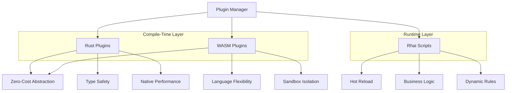
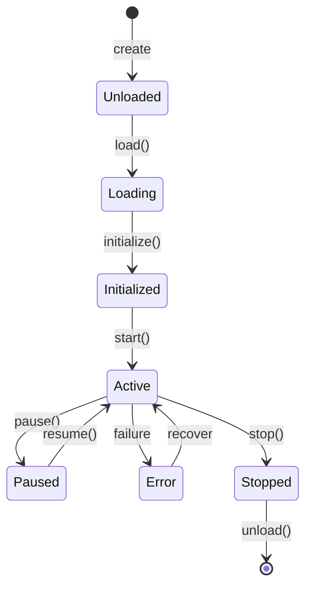

# 插件

MoFA 的双层插件系统通过编译时和运行时扩展实现无限的可扩展性。

## 双层架构



| 层 | 技术 | 用例 |
|-------|------------|----------|
| **编译时** | Rust / WASM | 性能关键、类型安全 |
| **运行时** | Rhai 脚本 | 业务逻辑、热重载 |

## 编译时插件

### Rust 插件

直接在 Rust 中创建插件以获得最大性能:

```rust
use mofa_sdk::kernel::plugin::{AgentPlugin, PluginContext, PluginResult};
use async_trait::async_trait;

pub struct LLMPlugin {
    name: String,
    version: String,
}

impl LLMPlugin {
    pub fn new() -> Self {
        Self {
            name: "llm-plugin".to_string(),
            version: "1.0.0".to_string(),
        }
    }
}

#[async_trait]
impl AgentPlugin for LLMPlugin {
    fn name(&self) -> &str {
        &self.name
    }

    fn version(&self) -> &str {
        &self.version
    }

    async fn initialize(&mut self, _ctx: &PluginContext) -> PluginResult<()> {
        // 初始化插件资源
        Ok(())
    }

    async fn on_agent_execute(
        &self,
        input: &AgentInput,
        output: &mut AgentOutput,
    ) -> PluginResult<()> {
        // 修改或增强智能体执行
        Ok(())
    }

    async fn shutdown(&mut self) -> PluginResult<()> {
        // 清理资源
        Ok(())
    }
}
```

### WASM 插件

用于具有沙箱隔离的语言灵活性:

```rust
// 在您的 WASM 模块中 (Rust)
use wasm_bindgen::prelude::*;

#[wasm_bindgen]
pub fn process_input(input: &str) -> String {
    // 处理输入并返回结果
    format!("Processed: {}", input)
}
```

加载 WASM 插件:

```rust
use mofa_sdk::plugins::WasmPlugin;

let plugin = WasmPlugin::load("./plugins/my_plugin.wasm").await?;
plugin_manager.register(plugin).await?;
```

## 运行时插件 (Rhai)

Rhai 是一种嵌入在 Rust 中的脚本语言，非常适合热重载的业务逻辑。

### 基本 Rhai 脚本

```rhai
// plugins/content_filter.rhai

fn process(input) {
    let text = input.to_string();

    // 检查禁止内容
    let prohibited = ["spam", "inappropriate"];

    for word in prohibited {
        if text.contains(word) {
            return error("Prohibited content detected");
        }
    }

    // 转换内容
    let result = text.to_upper_case();
    result
}

fn on_init() {
    print("Content filter plugin loaded!");
}
```

### 加载 Rhai 插件

```rust
use mofa_sdk::plugins::{RhaiPluginManager, RhaiPlugin};

let mut manager = RhaiPluginManager::new();

// 从文件加载插件
let plugin = RhaiPlugin::from_file("./plugins/content_filter.rhai").await?;
manager.register(plugin).await?;

// 调用插件函数
let result = manager.call("process", &input).await?;
```

### 热重载

Rhai 插件可以无需重启即可热重载:

```rust
use mofa_sdk::plugins::HotReloadWatcher;

// 监视文件变化
let watcher = HotReloadWatcher::new("./plugins/")?;

watcher.on_change(|path| async move {
    println!("Reloading plugin: {:?}", path);
    manager.reload(path).await?;
    Ok(())
});
```

### Rhai 脚本 API

Rhai 脚本可以访问:

```rhai
// JSON 操作
let data = json::parse(input);
let value = data["key"];
let output = json::stringify(data);

// 字符串操作
let upper = text.to_upper_case();
let parts = text.split(",");
let trimmed = text.trim();

// 集合
let list = [];
list.push(item);
let first = list[0];

// HTTP 调用（启用时）
let response = http::get("https://api.example.com/data");

// 日志
print("Debug message");
```

## 插件生命周期



## 插件管理器

插件管理器处理插件生命周期:

```rust
use mofa_sdk::plugins::PluginManager;

let mut manager = PluginManager::new()?;

// 注册插件
manager.register(Arc::new(LLMPlugin::new())).await?;
manager.register(Arc::new(RhaiPlugin::from_file("./rules.rhai")?)).await?;

// 初始化所有插件
manager.initialize_all(&ctx).await?;

// 执行插件钩子
manager.on_before_execute(&input).await?;
let output = agent.execute(input, &ctx).await?;
manager.on_after_execute(&output).await?;

// 关闭
manager.shutdown_all().await?;
```

## 插件钩子

插件可以在智能体生命周期的各个点进行钩子:

| 钩子 | 描述 |
|------|-------------|
| `on_initialize` | 智能体初始化时调用 |
| `on_before_execute` | 智能体执行前调用 |
| `on_after_execute` | 智能体执行后调用 |
| `on_error` | 发生错误时调用 |
| `on_shutdown` | 智能体关闭时调用 |

```rust
#[async_trait]
impl AgentPlugin for MyPlugin {
    async fn on_before_execute(&self, input: &AgentInput) -> PluginResult<()> {
        // 验证或转换输入
        Ok(())
    }

    async fn on_after_execute(&self, output: &mut AgentOutput) -> PluginResult<()> {
        // 修改或增强输出
        Ok(())
    }
}
```

## 插件类别

### LLM 插件

扩展 LLM 功能:

```rust
pub struct PromptTemplatePlugin {
    templates: HashMap<String, String>,
}

impl PromptTemplatePlugin {
    pub fn render(&self, name: &str, vars: HashMap<&str, &str>) -> String {
        let template = self.templates.get(name).unwrap();
        // 在模板中替换变量
        // ...
    }
}
```

### 工具插件

包装外部工具:

```rust
pub struct ToolPluginAdapter {
    tool: Arc<dyn Tool>,
}

impl AgentPlugin for ToolPluginAdapter {
    async fn on_before_execute(&self, input: &AgentInput) -> PluginResult<()> {
        // 检查是否应调用工具
        Ok(())
    }
}
```

### 持久化插件

添加持久化能力:

```rust
pub struct PersistencePlugin {
    store: Arc<dyn Storage>,
}

impl PersistencePlugin {
    pub async fn save_session(&self, session: &Session) -> Result<()> {
        self.store.save(session).await
    }
}
```

## 最佳实践

1. **关注点分离**: 每个插件应该只有一个职责
2. **错误处理**: 插件应优雅地处理错误
3. **文档**: 记录插件接口和预期行为
4. **测试**: 为插件编写单元测试
5. **版本控制**: 为插件使用语义版本控制

## 另见

- [Rhai 脚本指南](../api-reference/plugins/rhai.md) — 详细 Rhai 文档
- [WASM 插件](../api-reference/plugins/wasm.md) — WASM 插件开发
- [示例: 插件](../examples/插件.md) — 插件示例
