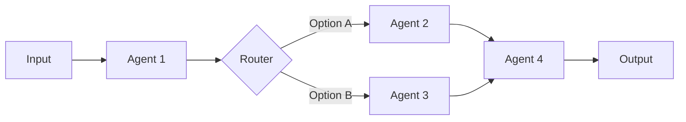

# 工作流

工作流将多个智能体编排成复杂、协调的流程。MoFA 提供强大的工作流抽象来构建复杂的 AI 系统。

## 工作流概述

工作流是一个有向图，其中:
- **节点**是智能体或操作
- **边**定义数据和控制流



## StateGraph

`StateGraph` 是 MoFA 的核心工作流抽象:

```rust
use mofa_sdk::workflow::{StateGraph, State, Transition};

// 创建工作流图
let mut graph = StateGraph::new();

// 定义状态（节点）
graph.add_state(State::new("start", start_handler));
graph.add_state(State::new("process", process_handler));
graph.add_state(State::new("end", end_handler));

// 定义转换（边）
graph.add_transition("start", "process");
graph.add_transition("process", "end");

// 设置入口点
graph.set_entry("start");
```

## 多智能体协调模式

MoFA 支持 7 种内置协调模式:

### 1. 请求-响应

一对一确定性通信:

```rust
use mofa_sdk::coordination::RequestResponse;

let pattern = RequestResponse::new(agent_a, agent_b);

let response = pattern
    .send(AgentInput::text("什么是 AI?"))
    .await?;
```

### 2. 发布-订阅

一对多广播:

```rust
use mofa_sdk::coordination::PubSub;

let mut pubsub = PubSub::new();

// 订阅智能体
pubsub.subscribe("news", agent_a);
pubsub.subscribe("news", agent_b);
pubsub.subscribe("news", agent_c);

// 广播消息
pubsub.publish("news", AgentInput::text("突发新闻!")).await?;
```

### 3. 共识

多轮协商用于决策:

```rust
use mofa_sdk::coordination::Consensus;

let consensus = Consensus::new()
    .with_agents(vec![agent_a, agent_b, agent_c])
    .with_threshold(0.6)  // 需要 60% 同意
    .with_max_rounds(5);

let decision = consensus.decide(&proposal).await?;
```

### 4. 辩论

交替讨论以提高质量:

```rust
use mofa_sdk::coordination::Debate;

let debate = Debate::new()
    .with_proposer(agent_a)
    .with_opponent(agent_b)
    .with_judge(agent_c)
    .with_rounds(3);

let result = debate.debide(&topic).await?;
```

### 5. 并行

同时执行并聚合结果:

```rust
use mofa_sdk::coordination::Parallel;

let parallel = Parallel::new()
    .with_agents(vec![agent_a, agent_b, agent_c])
    .with_aggregation(Aggregation::TakeBest);

let results = parallel.execute(input).await?;
```

### 6. 顺序

流水线执行:

```rust
use mofa_sdk::coordination::Sequential;

let pipeline = Sequential::new()
    .add_step(agent_a)  // 研究
    .add_step(agent_b)  // 分析
    .add_step(agent_c); // 摘要

let result = pipeline.execute(input).await?;
// 每步的输出成为下一步的输入
```

### 7. 自定义

用户定义的模式:

```rust
use mofa_sdk::coordination::CustomPattern;

struct MyCustomPattern {
    // 您的自定义逻辑
}

impl CoordinationPattern for MyCustomPattern {
    async fn execute(&self, input: AgentInput) -> AgentResult<AgentOutput> {
        // 您的自定义协调逻辑
    }
}
```

## 构建工作流

### 示例: 客户支持工作流

```rust
use mofa_sdk::workflow::{StateGraph, State, WorkflowContext};

// 定义状态处理器
async fn triage(input: AgentInput, ctx: &mut WorkflowContext) -> Result<String, WorkflowError> {
    let intent = ctx.call_agent("classifier", input.clone()).await?;

    match intent.as_text().unwrap_or("") {
        "technical" => Ok("technical_support"),
        "billing" => Ok("billing_support"),
        _ => Ok("general_support"),
    }
}

async fn technical_support(input: AgentInput, ctx: &mut WorkflowContext) -> Result<String, WorkflowError> {
    let response = ctx.call_agent("tech_agent", input).await?;
    ctx.set("response", response);
    Ok("satisfaction_check")
}

async fn billing_support(input: AgentInput, ctx: &mut WorkflowContext) -> Result<String, WorkflowError> {
    let response = ctx.call_agent("billing_agent", input).await?;
    ctx.set("response", response);
    Ok("satisfaction_check")
}

async fn satisfaction_check(input: AgentInput, ctx: &mut WorkflowContext) -> Result<String, WorkflowError> {
    let response = ctx.get::<AgentOutput>("response").unwrap();
    println!("响应: {}", response.as_text().unwrap());
    Ok("end")
}

// 构建工作流
let mut workflow = StateGraph::new();

workflow.add_state(State::async_handler("triage", triage));
workflow.add_state(State::async_handler("technical_support", technical_support));
workflow.add_state(State::async_handler("billing_support", billing_support));
workflow.add_state(State::async_handler("general_support", general_support));
workflow.add_state(State::async_handler("satisfaction_check", satisfaction_check));
workflow.add_state(State::terminal("end"));

workflow.add_transition("triage", "technical_support");
workflow.add_transition("triage", "billing_support");
workflow.add_transition("triage", "general_support");
workflow.add_transition("technical_support", "satisfaction_check");
workflow.add_transition("billing_support", "satisfaction_check");
workflow.add_transition("general_support", "satisfaction_check");
workflow.add_transition("satisfaction_check", "end");

workflow.set_entry("triage");
```

### 运行工作流

```rust
let ctx = WorkflowContext::new()
    .with_agent("classifier", classifier_agent)
    .with_agent("tech_agent", tech_agent)
    .with_agent("billing_agent", billing_agent);

let result = workflow.run(AgentInput::text("我无法登录我的账户"), ctx).await?;
```

## 工作流 DSL

MoFA 提供用于定义工作流的 DSL:

```rust
use mofa_sdk::workflow_dsl::WorkflowBuilder;

let workflow = WorkflowBuilder::new("customer_support")
    .start("triage")
    .agent("triage", classifier_agent)
        .route("technical", "tech_agent")
        .route("billing", "billing_agent")
        .default("general_agent")
    .agent("tech_agent", tech_agent)
        .then("satisfaction")
    .agent("billing_agent", billing_agent)
        .then("satisfaction")
    .agent("general_agent", general_agent)
        .then("satisfaction")
    .end("satisfaction")
    .build();
```

## 条件转换

```rust
// 条件路由
workflow.add_conditional_transition("triage", |ctx| {
    let intent = ctx.get::<String>("intent").unwrap();

    match intent.as_str() {
        "technical" => "technical_support",
        "billing" => "billing_support",
        _ => "general_support",
    }
});
```

## 工作流中的错误处理

```rust
// 错误恢复状态
workflow.add_state(State::new("error_handler", error_handler));
workflow.add_transition("error", "error_handler");
workflow.add_transition("error_handler", "retry");
workflow.add_transition("error_handler", "end");
```

## 工作流可视化

将工作流导出为各种格式:

```rust
// 导出为 Mermaid 图
let mermaid = workflow.to_mermaid();
println!("{}", mermaid);

// 导出为 DOT (Graphviz)
let dot = workflow.to_dot();
```

## 最佳实践

1. **保持状态简单**: 每个状态应该做好一件事
2. **使用有意义的名称**: 状态名称应该描述其目的
3. **处理错误**: 始终有错误恢复路径
4. **记录转换**: 记录状态转换以便调试
5. **测试路径**: 测试工作流中所有可能的路径

## 另见

- [多智能体指南](../guides/multi-agent.md) — 详细协调指南
- [秘书智能体](../guides/secretary-agent.md) — 人在回路工作流
- [示例: 工作流](../examples/核心智能体.md) — 工作流示例
