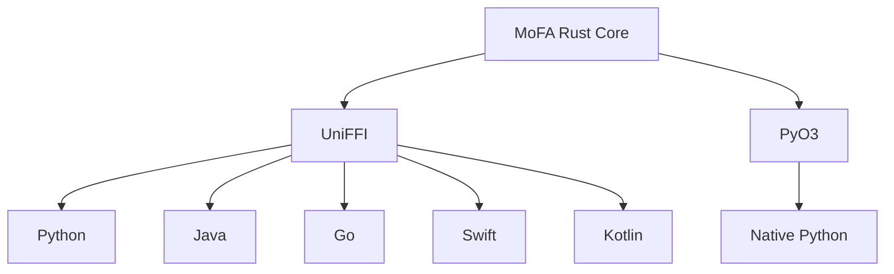

# 跨语言绑定

MoFA 通过 UniFFI 和 PyO3 为多种编程语言提供绑定。

## 支持的语言

| 语言 | 方法 | 状态 |
|----------|--------|--------|
| Python | UniFFI / PyO3 | 稳定 |
| Java | UniFFI | 测试版 |
| Go | UniFFI | 测试版 |
| Swift | UniFFI | 测试版 |
| Kotlin | UniFFI | 测试版 |

## 架构



## 选择绑定

### UniFFI (Python, Java, Go, Swift, Kotlin)

**优点:**
- 跨语言 API 一致
- 从 Rust 定义生成
- 类型安全

**缺点:**
- 某些 Rust 模式转换不佳
- 需要额外的二进制文件

### PyO3 (Python 原生)

**优点:**
- 原生 Python 体验
- 更好地与 Python 生态系统集成
- 异步支持

**缺点:**
- 仅限 Python
- 需要 Python 开发头文件

## 安装

### Python (UniFFI)

```bash
pip install mofa
```

### Python (PyO3)

```bash
pip install mofa-native
```

### Java (Maven)

```xml
<dependency>
    <groupId>org.mofa</groupId>
    <artifactId>mofa-java</artifactId>
    <version>0.1.0</version>
</dependency>
```

### Go

```bash
go get github.com/mofa-org/mofa-go
```

## 功能标志

构建时启用 `uniffi` 或 `python` 功能:

```toml
[dependencies]
mofa-ffi = { version = "0.1", features = ["uniffi"] }
```

## 另见

- [Python](python.md) — Python 绑定
- [Java](java.md) — Java 绑定
- [Go](go.md) — Go 绑定
