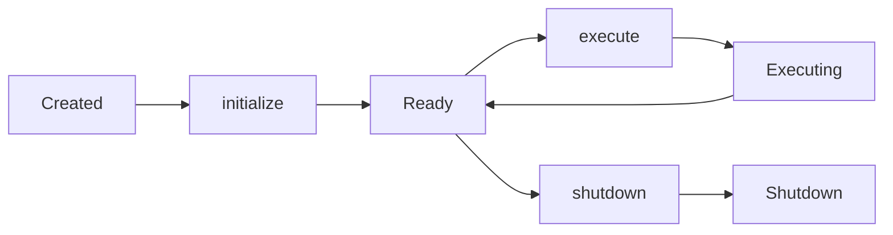

# 您的第一个智能体

通过本分步指南从头开始构建您的第一个 MoFA 智能体。

## 前提条件

- [已安装 MoFA](installation.md)
- [已配置 LLM](llm-setup.md)

## 概述

在本指南中，您将构建一个最小化的 LLM 驱动智能体，它能够:

1. 实现 `MoFAAgent` trait
2. 使用 LLM 提供商生成响应
3. 通过标准 MoFA 类型处理输入和输出

## 项目设置

创建一个新的 Rust 项目:

```bash
cargo new my-first-agent
cd my-first-agent
```

在 `Cargo.toml` 中添加依赖:

```toml
[dependencies]
mofa-sdk = { path = "../mofa/crates/mofa-sdk" }
tokio = { version = "1", features = ["full"] }
dotenvy = "0.15"
async-trait = "0.1"
```

## MoFAAgent Trait

每个 MoFA 智能体都实现 `MoFAAgent` trait，它定义了核心智能体接口:

```rust
#[async_trait]
pub trait MoFAAgent: Send + Sync {
    fn id(&self) -> &str;
    fn name(&self) -> &str;
    fn capabilities(&self) -> &AgentCapabilities;
    fn state(&self) -> AgentState;

    async fn initialize(&mut self, ctx: &AgentContext) -> AgentResult<()>;
    async fn execute(&mut self, input: AgentInput, ctx: &AgentContext) -> AgentResult<AgentOutput>;
    async fn shutdown(&mut self) -> AgentResult<()>;
}
```

## 实现您的智能体

将 `src/main.rs` 替换为:

```rust
//! 最小化的 MoFA 智能体，使用 LLM 回答问题。

use std::sync::Arc;
use dotenvy::dotenv;
use mofa_sdk::kernel::agent::prelude::*;
use mofa_sdk::llm::{LLMClient, openai_from_env};

struct LLMAgent {
    id: String,
    name: String,
    capabilities: AgentCapabilities,
    state: AgentState,
    client: LLMClient,
}

impl LLMAgent {
    fn new(client: LLMClient) -> Self {
        Self {
            id: "llm-agent-1".to_string(),
            name: "LLM Agent".to_string(),
            capabilities: AgentCapabilities::builder()
                .tag("llm").tag("qa")
                .input_type(InputType::Text)
                .output_type(OutputType::Text)
                .build(),
            state: AgentState::Created,
            client,
        }
    }
}

#[async_trait]
impl MoFAAgent for LLMAgent {
    fn id(&self)           -> &str               { &self.id }
    fn name(&self)         -> &str               { &self.name }
    fn capabilities(&self) -> &AgentCapabilities { &self.capabilities }
    fn state(&self)        -> AgentState         { self.state.clone() }

    async fn initialize(&mut self, _ctx: &AgentContext) -> AgentResult<()> {
        self.state = AgentState::Ready;
        Ok(())
    }

    async fn execute(&mut self, input: AgentInput, _ctx: &AgentContext) -> AgentResult<AgentOutput> {
        self.state = AgentState::Executing;
        let answer = self.client
            .ask_with_system("You are a helpful Rust expert.", &input.to_text())
            .await
            .map_err(|e| AgentError::ExecutionFailed(e.to_string()))?;
        self.state = AgentState::Ready;
        Ok(AgentOutput::text(answer))
    }

    async fn shutdown(&mut self) -> AgentResult<()> {
        self.state = AgentState::Shutdown;
        Ok(())
    }
}

#[tokio::main]
async fn main() -> Result<(), Box<dyn std::error::Error>> {
    dotenv().ok();   // 重要: 加载 .env

    let provider = openai_from_env()?;
    let client   = LLMClient::new(Arc::new(provider));

    let mut agent = LLMAgent::new(client);
    let ctx       = AgentContext::new("exec-001");

    agent.initialize(&ctx).await?;

    let output = agent.execute(
        AgentInput::text("What is the borrow checker in Rust?"),
        &ctx,
    ).await?;

    println!("{}", output.as_text().unwrap_or("(no answer)"));
    agent.shutdown().await?;
    Ok(())
}
```

## 运行您的智能体

```bash
cargo run
```

您应该看到类似这样的输出:

```
The borrow checker is a core component of Rust's compiler...
```

## 理解代码

### 智能体结构

您的智能体有几个关键组件:

| 字段 | 用途 |
|-------|---------|
| `id` | 智能体的唯一标识符 |
| `name` | 人类可读的名称 |
| `capabilities` | 描述智能体能做什么 |
| `state` | 当前生命周期状态 |
| `client` | 用于生成响应的 LLM 客户端 |

### 生命周期方法



1. **`initialize`**: 智能体启动时调用一次。在此设置资源。
2. **`execute`**: 每个任务调用。这是智能体主要逻辑所在。
3. **`shutdown`**: 智能体停止时调用。在此清理资源。

### 输入和输出

- **`AgentInput`**: 包装输入数据（文本、结构化数据等）
- **`AgentOutput`**: 包装带有元数据的输出数据

## 使用 AgentRunner

对于生产环境使用，用 `AgentRunner` 包装您的智能体:

```rust
use mofa_sdk::runtime::AgentRunner;

#[tokio::main]
async fn main() -> Result<(), Box<dyn std::error::Error>> {
    dotenv().ok();

    let provider = openai_from_env()?;
    let client = LLMClient::new(Arc::new(provider));
    let agent = LLMAgent::new(client);

    let mut runner = AgentRunner::new(agent).await?;

    let output = runner.execute(
        AgentInput::text("Explain async/await in Rust"),
    ).await?;

    println!("{}", output.as_text().unwrap_or("(no answer)"));
    runner.shutdown().await?;

    Ok(())
}
```

## 下一步是什么?

现在您已经有了一个可工作的智能体，可以探索这些主题:

- **[核心概念](../concepts/architecture.md)** — 理解 MoFA 的架构
- **[教程](../tutorial/README.md)** — 全面的分步指南
- **[工具](../concepts/tools.md)** — 为您的智能体添加函数调用
- **[多智能体](../guides/multi-agent.md)** — 协调多个智能体

## 故障排除

### "OPENAI_API_KEY not found"

确保您已经:
1. 在项目根目录创建了 `.env` 文件
2. 添加了您的 API 密钥: `OPENAI_API_KEY=sk-...`
3. 在 `main()` 开始时调用了 `dotenv().ok()`

### 编译错误

- 确保 Rust 版本为 1.85+
- 运行 `cargo clean` 并重新构建
- 检查所有依赖是否正确指定

### 空响应

- 检查您的 API 密钥是否有效
- 验证模型名称是否正确
- 检查是否有速率限制或配额问题
