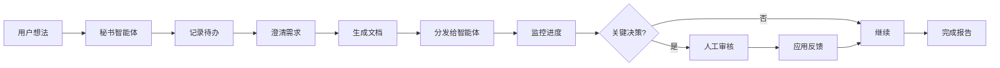

# 秘书智能体

秘书智能体模式实现了人机协同工作流，AI 管理任务同时让人类掌控关键决策。

## 概述

秘书智能体作为一个智能协调者：

1. **接收想法** — 记录任务和待办事项
2. **澄清需求** — 生成项目文档
3. **调度分发** — 调用执行智能体
4. **监控反馈** — 将关键决策推送给人类
5. **验收报告** — 更新待办和状态



## 基本使用

### 创建秘书智能体

```rust
use mofa_sdk::secretary::{SecretaryAgent, SecretaryConfig};
use mofa_sdk::llm::openai_from_env;

let config = SecretaryConfig {
    human_feedback_enabled: true,
    max_delegations: 5,
    check_interval: Duration::from_secs(30),
};

let secretary = SecretaryAgent::builder()
    .with_llm(openai_from_env()?)
    .with_config(config)
    .with_delegation_target("researcher", researcher_agent)
    .with_delegation_target("writer", writer_agent)
    .build();
```

### 处理任务

```rust
use mofa_sdk::kernel::{AgentInput, AgentContext};

let ctx = AgentContext::new("exec-001");
let mut secretary = secretary.await?;

// 初始化
secretary.initialize(&ctx).await?;

// 处理任务
let input = AgentInput::text("我想构建一个新闻文章的网络爬虫");
let output = secretary.execute(input, &ctx).await?;

println!("{}", output.as_text().unwrap());

// 关闭
secretary.shutdown().await?;
```

## 五个阶段

### 阶段一：接收想法

秘书记录传入的想法并创建待办列表：

```rust
// 用户输入
let idea = "构建一个总结 GitHub issues 的 CLI 工具";

// 秘书创建待办
// - [ ] 研究现有解决方案
// - [ ] 设计 CLI 接口
// - [ ] 实现核心功能
// - [ ] 添加测试
// - [ ] 编写文档
```

### 阶段二：澄清需求

秘书生成澄清问题：

```rust
let questions = secretary.clarify_requirements(&idea).await?;

// 问题可能包括：
// - 使用什么编程语言？
// - 使用哪个 LLM 提供商进行总结？
// - 是否需要处理私有仓库？
```

### 阶段三：调度分发

任务被委派给专门的智能体：

```rust
// 秘书决定使用哪个智能体
let dispatch = secretary.schedule_dispatch(&todos).await?;

// {
//   "research": ["研究现有解决方案"],
//   "developer": ["实现核心功能"],
//   "writer": ["编写文档"]
// }
```

### 阶段四：监控反馈

秘书监控进度并标记重要决策：

```rust
// 设置反馈处理器
secretary.on_decision(|decision| {
    println!("需要决策: {}", decision.question);
    // 展示给人类
    let choice = prompt_human(&decision.options);
    async move { choice }
}).await;

// 秘书会在关键决策时暂停等待人工输入
```

### 阶段五：验收报告

最终状态和待办更新：

```rust
let report = secretary.generate_report().await?;

// {
//   "completed": ["研究", "核心实现"],
//   "in_progress": ["文档编写"],
//   "blocked": [],
//   "next_steps": ["添加错误处理"]
// }
```

## 人工反馈集成

### 同步模式（阻塞）

```rust
use mofa_sdk::secretary::HumanFeedback;

let feedback = HumanFeedback::sync(|decision| {
    print!("{} [y/n]: ", decision.question);
    let mut input = String::new();
    std::io::stdin().read_line(&mut input).unwrap();
    input.trim() == "y"
});

secretary.with_human_feedback(feedback);
```

### 异步模式（非阻塞）

```rust
use mofa_sdk::secretary::AsyncFeedback;

let feedback = AsyncFeedback::new()
    .with_webhook("https://your-app.com/approve")
    .with_timeout(Duration::from_minutes(30));

secretary.with_async_feedback(feedback);
```

### 基于文件的反馈

```rust
use mofa_sdk::secretary::FileFeedback;

let feedback = FileFeedback::new("./feedback_queue/")
    .with_poll_interval(Duration::from_secs(5));

// 秘书将决策写入 ./feedback_queue/pending/
// 人类将响应写入 ./feedback_queue/resolved/
```

## 委派

### 注册智能体

```rust
secretary
    .with_delegation_target("researcher", ResearcherAgent::new())
    .with_delegation_target("coder", CoderAgent::new())
    .with_delegation_target("reviewer", ReviewerAgent::new());
```

### 委派规则

```rust
use mofa_sdk::secretary::DelegationRule;

let rule = DelegationRule::new()
    .when_tag("code", delegate_to("coder"))
    .when_tag("research", delegate_to("researcher"))
    .when_complexity_gt(0.8, require_human_approval())
    .default(delegate_to("general"));

secretary.with_delegation_rules(rule);
```

## 配置

```rust
pub struct SecretaryConfig {
    /// 启用人工反馈循环
    pub human_feedback_enabled: bool,

    /// 需要审批前的最大委派次数
    pub max_delegations: usize,

    /// 检查反馈的频率
    pub check_interval: Duration,

    /// 自动批准低风险决策的阈值
    pub auto_approve_threshold: f32,

    /// 保持上下文大小可控
    pub context_window: usize,
}
```

## 示例

查看完整示例 `examples/secretary_agent/`：

```bash
cargo run -p secretary_agent
```

## 相关链接

- [工作流](../concepts/workflows.md) — 工作流编排
- [多智能体系统](multi-agent.md) — 协调模式
- [教程第六章](../tutorial/06-multi-agent.md) — 多智能体教程
