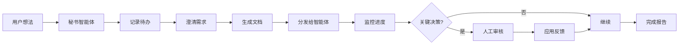

# 秘书智能体

秘书智能体模式实现了人机协同工作流，AI 管理任务同时让人类掌控关键决策。

## 概述

当前秘书 API 采用事件循环模式：

1. 使用 `DefaultSecretaryBuilder` 构建行为
2. 使用 `SecretaryCore` 启动运行时
3. 通过 `DefaultInput` 和 `DefaultOutput` 交换消息

这对应 5 个阶段：

1. 接收想法
2. 澄清需求
3. 调度分发
4. 监控反馈与决策
5. 生成验收汇报


```mermaid
graph LR
    A[用户想法] --> B[秘书智能体]
    B --> C[记录待办]
    C --> D[澄清需求]
    D --> E[生成文档]
    E --> F[分发给智能体]
    F --> G[监控进度]
    G --> H{关键决策?}
    H -->|是| I[人工审核]
    H -->|否| J[继续]
    I --> K[应用反馈]
    K --> J
    J --> L[完成报告]
```

## 基本使用

```rust
use mofa_sdk::secretary::{
    AgentInfo,
    ChannelConnection,
    DefaultInput,
    DefaultOutput,
    DefaultSecretaryBuilder,
    SecretaryCommand,
    SecretaryCore,
    TodoPriority,
};

#[tokio::main]
async fn main() -> Result<(), Box<dyn std::error::Error>> {
    // 1) 注册执行智能体
    let mut backend = AgentInfo::new("backend_agent", "后端智能体");
    backend.capabilities = vec!["backend".to_string(), "api".to_string()];
    backend.available = true;
    backend.performance_score = 0.9;

    // 2) 构建秘书行为
    let behavior = DefaultSecretaryBuilder::new()
        .with_name("项目秘书")
        .with_auto_clarify(true)
        .with_auto_dispatch(true)
        .with_executor(backend)
        .build();

    // 3) 启动核心事件循环
    let (conn, input_tx, mut output_rx) = ChannelConnection::new_pair(32);
    let (handle, join_handle) = SecretaryCore::new(behavior).start(conn).await;

    // 阶段1：接收想法
    input_tx
        .send(DefaultInput::Idea {
            content: "开发一个 GitHub issue 摘要 CLI".to_string(),
            priority: Some(TodoPriority::High),
            metadata: None,
        })
        .await?;

    // 阶段2/3：针对具体 todo 触发澄清和分发
    input_tx
        .send(DefaultInput::Command(SecretaryCommand::Clarify {
            todo_id: "todo_1".to_string(),
        }))
        .await?;
    input_tx
        .send(DefaultInput::Command(SecretaryCommand::Dispatch {
            todo_id: "todo_1".to_string(),
        }))
        .await?;

    // 阶段4/5：处理反馈、决策与汇报
    while let Some(output) = output_rx.recv().await {
        match output {
            DefaultOutput::Acknowledgment { message } => {
                println!("ack: {}", message);
            }
            DefaultOutput::DecisionRequired { decision } => {
                println!("需要决策: {}", decision.description);

                // 人类决策通过 DefaultInput::Decision 回传
                input_tx
                    .send(DefaultInput::Decision {
                        decision_id: decision.id,
                        selected_option: 0,
                        comment: Some("批准".to_string()),
                    })
                    .await?;
            }
            DefaultOutput::StatusUpdate { todo_id, status } => {
                println!("{} => {:?}", todo_id, status);
            }
            DefaultOutput::TaskCompleted { todo_id, result } => {
                println!("完成 {}: {}", todo_id, result.summary);
            }
            DefaultOutput::Report { report } => {
                println!("report: {}", report.content);
                break;
            }
            DefaultOutput::Error { message } => {
                eprintln!("error: {}", message);
            }
            DefaultOutput::Message { content } => {
                println!("message: {}", content);
            }
        }
    }

    handle.stop().await;
    join_handle.abort();
    Ok(())
}
```

## 五个阶段与 API 对应

### 阶段一：接收想法

通过 `DefaultInput::Idea` 提交任务。

### 阶段二：澄清需求

使用 `DefaultInput::Command(SecretaryCommand::Clarify { .. })`。

### 阶段三：调度分发

使用 `DefaultInput::Command(SecretaryCommand::Dispatch { .. })`。

### 阶段四：监控反馈

消费 `DefaultOutput::DecisionRequired`，然后发送 `DefaultInput::Decision`。

### 阶段五：验收报告

发送 `DefaultInput::Command(SecretaryCommand::GenerateReport { .. })`，并处理 `DefaultOutput::Report`。

## 人工反馈集成

人工反馈通过消息交互完成：

1. 接收 `DefaultOutput::DecisionRequired`
2. 获取人工选择
3. 发送 `DefaultInput::Decision`

```rust
if let DefaultOutput::DecisionRequired { decision } = output {
    let selected_option = 0; // 这里替换为真实人工输入

    input_tx
        .send(DefaultInput::Decision {
            decision_id: decision.id,
            selected_option,
            comment: Some("人工审批通过".to_string()),
        })
        .await?;
}
```

## 委派

通过构建器注册执行智能体，并使用分发命令进行任务路由：

```rust
use mofa_sdk::secretary::{AgentInfo, DefaultSecretaryBuilder, DispatchStrategy};

let mut researcher = AgentInfo::new("researcher", "研究智能体");
researcher.capabilities = vec!["research".to_string()];
researcher.available = true;
researcher.performance_score = 0.85;

let mut writer = AgentInfo::new("writer", "写作智能体");
writer.capabilities = vec!["writing".to_string()];
writer.available = true;
writer.performance_score = 0.9;

let behavior = DefaultSecretaryBuilder::new()
    .with_dispatch_strategy(DispatchStrategy::CapabilityFirst)
    .with_executor(researcher)
    .with_executor(writer)
    .build();
```

## 配置

通过构建器方法配置，而不是单独的旧配置结构体：

- `.with_name(...)`
- `.with_llm(...)`
- `.with_auto_clarify(...)`
- `.with_auto_dispatch(...)`
- `.with_dispatch_strategy(...)`
- `.with_executor(...)`

## 示例

完整运行示例位于 `examples/secretary_agent/`：

```bash
cargo run -p secretary_agent
```

## 相关链接

- [工作流](../concepts/workflows.md) - 工作流编排
- [多智能体系统](multi-agent.md) - 协调模式
- [教程第六章](../tutorial/06-multi-agent.md) - 多智能体教程
