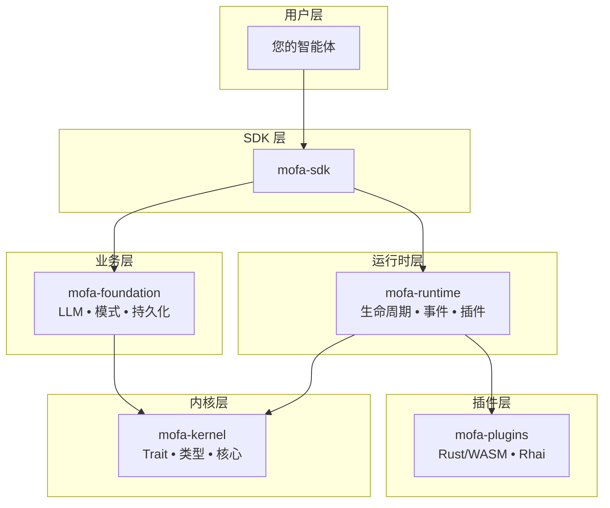

# 简介

<div class="hero">
<h1>MoFA</h1>
<p>一个用 Rust 构建的生产级 AI 智能体框架，专为极致性能、无限扩展性和运行时可编程性而设计。</p>
<div class="cta-buttons">
<a href="getting-started/installation.html" class="btn btn-primary">开始使用 →</a>
<a href="concepts/architecture.html" class="btn btn-secondary">架构概览</a>
</div>
</div>

## 什么是 MoFA？

MoFA（Modular Framework for Agents）采用 **微内核 + 双层插件系统** 架构，使您能够构建复杂的 AI 智能体：

<div class="feature-grid">
<div class="feature-card">
<h3>🚀 极致性能</h3>
<p>Rust 核心与零成本抽象、异步运行时和高效内存管理。</p>
</div>
<div class="feature-card">
<h3>🔧 无限扩展性</h3>
<p>双层插件：编译时（Rust/WASM）用于性能 + 运行时（Rhai 脚本）用于灵活性。</p>
</div>
<div class="feature-card">
<h3>🌐 多语言支持</h3>
<p>通过 UniFFI 和 PyO3 支持 Python、Java、Swift、Kotlin、Go 绑定。</p>
</div>
<div class="feature-card">
<h3>🏭 生产就绪</h3>
<p>内置持久化、监控、分布式支持和人在回路工作流。</p>
</div>
</div>

## 架构

MoFA 遵循严格的微内核设计原则：



## 核心特性

### 多智能体协调

MoFA 支持 7 种 LLM 驱动的协作模式：

| 模式 | 描述 | 用例 |
|------|------|------|
| 请求-响应 | 一对一确定性任务 | 简单问答 |
| 发布-订阅 | 一对多广播 | 事件通知 |
| 共识 | 多轮协商 | 决策制定 |
| 辩论 | 交替讨论 | 质量提升 |
| 并行 | 同时执行 | 批量处理 |
| 顺序 | 管道执行 | 数据转换 |
| 自定义 | 用户定义模式 | 特殊工作流 |

### 秘书智能体模式

人在回路的流程管理，包含 5 个阶段：

1. **接收想法** → 记录待办事项
2. **澄清需求** → 项目文档
3. **调度分发** → 调用执行智能体
4. **监控反馈** → 将关键决策推送给人类
5. **验收报告** → 更新待办事项

### 双层插件系统

- **编译时插件**：Rust/WASM 用于性能关键路径
- **运行时插件**：Rhai 脚本用于动态业务逻辑，支持热重载

## 快速示例

```rust
use mofa_sdk::kernel::prelude::*;
use mofa_sdk::llm::{LLMClient, openai_from_env};

struct MyAgent {
    client: LLMClient,
}

#[async_trait]
impl MoFAAgent for MyAgent {
    fn id(&self) -> &str { "my-agent" }
    fn name(&self) -> &str { "My Agent" }

    async fn execute(&mut self, input: AgentInput, _ctx: &AgentContext) -> AgentResult<AgentOutput> {
        let response = self.client.ask(&input.to_text()).await
            .map_err(|e| AgentError::ExecutionFailed(e.to_string()))?;
        Ok(AgentOutput::text(response))
    }
}

#[tokio::main]
async fn main() -> Result<(), Box<dyn std::error::Error>> {
    let client = LLMClient::new(Arc::new(openai_from_env()?));
    let mut agent = MyAgent { client };
    let ctx = AgentContext::new("exec-001");

    let output = agent.execute(AgentInput::text("你好！"), &ctx).await?;
    println!("{}", output.as_text().unwrap());

    Ok(())
}
```

## 快速开始

| 目标 | 前往 |
|------|------|
| 10 分钟快速上手 | [安装指南](getting-started/installation.md) |
| 配置您的 LLM | [第 4 章：LLM 智能体](tutorial/04-llm-agent.md) |
| 构建第一个智能体 | [第 3 章：第一个智能体](tutorial/03-first-agent.md) |
| 逐步学习 | [教程](tutorial/README.md) |
| 理解设计理念 | [架构概览](concepts/architecture.md) |

## 谁应该使用 MoFA？

- **AI 工程师** 构建生产级 AI 智能体
- **平台团队** 需要可扩展的智能体基础设施
- **研究人员** 实验多智能体系统
- **开发者** 想要类型安全、高性能的智能体框架

## 社区与支持

- [GitHub Discussions](https://github.com/mofa-org/mofa/discussions) — 提问交流
- [Discord](https://discord.com/invite/hKJZzDMMm9) — 与社区聊天
- [贡献指南](https://github.com/mofa-org/mofa/blob/main/CONTRIBUTING.md) — 帮助改进 MoFA

## 许可证

MoFA 基于 [Apache License 2.0](https://github.com/mofa-org/mofa/blob/main/LICENSE) 许可。

---

<div class="callout info">
<strong>📖 文档语言：</strong> 本文档提供 <a href="../introduction.html">English</a> 和 <a href="introduction.html">简体中文</a> 两种语言版本。
</div>
