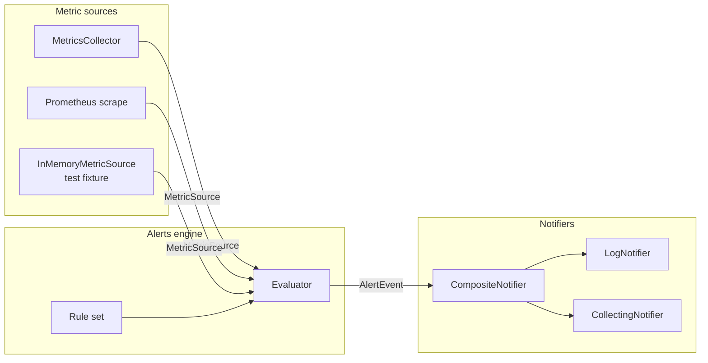
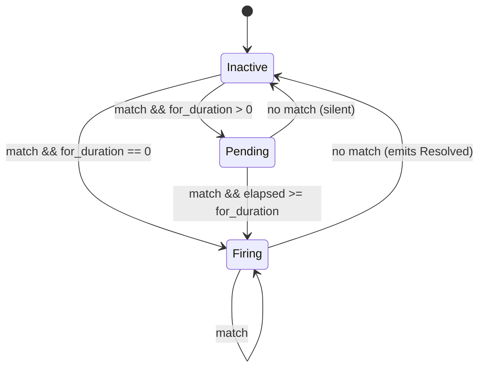
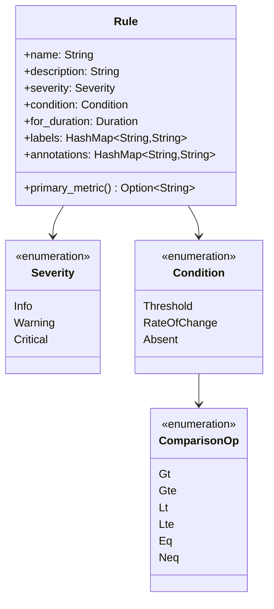
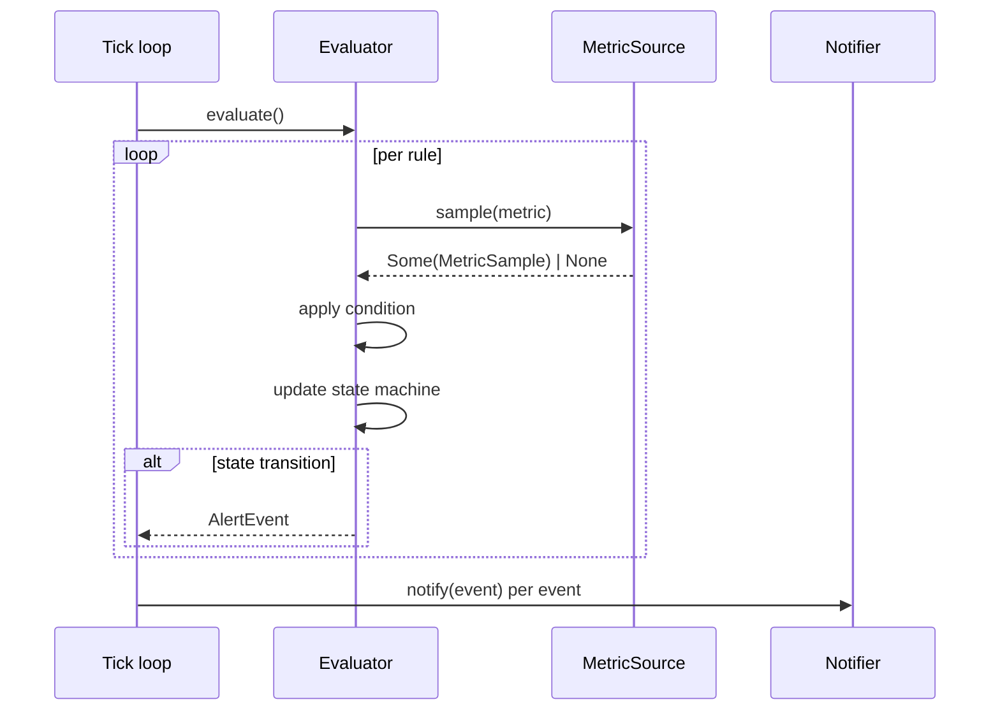

# Monitoring Alert Rules Engine

Declarative SLO-style alerting for `mofa-monitoring`. Operates alongside
the existing dashboard, Prometheus exporter, and OpenTelemetry tracing
layers — this module adds the evaluation + notification loop that
consumes the metrics those layers publish.

---

## Architecture



The engine is backend-agnostic in both directions:
`MetricSource` lets the evaluator consume from any backend that can
return the current value of a named metric, and `Notifier` lets the
operator wire events to log, webhook, chat, pager, or any composition.

---

## State machine

Matches Prometheus semantics: a rule soaks in `Pending` for the
configured `for_duration` before it is allowed to fire, guarding against
flapping.



Only the following transitions emit an `AlertEvent`:

| Transition | Emitted state |
|------------|---------------|
| `Inactive → Firing` | `Firing` |
| `Inactive → Pending` | `Pending` |
| `Pending → Firing` | `Firing` |
| `Firing → Inactive` | `Resolved` |
| `Pending → Inactive` | *silent* |

---

## Rule model



---

## Condition families

### `Threshold`

Fire when a scalar metric satisfies `value OP threshold`.

```rust
use std::time::Duration;
use mofa_monitoring::alerts::{ComparisonOp, Condition, Rule, Severity};

let rule = Rule::new(
    "high-error-rate",
    "LLM error rate above 5%",
    Severity::Warning,
    Condition::Threshold {
        metric: "llm_error_rate".into(),
        op: ComparisonOp::Gt,
        threshold: 0.05,
    },
)
.with_for(Duration::from_secs(120))
.with_label("team", "platform")
.with_annotation("runbook", "https://runbooks.internal/llm-errors");
```

### `RateOfChange`

Fire when the per-second derivative of a monotonic counter over a sliding
window satisfies `OP threshold`. The evaluator maintains the window
samples internally; configure a sane `max_window_samples` in
`EvaluatorConfig` to cap memory.

### `Absent`

Fire when a metric has not been observed within `staleness` — heartbeat
and liveness checks.

---

## Evaluation flow



The evaluator is re-entrant-safe: its state is held under a `Mutex`
keyed by rule name. Production deployments typically call `evaluate()`
from a single tick loop; when scaling out, shard rules across evaluator
instances rather than locking a single evaluator.

---

## Notifiers

| Notifier | Purpose |
|----------|---------|
| `LogNotifier` | Emit through `tracing`. Warning/Critical go to `warn!`; Info to `info!`. Good default alongside richer delivery. |
| `CollectingNotifier` | Bounded in-memory buffer. Powers the dashboard "recent alerts" panel and tests. |
| `CompositeNotifier` | Fan out to multiple notifiers best-effort. |

Future integrations (webhook, Slack, PagerDuty) plug in as additional
`Notifier` implementors without changing the evaluator contract.

---

## Wiring checklist

- [ ] Construct an `Arc<dyn MetricSource>` — either the in-memory fixture,
      a `MetricsCollector` adapter, or a Prometheus scrape client.
- [ ] Build the rule set: `Vec<Rule>`.
- [ ] Instantiate an `Evaluator` (use `with_config` to override
      `max_window_samples` if you run rate-of-change rules over long
      windows).
- [ ] Wire one or more `Notifier`s (typically `CompositeNotifier` over
      `LogNotifier` + a delivery notifier).
- [ ] Tick `evaluator.evaluate()` on a cadence (typically every 15–60s)
      and fan each event to the notifier.

---

## Status

- Rule model, condition families, evaluator, notifier abstraction —
  delivered
- Metric source adapter against the existing `MetricsCollector` —
  follow-up
- Prometheus scrape adapter — follow-up
- Webhook / Slack notifier — follow-up
- YAML rule-file loader — follow-up
