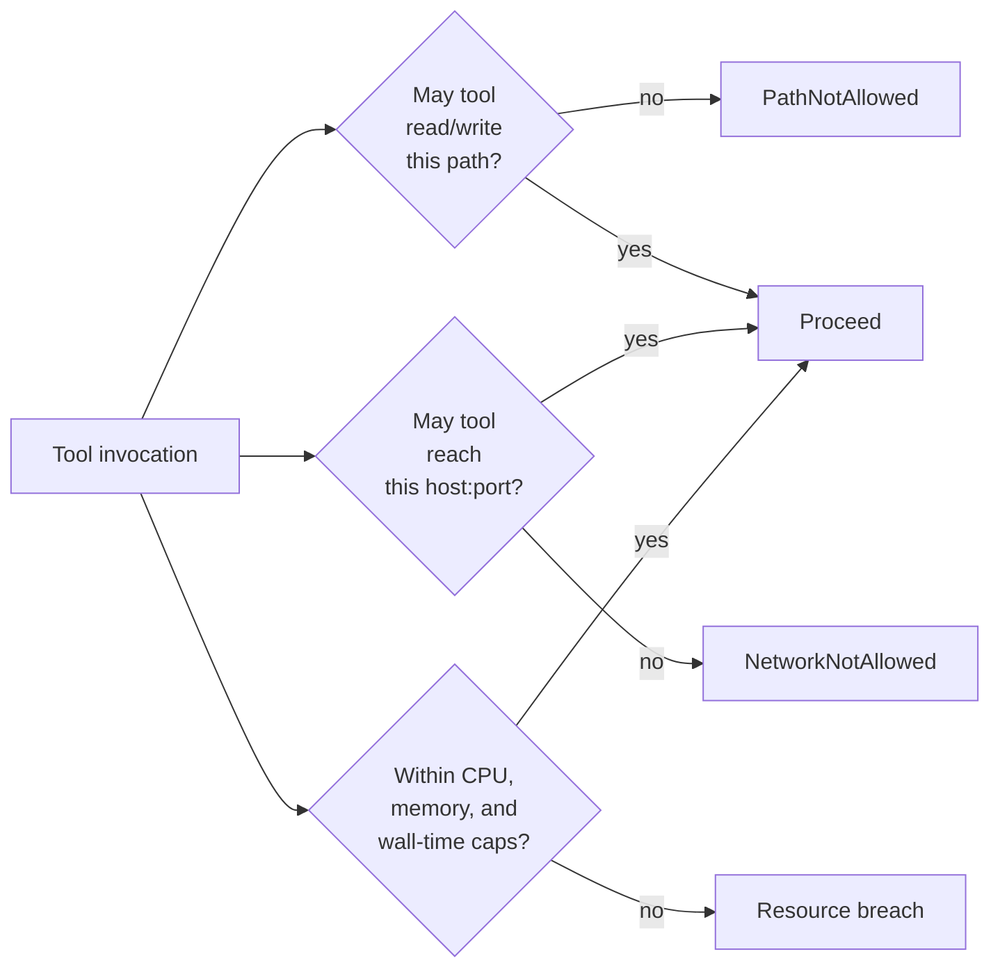
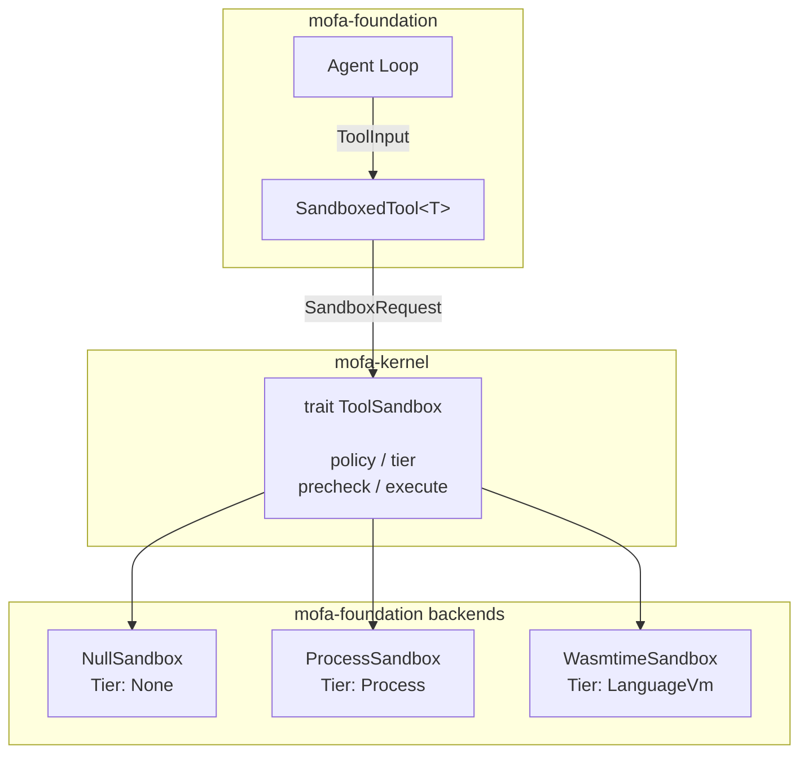
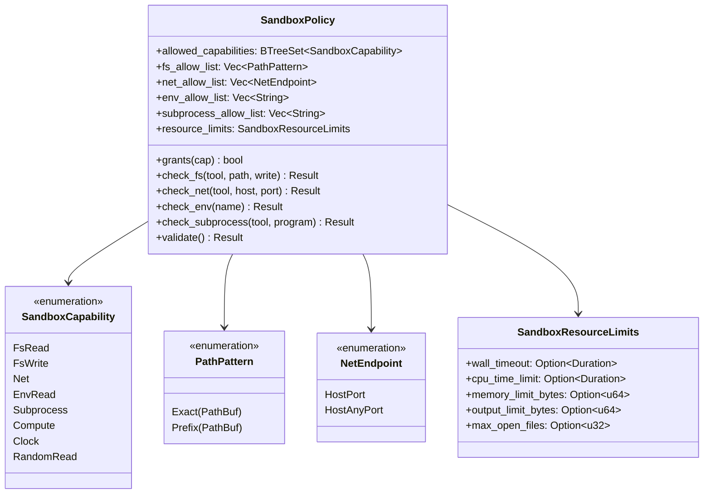
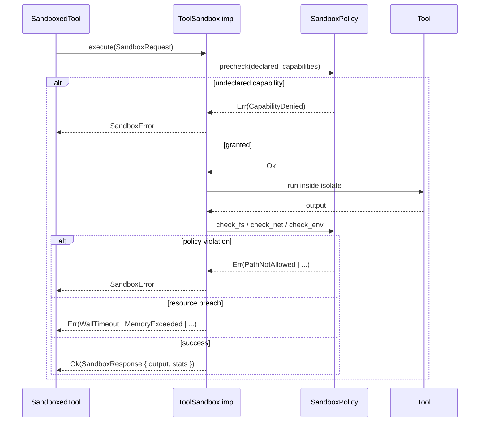
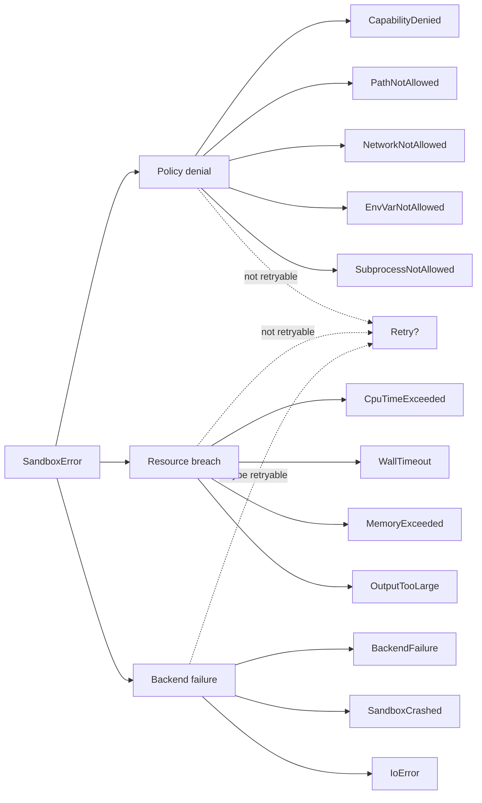
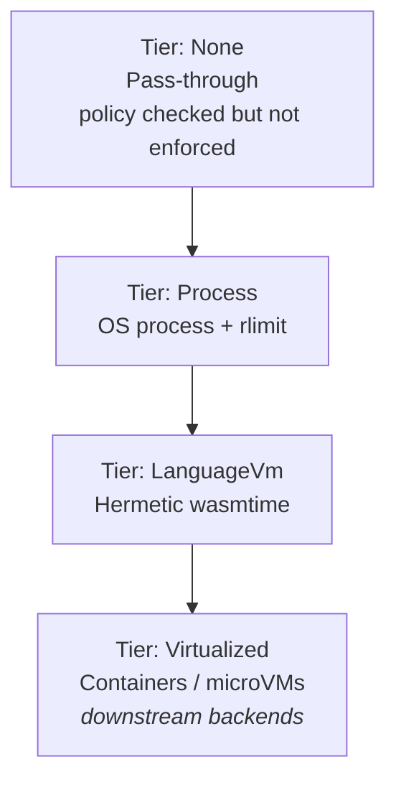
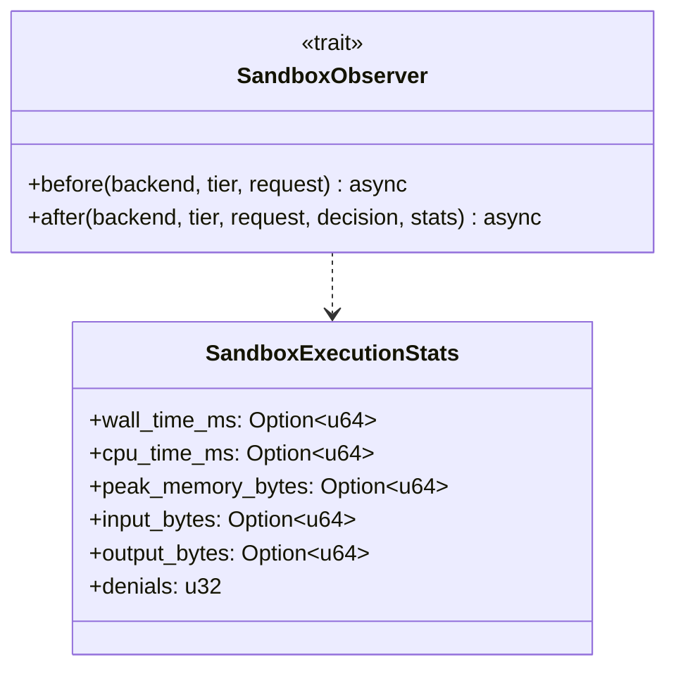

# Tool Execution Sandbox

Capability-scoped, resource-limited execution for untrusted tools invoked by
LLMs. Tracks GSoC ideas-list Task 34. This document covers the kernel-level
trait contracts and policy model; concrete backends live in
`mofa-foundation`.

---

## Motivation

LLM-called tools execute inside the agent process. Today, a compromised or
malicious tool has the same privileges as the agent: it can read any file
the user can read, open outbound network connections, spawn subprocesses,
and exfiltrate environment variables. That posture is unsustainable once
tools arrive from third-party plugin registries, MCP servers, or prompt-
induced code paths.

The sandbox mediates three questions at every tool call:



---

## Layered architecture

The kernel owns trait contracts only; foundation owns concrete backends.



---

## Policy model

Policies are default-deny. The base capability set is empty except for
implicit `Compute`; every other capability must be listed and, where
applicable, combined with a fine-grained allow-list.



### Capability gating

| Capability | Fine-grained gate |
|------------|-------------------|
| `FsRead` | `fs_allow_list` (`Vec<PathPattern>`) |
| `FsWrite` | `fs_allow_list` |
| `Net` | `net_allow_list` (`Vec<NetEndpoint>`) |
| `EnvRead` | `env_allow_list` (`Vec<String>`) |
| `Subprocess` | `subprocess_allow_list` (`Vec<String>`) |
| `Compute` | implicit, always granted |
| `Clock` | — |
| `RandomRead` | — |

---

## Execution flow



---

## Error taxonomy

Three disjoint failure classes with distinct retry semantics.



`SandboxError::is_policy_denial()`, `is_resource_limit()`, and
`is_backend_failure()` let retry middleware branch on error class.

---

## Tiers of isolation



`SandboxTier` derives `Ord`; callers can reject backends below a required
isolation threshold in a single comparison.

---

## Usage

```rust
use std::path::PathBuf;
use std::time::Duration;
use mofa_kernel::agent::components::sandbox::{
    NetEndpoint, PathPattern, SandboxCapability, SandboxPolicy,
    SandboxResourceLimits,
};

let policy = SandboxPolicy::builder()
    .allow(SandboxCapability::FsRead)
    .allow_fs(PathPattern::Prefix(PathBuf::from("/tmp/tool-scratch")))
    .allow(SandboxCapability::Net)
    .allow_net(NetEndpoint::HostPort {
        host: "api.openai.com".into(),
        port: 443,
    })
    .resource_limits(SandboxResourceLimits {
        wall_timeout: Some(Duration::from_secs(10)),
        memory_limit_bytes: Some(128 * 1024 * 1024),
        ..Default::default()
    })
    .build()
    .unwrap();
```

---

## Observability

Every sandboxed call yields `SandboxExecutionStats`:



`SandboxObserver` is an async hook fired before and after every execution,
suitable for audit-log append, Prometheus metric emission, and policy-drift
detection.

---

## Status

- Kernel trait contracts and policy model — this change
- Foundation backends (`NullSandbox`, `ProcessSandbox`, `WasmtimeSandbox`),
  `SandboxedTool<T>` wrapper, integration tests, runnable example —
  follow-up
- Prometheus sandbox metrics exporter — follow-up

---

## References

- `mofa-kernel::agent::components::sandbox`
- OWASP Tool Sandbox design pattern
- Capability-based security (principle of least authority)
