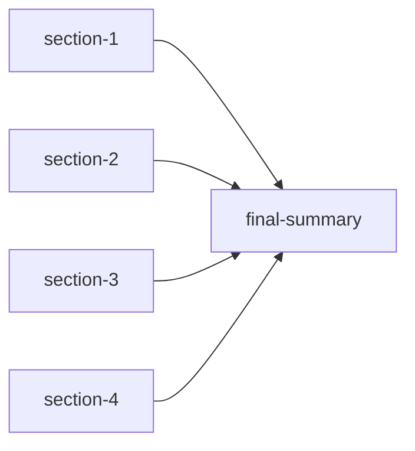
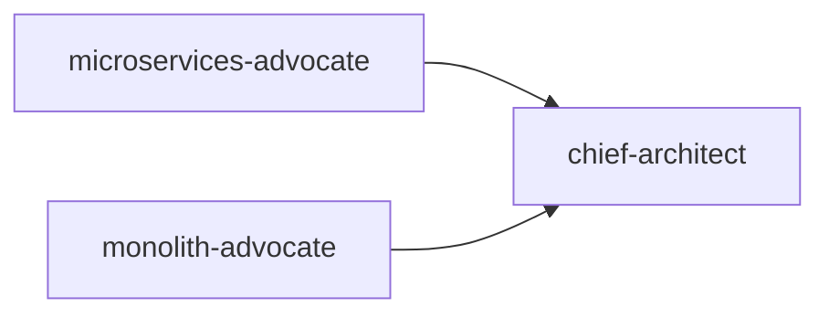
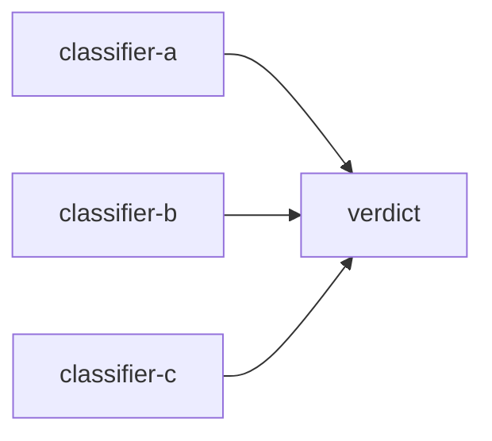
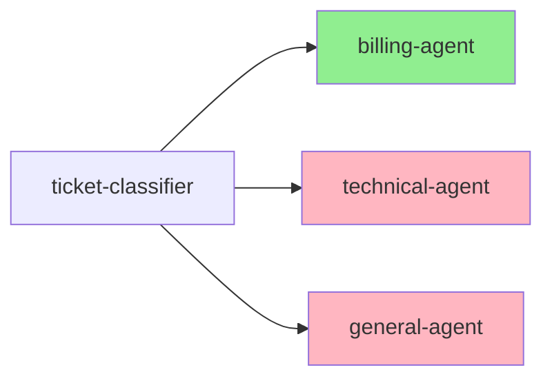
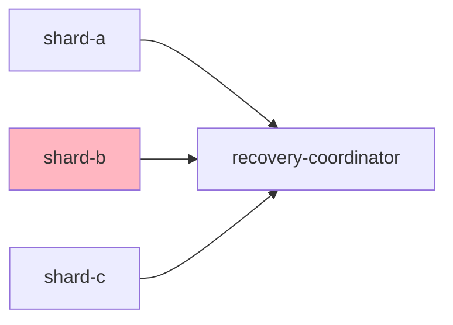

# Chapter 6: Multi-Agent Coordination

> **Learning objectives:** Understand why and when to use multiple agents, learn the 7 coordination patterns, and build chain and parallel agent pipelines.

## Why Multiple Agents?

A single agent can do a lot, but some tasks benefit from **specialization**:

- **Quality**: A "researcher" agent gathers facts, a "writer" agent crafts prose, an "editor" agent polishes — each focused on what it does best
- **Parallelism**: Multiple agents analyze different aspects of a problem simultaneously
- **Robustness**: Agents can debate or vote, reducing individual errors
- **Scalability**: Add more agents without changing existing ones

## The 7 Coordination Patterns

MoFA supports seven patterns for orchestrating multiple agents. The `CoordinationPattern` enum in `mofa-kernel` defines them:

```rust
// crates/mofa-kernel/src/agent/components/coordinator.rs

pub enum CoordinationPattern {
    Sequential,                        // Chain: A → B → C
    Parallel,                          // Fan-out: A, B, C run simultaneously
    Hierarchical { supervisor_id: String }, // Supervisor delegates to workers
    Consensus { threshold: f32 },      // Agents vote, must reach threshold
    Debate { max_rounds: usize },      // Agents argue, refine answer
    MapReduce,                         // Split task, process in parallel, merge
    Voting,                            // Majority wins
    Custom(String),                    // Your own pattern
}
```

Here's when to use each:

| Pattern | Use When | Example |
|---------|----------|---------|
| **Sequential (Chain)** | Task has natural stages | Research → Write → Edit |
| **Parallel** | Subtasks are independent | Analyze code + check security + review style |
| **Hierarchical** | Need oversight/delegation | Manager assigns tasks to specialists |
| **Consensus** | Need agreement | Multi-agent fact-checking |
| **Debate** | Quality through disagreement | Pro/con analysis, peer review |
| **MapReduce** | Large input, uniform processing | Summarize 100 documents |
| **Voting** | Simple majority decision | Classification with multiple models |

## The Coordinator Trait

The `Coordinator` trait defines how agents work together:

```rust
#[async_trait]
pub trait Coordinator: Send + Sync {
    async fn dispatch(
        &self,
        task: Task,
        ctx: &AgentContext,
    ) -> AgentResult<Vec<DispatchResult>>;

    async fn aggregate(
        &self,
        results: Vec<AgentOutput>,
    ) -> AgentResult<AgentOutput>;

    fn pattern(&self) -> CoordinationPattern;
    fn name(&self) -> &str;

    async fn select_agents(
        &self,
        task: &Task,
        ctx: &AgentContext,
    ) -> AgentResult<Vec<String>>;

    fn requires_all(&self) -> bool;
}
```

- **`dispatch`**: Sends a task to the appropriate agents
- **`aggregate`**: Combines results from multiple agents into one output
- **`select_agents`**: Decides which agents should handle a given task
- **`pattern`**: Returns the coordination strategy

## Build: Chain and Parallel Pipelines

Let's build two multi-agent examples using `MoFAAgent` implementations.

Create a new project:

```bash
cargo new multi_agent_demo
cd multi_agent_demo
```

Edit `Cargo.toml`:

```toml
[package]
name = "multi_agent_demo"
version = "0.1.0"
edition = "2024"

[dependencies]
mofa-sdk = { path = "../../crates/mofa-sdk" }
async-trait = "0.1"
tokio = { version = "1", features = ["full"] }
serde_json = "1"
```

### Example 1: Sequential Chain

Three agents in a pipeline — each transforms the output of the previous one:

```rust
use async_trait::async_trait;
use mofa_sdk::kernel::{
    AgentCapabilities, AgentCapabilitiesBuilder, AgentContext, AgentInput,
    AgentOutput, AgentResult, AgentState, MoFAAgent,
};
use mofa_sdk::runtime::run_agents;

// --- Agent that analyzes text ---
struct AnalystAgent {
    id: String,
    state: AgentState,
}

impl AnalystAgent {
    fn new() -> Self {
        Self {
            id: "analyst-001".to_string(),
            state: AgentState::Created,
        }
    }
}

#[async_trait]
impl MoFAAgent for AnalystAgent {
    fn id(&self) -> &str { &self.id }
    fn name(&self) -> &str { "Analyst" }
    fn capabilities(&self) -> &AgentCapabilities {
        &AgentCapabilitiesBuilder::new().build()
    }

    async fn initialize(&mut self, _ctx: &AgentContext) -> AgentResult<()> {
        self.state = AgentState::Ready;
        Ok(())
    }

    async fn execute(&mut self, input: AgentInput, _ctx: &AgentContext) -> AgentResult<AgentOutput> {
        let text = input.to_text();
        let analysis = format!(
            "ANALYSIS: The text '{}' has {} words and {} characters.",
            text,
            text.split_whitespace().count(),
            text.len()
        );
        Ok(AgentOutput::text(analysis))
    }

    async fn shutdown(&mut self) -> AgentResult<()> {
        self.state = AgentState::Shutdown;
        Ok(())
    }

    fn state(&self) -> AgentState { self.state.clone() }
}

// --- Agent that rewrites text ---
struct WriterAgent {
    id: String,
    state: AgentState,
}

impl WriterAgent {
    fn new() -> Self {
        Self {
            id: "writer-001".to_string(),
            state: AgentState::Created,
        }
    }
}

#[async_trait]
impl MoFAAgent for WriterAgent {
    fn id(&self) -> &str { &self.id }
    fn name(&self) -> &str { "Writer" }
    fn capabilities(&self) -> &AgentCapabilities {
        &AgentCapabilitiesBuilder::new().build()
    }

    async fn initialize(&mut self, _ctx: &AgentContext) -> AgentResult<()> {
        self.state = AgentState::Ready;
        Ok(())
    }

    async fn execute(&mut self, input: AgentInput, _ctx: &AgentContext) -> AgentResult<AgentOutput> {
        let analysis = input.to_text();
        let report = format!("REPORT:\n{}\n\nConclusion: Text processed successfully.", analysis);
        Ok(AgentOutput::text(report))
    }

    async fn shutdown(&mut self) -> AgentResult<()> {
        self.state = AgentState::Shutdown;
        Ok(())
    }

    fn state(&self) -> AgentState { self.state.clone() }
}

// --- Chain execution ---
async fn run_chain(input: &str) -> Result<String, Box<dyn std::error::Error>> {
    // Stage 1: Analyst
    let analyst = AnalystAgent::new();
    let outputs = run_agents(analyst, vec![AgentInput::text(input)]).await?;
    let analysis = outputs[0].to_text();
    println!("  [Analyst] → {}", analysis);

    // Stage 2: Writer (receives analyst's output)
    let writer = WriterAgent::new();
    let outputs = run_agents(writer, vec![AgentInput::text(&analysis)]).await?;
    let report = outputs[0].to_text();
    println!("  [Writer]  → {}", report);

    Ok(report)
}

#[tokio::main]
async fn main() -> Result<(), Box<dyn std::error::Error>> {
    println!("=== Sequential Chain: Analyst → Writer ===\n");
    let result = run_chain("MoFA is a modular agent framework built in Rust").await?;
    println!("\nFinal output:\n{}", result);

    Ok(())
}
```

### Example 2: Parallel Execution

Multiple agents process the same input concurrently, then results are aggregated:

```rust
use tokio::task::JoinSet;

async fn run_parallel(input: &str) -> Result<Vec<String, Box<dyn std::error::Error>>> {
    let mut tasks = JoinSet::new();

    // Launch multiple agents in parallel
    let input_clone = input.to_string();
    tasks.spawn(async move {
        let agent = AnalystAgent::new();
        let outputs = run_agents(agent, vec![AgentInput::text(&input_clone)]).await?;
        Ok::<_, anyhow::Error>(outputs[0].to_text())
    });

    let input_clone = input.to_string();
    tasks.spawn(async move {
        let agent = WriterAgent::new();
        let outputs = run_agents(agent, vec![AgentInput::text(&input_clone)]).await?;
        Ok::<_, anyhow::Error>(outputs[0].to_text())
    });

    // Collect results as they complete
    let mut results = Vec::new();
    while let Some(result) = tasks.join_next().await {
        match result? {
            Ok(text) => results.push(text),
            Err(e) => eprintln!("Agent failed: {}", e),
        }
    }

    Ok(results)
}
```

> **Rust tip: `JoinSet`**
> `tokio::task::JoinSet` lets you spawn multiple async tasks and collect their results as they finish. Each `spawn` returns a `JoinHandle`. `join_next().await` returns the next completed task. This is how you do parallel execution in async Rust.

## Using AgentTeam (Foundation)

For more sophisticated multi-agent coordination, MoFA's foundation layer provides `AgentTeam`:

```rust
use mofa_sdk::llm::{LLMAgentBuilder, OpenAIProvider};
use mofa_foundation::llm::multi_agent::{AgentTeam, TeamPattern};

// Create specialized LLM agents
let researcher = LLMAgentBuilder::new()
    .with_provider(provider.clone())
    .with_system_prompt("You are a thorough researcher. Gather facts.")
    .build();

let writer = LLMAgentBuilder::new()
    .with_provider(provider.clone())
    .with_system_prompt("You are a skilled writer. Create engaging content.")
    .build();

// Create a team with the builder pattern
let team = AgentTeam::new("content-team")
    .with_name("Content Team")
    .add_member("researcher", Arc::new(researcher))
    .add_member("writer", Arc::new(writer))
    .with_pattern(TeamPattern::Chain)   // Sequential pipeline
    .build();

let result = team.run("Write a blog post about Rust").await?;
```

Available `TeamPattern` values:

```rust
pub enum TeamPattern {
    Chain,                          // Output of each agent feeds into the next
    Parallel,                       // All agents run simultaneously
    Debate { max_rounds: usize },   // Agents discuss and refine over rounds
    Supervised,                     // A supervisor agent evaluates results
    MapReduce,                      // Process in parallel, then reduce
    Custom,                         // User-defined pattern (defaults to chain)
}
```

> **Architecture note:** `AgentTeam` lives in `mofa-foundation` (`crates/mofa-foundation/src/llm/multi_agent.rs`). It implements the `Coordinator` trait from `mofa-kernel` internally. See `examples/multi_agent_coordination/src/main.rs` and `examples/adaptive_collaboration_agent/src/main.rs` for complete working examples.

## Phase 2: Advanced Coordination Patterns

The `SwarmScheduler` trait in `mofa-foundation` provides five additional patterns beyond sequential and parallel. Each targets a distinct coordination problem.

### MapReduce

**When to use:** You have a large input that can be split into uniform chunks, each processed independently, and then merged. Classic for document summarization, batch data processing, and parallel search.



```rust
let mut dag = SubtaskDAG::new("document-summarization");

let s1 = dag.add_task(SwarmSubtask::new("section-1", "Summarize Introduction"));
let s2 = dag.add_task(SwarmSubtask::new("section-2", "Summarize Methodology"));
let s3 = dag.add_task(SwarmSubtask::new("section-3", "Summarize Experiments"));
let s4 = dag.add_task(SwarmSubtask::new("section-4", "Summarize Conclusion"));
let reducer = dag.add_task(SwarmSubtask::new("final-summary", "Merge all section summaries"));

dag.add_dependency(s1, reducer)?;
dag.add_dependency(s2, reducer)?;
dag.add_dependency(s3, reducer)?;
dag.add_dependency(s4, reducer)?;

let summary = MapReduceScheduler::new().execute(&mut dag, executor).await?;
```

The scheduler runs all mappers in parallel, then injects their outputs into the reducer's `description` field under a `## Map Phase Outputs` heading before calling the executor on it.

---

### Debate

**When to use:** You want two or more agents to argue opposing positions before a judge synthesizes the best answer. Use for architecture decisions, risk analysis, and peer review workflows where adversarial pressure improves quality.



```rust
let mut dag = SubtaskDAG::new("architecture-debate");

let pro = dag.add_task(SwarmSubtask::new("microservices-advocate", "Argue for microservices"));
let con = dag.add_task(SwarmSubtask::new("monolith-advocate", "Argue for monolith"));
let judge = dag.add_task(SwarmSubtask::new("chief-architect", "Issue architecture decision"));

dag.add_dependency(pro, judge)?;
dag.add_dependency(con, judge)?;

let summary = DebateScheduler::new().execute(&mut dag, executor).await?;
```

Debaters run in parallel. Each debater's output is formatted as `**{task_id}:** {output}` and injected into the judge's description under `## Debate Arguments`.

---

### Consensus

**When to use:** Multiple independent agents each produce a label or classification; you want the majority vote to win. Use for sentiment analysis, fact-checking, and any scenario where a single model's confidence is insufficient.



```rust
let mut dag = SubtaskDAG::new("sentiment-consensus");

let a = dag.add_task(SwarmSubtask::new("classifier-a", "Classify sentiment via BERT"));
let b = dag.add_task(SwarmSubtask::new("classifier-b", "Classify sentiment via RoBERTa"));
let c = dag.add_task(SwarmSubtask::new("classifier-c", "Classify sentiment via GPT"));
let verdict = dag.add_task(SwarmSubtask::new("verdict", "Return majority sentiment"));

dag.add_dependency(a, verdict)?;
dag.add_dependency(b, verdict)?;
dag.add_dependency(c, verdict)?;

let summary = ConsensusScheduler::new().execute(&mut dag, executor).await?;
```

Voters run in parallel. The scheduler counts exact string matches across voter outputs, then prepends `## Majority Candidate\n{candidate}` to the aggregator's description when a strict majority exists (count > 1 and count is maximal).

---

### Routing

**When to use:** A classifier or router agent must inspect input and dispatch it to exactly one specialist. Use for customer support triage, query routing, and intent-based dispatch where only one handler is appropriate.



```rust
let mut dag = SubtaskDAG::new("support-ticket-routing");

let classifier = dag.add_task(SwarmSubtask::new("ticket-classifier", "Classify the support ticket"));

let mut billing = SwarmSubtask::new("billing-agent", "Handle billing disputes");
billing.required_capabilities = vec!["billing".into()];
let billing_idx = dag.add_task(billing);

let mut technical = SwarmSubtask::new("technical-agent", "Handle technical bugs");
technical.required_capabilities = vec!["technical".into(), "bug".into()];
let technical_idx = dag.add_task(technical);

dag.add_dependency(classifier, billing_idx)?;
dag.add_dependency(classifier, technical_idx)?;

let summary = RoutingScheduler::new().execute(&mut dag, executor).await?;
// summary.skipped == 1: only the matched specialist runs
```

The router runs first. Its output string is matched case-insensitively against each specialist's `required_capabilities`. The first matching specialist runs; all others are marked `Skipped`. If no capability matches, the first specialist is used as a fallback.

---

### Supervision

**When to use:** Workers may fail, and a supervisor must always run to handle recovery, alerting, or partial-result aggregation regardless of worker outcomes. Use for distributed data pipelines, batch jobs, and any fault-tolerant processing workflow.



```rust
let mut dag = SubtaskDAG::new("resilient-data-pipeline");

let a = dag.add_task(SwarmSubtask::new("shard-a", "Process partition A"));
let b = dag.add_task(SwarmSubtask::new("shard-b", "Process partition B"));
let c = dag.add_task(SwarmSubtask::new("shard-c", "Process partition C"));
let supervisor = dag.add_task(SwarmSubtask::new("recovery-coordinator", "Review and recover"));

dag.add_dependency(a, supervisor)?;
dag.add_dependency(b, supervisor)?;
dag.add_dependency(c, supervisor)?;

let summary = SupervisionScheduler::new().execute(&mut dag, shard_executor).await?;
```

Workers run in parallel. Regardless of individual success or failure, the supervisor always executes. Each worker's outcome is injected as `{task_id} (SUCCESS): {output}` or `{task_id} (FAILED): {error}` under `## Worker Results` in the supervisor's description.

---

### Pattern Decision Guide

| Pattern | Pick when... | Avoid when... |
|---------|-------------|--------------|
| **Sequential** | Stages have data dependencies; output of one stage is input to the next | Tasks are independent and you want maximum throughput |
| **Parallel** | Subtasks are fully independent and all results are needed before proceeding | Tasks depend on each other's outputs |
| **MapReduce** | Input can be partitioned uniformly; reduction is associative or commutative | Chunks have wildly different sizes or the reduce step must be incremental |
| **Debate** | Adversarial critique improves answer quality; you need a reasoned synthesis | Debaters share the same perspective or the task has one objectively correct answer |
| **Consensus** | You need majority agreement across independent models to reduce individual error | All agents share the same underlying model (no diversity benefit) |
| **Routing** | Exactly one specialist should handle a request based on content inspection | Multiple specialists must collaborate or all specialists must run |
| **Supervision** | Workers may fail and recovery or aggregation must always execute | All workers must succeed for the pipeline to be meaningful |

### Auto-Selecting a Pattern

If you are not sure which pattern fits your DAG, `PatternSelector` inspects the topology and task metadata and recommends one automatically — no LLM call required.

```rust
use mofa_foundation::swarm::{PatternSelector, SubtaskDAG};

let dag: SubtaskDAG = /* build your dag */;

let selection = PatternSelector::select_with_reason(&dag);
println!("pattern:    {:?}", selection.pattern);
println!("confidence: {:.0}%", selection.confidence * 100.0);
println!("reason:     {}", selection.reason);

// execute with the recommended pattern — no manual choice needed
let scheduler = selection.pattern.into_scheduler();
let summary = scheduler.execute(&mut dag, executor).await?;
```

Rules are applied in priority order; the first match wins:

| Priority | Pattern | Trigger |
|----------|---------|---------|
| 1 | Routing | Single source + any sink has `required_capabilities` set |
| 2 | Supervision | Any task has `risk_level ≥ High` or `hitl_required = true` |
| 3 | Debate | Exactly 2 sources → 1 sink |
| 4 | Consensus | ≥3 sources with identical `required_capabilities` → 1 sink |
| 5 | MapReduce | ≥2 heterogeneous sources → 1 sink |
| 6 | Sequential | All nodes form a strict linear chain |
| 7 | Parallel | Fallback for all other shapes |

`RiskAwareAnalysis` (returned by `TaskAnalyzer::analyze_with_risk`) includes a pre-populated `suggested_pattern` field — you get a recommendation for free alongside the DAG:

```rust
let analysis = analyzer.analyze_with_risk("deploy the payment service").await?;
println!("suggested: {:?}", analysis.suggested_pattern.pattern);
// → Supervision  (any deploy task is classified Critical risk)
```

---

## What Just Happened?

In the chain example:
1. The `AnalystAgent` receives raw text and produces an analysis
2. The analysis becomes the input to the `WriterAgent`
3. The writer produces a final report

In the parallel example:
1. Both agents receive the same input simultaneously
2. They process independently (using separate OS threads via `tokio::spawn`)
3. Results are collected as they complete — no ordering guarantee

The `AgentTeam` abstraction handles this plumbing for you with LLM agents, including:
- Automatic message formatting between agents
- Error handling and retries
- Result aggregation based on the chosen pattern

## Key Takeaways

- Multi-agent coordination enables specialization, parallelism, and robustness
- 7 patterns: Sequential, Parallel, Hierarchical, Consensus, Debate, MapReduce, Voting
- `Coordinator` trait defines `dispatch`, `aggregate`, and `select_agents`
- Manual chaining: run agents sequentially, passing output as next input
- Manual parallelism: use `tokio::task::JoinSet` for concurrent execution
- `AgentTeam` provides high-level coordination for LLM agents
- `TeamPattern` selects the orchestration strategy

---

**Next:** [Chapter 7: Workflows with StateGraph](07-workflows.md) — Build stateful, graph-based workflows.

[← Back to Table of Contents](README.md)

---

**English** | [简体中文](../zh-CN/tutorial/06-multi-agent.md)
