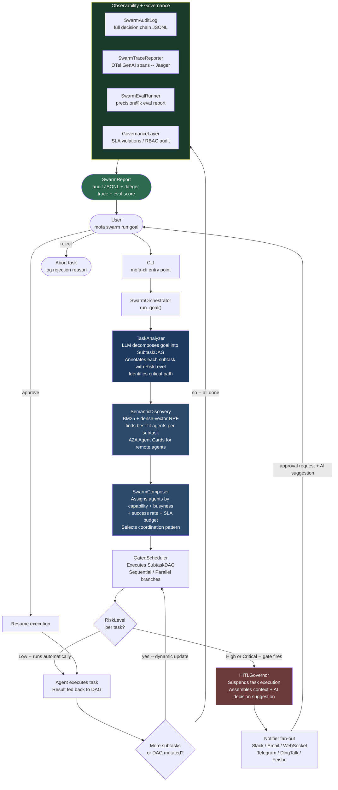
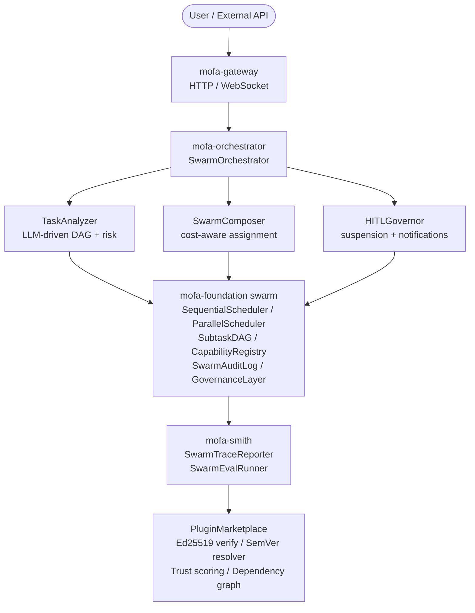
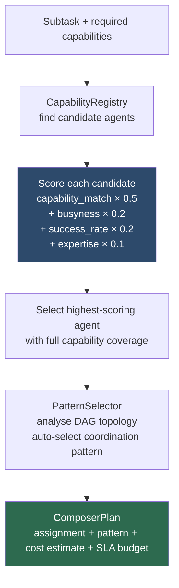
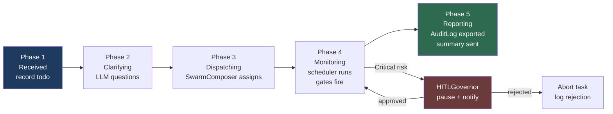
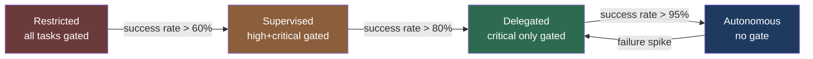
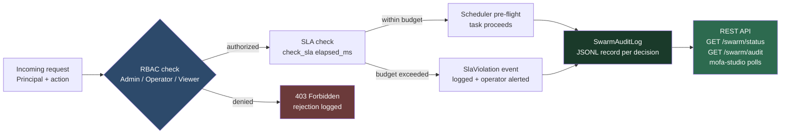
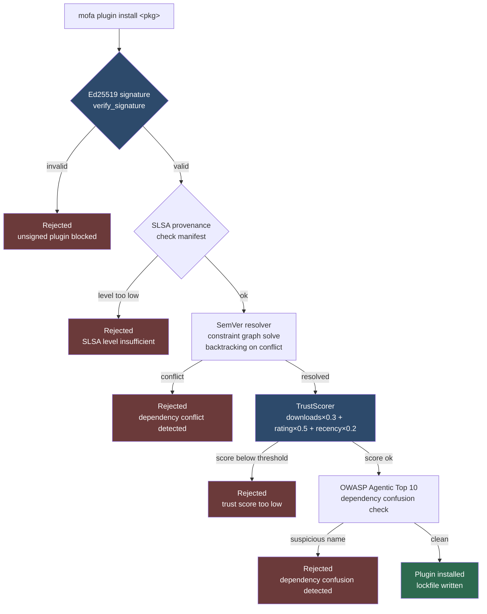
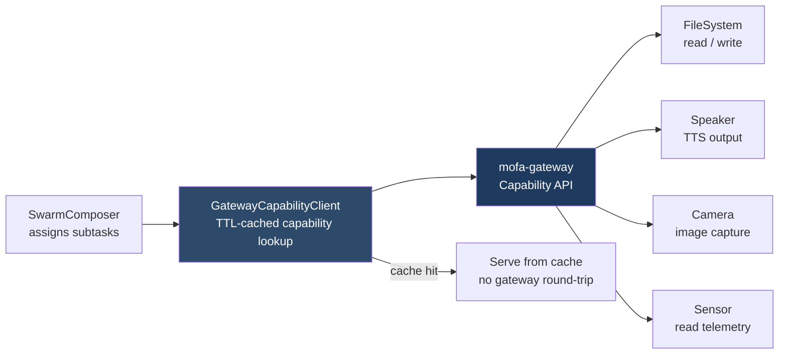
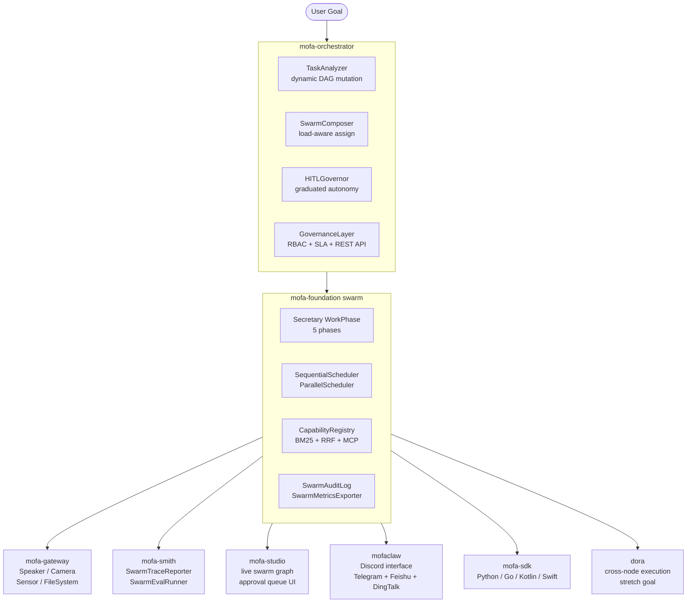

# GSoC 2026 Proposal: Cognitive Swarm Orchestrator

## Personal Information

| Field | Details |
|-------|---------|
| **Name** | Nityam |
| **Email** | nityamt19@gmail.com |
| **Discord** | nityam_33606 |
| **GitHub** | [Nixxx19](https://github.com/Nixxx19) |
| **Timezone** | IST (UTC+5:30) |

---

## About Me

Rust is the language I reach for when correctness actually matters. Before GSoC was announced, I was building ObjectiveAI — a collective judgment harness that routes decisions through model swarms using probabilistic voting and recursive function composition. That project forced me to think hard about the things that break quietly in multi-agent systems: decomposition quality, what happens when one agent in the chain fails silently, and how you make the whole execution auditable when something goes wrong three layers deep.

When I discovered MoFA in the GSoC organization list, I started contributing immediately and treated it like a production system. Each PR started the same way — I read the codebase, found something missing or broken, and built it. The first ones were CI pipelines because the repo needed them. The later ones were the things nobody had closed yet: a SubtaskDAG decomposer with risk-level annotation, a 6,234-line HITL system with `ReviewManager`, `ReviewStore`, and `WebhookDelivery`, a distributed control plane and gateway for multi-node coordination, an LLM provider fallback chain with circuit breakers, and finally the full `mofa-orchestrator` skeleton crate with 23 tests. By the time I finished, I had 50+ PRs across mofa-org repositories with 27+ merged — not because I was chasing a number, but because the gaps kept being real and the fixes kept being necessary.

The work outside MoFA pushed the same instincts. A fix in Gemini CLI's OAuth error path taught me that a bad error message at a critical moment is indistinguishable from a broken system. Security patches in p5.js-web-editor — mass assignment vulnerabilities, a GitHub OAuth assignment-as-comparison bug, unauthenticated asset access — showed me what "safe defaults" means when real users are on the other end. Idea 5 is not a topic I selected from a list. It is what I have been building toward the whole time.

---

## Past Experience

### Technical Background

**Languages:** Rust (primary -- async/await, trait design, proc-macros), Python, TypeScript, Go

**Frameworks and Tools:** Tokio, Ractor (actor model), Axum, SQLx, serde, thiserror, OpenTelemetry, Prometheus, Docker, GitHub Actions, Starlark, Rhai, wasmtime, LLM prompt engineering (OpenAI API), Slack/Telegram/DingTalk notification APIs, tokio::sync::broadcast, SemVer dependency resolution, Ed25519/ring, BM25 + dense-vector retrieval

**Concepts:** Microkernel architecture, DAG-based task scheduling and critical path analysis, actor-based concurrency, trait-based plugin systems, hybrid information retrieval (BM25 + dense vectors with RRF), cryptographic signature verification (Ed25519, SLSA provenance), SemVer dependency resolution with backtracking, workflow engine and orchestration system design, notification systems and message queues, human-in-the-loop workflow design, RBAC and audit logging, OpenTelemetry GenAI semantic conventions

**Relevant Projects:**
- [ObjectiveAI](https://github.com/ObjectiveAI/objectiveai) - Rust AI API server; agentic collective judgment harness with swarm voting, Starlark expression pipelines, and multi-language SDKs
- [mofaclaw](https://github.com/mofa-org/mofaclaw) - MoFA-powered collaboration assistant; Discord integration, Telegram notifications, Feishu notifications, RBAC permission control, multi-agent coordination, CI pipeline, and repo-report skill - all shipped in production

### Open Source Contributions

#### mofa-org/mofa (Merged)

| Contribution | Link |
|-------------|------|
| feat(swarm): risk-aware task decomposer with critical path | [#1397](https://github.com/mofa-org/mofa/pull/1397) |
| feat(swarm): integrate DAG schedulers (sequential and parallel) | [#1363](https://github.com/mofa-org/mofa/pull/1363) |
| feat: Add Human-in-the-Loop (HITL) System - Pause at Any Node for Manual Review | [#826](https://github.com/mofa-org/mofa/pull/826) |
| feat(security): Add Security Governance Layer (RBAC, PII Redaction, Content Moderation, Prompt Guard) | [#799](https://github.com/mofa-org/mofa/pull/799) |
| feat(core): add distributed control plane and gateway for multi-node AI agent coordination | [#774](https://github.com/mofa-org/mofa/pull/774) |
| feat(llm): add LLM provider fallback chain with circuit breaker, metrics, and YAML config | [#1226](https://github.com/mofa-org/mofa/pull/1226) |
| feat(llm): complete token budget: auto-summarization and graceful halt | [#1227](https://github.com/mofa-org/mofa/pull/1227) |
| feat(gateway): unified SSE/WebSocket streaming abstraction | [#1238](https://github.com/mofa-org/mofa/pull/1238) |
| feat(speech): integrate TTS/ASR cloud vendors into speech registry | [#1255](https://github.com/mofa-org/mofa/pull/1255) |
| feat(foundation): implement codex-style context compression | [#638](https://github.com/mofa-org/mofa/pull/638) |
| feat(cli): implement agent logs and plugin install commands with examples | [#495](https://github.com/mofa-org/mofa/pull/495) |
| Add compression architecture diagrams | [#683](https://github.com/mofa-org/mofa/pull/683) |
| Fix ci: AgentEvent generics and tool registration | [#453](https://github.com/mofa-org/mofa/pull/453) |
| fixes workflow limit and envs for handling special characters | [#442](https://github.com/mofa-org/mofa/pull/442) |
| GitHub Actions pt 2 | [#420](https://github.com/mofa-org/mofa/pull/420) |
| add unassign command for CI | [#1275](https://github.com/mofa-org/mofa/pull/1275) |
| Nityam/GitHub workflows (first CI pipeline) | [#393](https://github.com/mofa-org/mofa/pull/393) |

#### mofa-org/mofa (Open - pending review, Idea 5 groundwork)

| Contribution | Link |
|-------------|------|
| feat(swarm): swarmHITLGate HITL approval workflow | [#1398](https://github.com/mofa-org/mofa/pull/1398) |
| feat(swarm): implement 5 more coordination patterns with 30 runnable examples | [#1406](https://github.com/mofa-org/mofa/pull/1406) |
| feat(swarm): add PatternSelector - automatic coordination pattern detection from DAG topology | [#1409](https://github.com/mofa-org/mofa/pull/1409) |
| feat(swarm): SwarmTelemetry: span enrichment and Prometheus metrics for schedulers | [#1427](https://github.com/mofa-org/mofa/pull/1427) |
| feat(swarm): add SwarmAdmissionGate, policy-based pre-execution safety gate for DAGs | [#1430](https://github.com/mofa-org/mofa/pull/1430) |
| feat(swarm): add SwarmAuditLog structured governance log with observer trait | [#1432](https://github.com/mofa-org/mofa/pull/1432) |
| feat(swarm): add SwarmCapabilityRegistry with multi-cap matching and coverage gap analysis | [#1433](https://github.com/mofa-org/mofa/pull/1433) |
| feat(swarm): add SwarmMetricsExporter with Prometheus text-format output | [#1436](https://github.com/mofa-org/mofa/pull/1436) |
| feat(swarm): add mofa swarm run CLI with five-stage pipeline | [#1437](https://github.com/mofa-org/mofa/pull/1437) |
| feat(smith): add SwarmEvalRunner - dataset-driven evaluation harness for swarm agents | [#1442](https://github.com/mofa-org/mofa/pull/1442) |
| feat(observability): export missing Prometheus LLM metrics and wire OTel distributed tracing spans | [#1246](https://github.com/mofa-org/mofa/pull/1246) |
| feat(foundation): add MCP server support to expose MoFA tools over MCP | [#1321](https://github.com/mofa-org/mofa/pull/1321) |
| feat(core): integrate mofa-local-llm as server-side proxy in gateway | [#931](https://github.com/mofa-org/mofa/pull/931) |
| feat(plugins): add Ed25519 signature verification for plugin installs | [#1486](https://github.com/mofa-org/mofa/pull/1486) |
| feat(swarm): upgrade CapabilityRegistry to hybrid BM25 + dense semantic discovery with RRF | [#1487](https://github.com/mofa-org/mofa/pull/1487) |
| feat(swarm): wire HITLGate into sequential and parallel schedulers with async suspension | [#1488](https://github.com/mofa-org/mofa/pull/1488) |
| feat(swarm): add SwarmComposer with cost-aware agent assignment and SLA budget enforcement | [#1489](https://github.com/mofa-org/mofa/pull/1489) |
| feat(smith): add SwarmTraceReporter with pluggable TraceBackend and async channel loop | [#1490](https://github.com/mofa-org/mofa/pull/1490) |
| feat(orchestrator): add mofa-orchestrator crate -- connective tissue for the cognitive swarm | [#1491](https://github.com/mofa-org/mofa/pull/1491) |
| feat(plugins): SemVer trust resolver with OWASP supply chain security (16 tests) | [#1498](https://github.com/mofa-org/mofa/pull/1498) |
| feat(orchestrator): hardware-aware GatewayCapabilityClient with TTL caching (16 tests) | [#1500](https://github.com/mofa-org/mofa/pull/1500) |

#### mofa-org/mofaclaw (Merged)

| Contribution | Link |
|-------------|------|
| feat(core): add Discord channel integration with slash commands and natural language support (2,623 lines) | [#32](https://github.com/mofa-org/mofaclaw/pull/32) |
| fix: avoid regex backreference in heading parser | [#35](https://github.com/mofa-org/mofaclaw/pull/35) |
| feat(core): adding CI pipeline | [#38](https://github.com/mofa-org/mofaclaw/pull/38) |
| feature: enhanced RBAC permission control for skills and tools | [#44](https://github.com/mofa-org/mofaclaw/pull/44) |
| feat: Telegram notification integration | [#54](https://github.com/mofa-org/mofaclaw/pull/54) |
| feat: Feishu notification integration | [#57](https://github.com/mofa-org/mofaclaw/pull/57) |
| fix ci fork error issue | [#86](https://github.com/mofa-org/mofaclaw/pull/86) |
| feat(skill): add repo-report skill | [#91](https://github.com/mofa-org/mofaclaw/pull/91) |

#### mofa-org/mofaclaw (Open)

| Contribution | Link |
|-------------|------|
| feat: multi-agent collaboration | [#73](https://github.com/mofa-org/mofaclaw/pull/73) |

#### ObjectiveAI/objectiveai (Merged)

Rust-based agentic collective judgment harness with swarm voting, Starlark expression pipelines, and probabilistic ensemble decisions.

| Contribution | Link |
|-------------|------|
| Add inversion for ensemble votes and task outputs -- lets ensemble voters express negative confidence, improving decision quality in adversarial input scenarios | [#65](https://github.com/ObjectiveAI/objectiveai/pull/65) |
| Optimize Starlark expression output handling for function expressions -- reduces redundant AST traversal in the expression pipeline | [#67](https://github.com/ObjectiveAI/objectiveai/pull/67) |
| Add client_tests.rs for vector completions with from_rng-only requests -- covers the random-seed completion path that had no test coverage | [#70](https://github.com/ObjectiveAI/objectiveai/pull/70) |
| Add comprehensive tests for expression outputs in objectiveai-rs -- validates all output variant arms including nested function composition | [#64](https://github.com/ObjectiveAI/objectiveai/pull/64) |
| Improve Docs page responsiveness and mobile navigation -- fixes layout breakage on small viewports | [#49](https://github.com/ObjectiveAI/objectiveai/pull/49) |

#### google-gemini/gemini-cli (Merged)

Google's official Gemini CLI -- TypeScript/Node.js command-line interface for the Gemini API with A2A server, streaming, and OAuth support.

| Contribution | Link |
|-------------|------|
| fix: preserve prompt text when cancelling streaming -- text typed before a cancellation was lost; now restored correctly | [#21103](https://github.com/google-gemini/gemini-cli/pull/21103) |
| fix: improve error message when OAuth succeeds but project ID is required -- users saw a cryptic error; now actionable | [#21070](https://github.com/google-gemini/gemini-cli/pull/21070) |
| fix(core): deduplicate GEMINI.md files by device/inode on case-insensitive filesystems -- prevented duplicate context injection on macOS | [#19915](https://github.com/google-gemini/gemini-cli/pull/19915) |
| Fix: persist manual model selection on restart -- user-chosen model reverted to default on every restart | [#19891](https://github.com/google-gemini/gemini-cli/pull/19891) |
| Fix: handle corrupted token file gracefully when switching auth types -- previously crashed on malformed JSON | [#19850](https://github.com/google-gemini/gemini-cli/pull/19850) |
| fix(cli): remove unsafe type assertions in activityLogger -- replaced `as` casts with proper type guards | [#19745](https://github.com/google-gemini/gemini-cli/pull/19745) |
| fix(a2a-server): remove unsafe type assertions in agent -- same type-safety fix applied to the A2A server agent | [#19723](https://github.com/google-gemini/gemini-cli/pull/19723) |
| Enforce import/no-duplicates as error -- added ESLint rule to catch duplicate imports at lint time | [#19797](https://github.com/google-gemini/gemini-cli/pull/19797) |
| fix: merge duplicate imports in sdk and test-utils packages (1/4) | [#19777](https://github.com/google-gemini/gemini-cli/pull/19777) |
| fix: merge duplicate imports in a2a-server package (2/4) | [#19781](https://github.com/google-gemini/gemini-cli/pull/19781) |
| fix: merge duplicate imports in packages/core (3/4) | [#20928](https://github.com/google-gemini/gemini-cli/pull/20928) |
| merge duplicate imports packages/cli/src subtask1 (4a/4) | [#22040](https://github.com/google-gemini/gemini-cli/pull/22040) |
| merge duplicate imports packages/cli/src subtask2 (4b/4) | [#22051](https://github.com/google-gemini/gemini-cli/pull/22051) |
| merge duplicate imports packages/cli/src subtask3 (4c/4) | [#22056](https://github.com/google-gemini/gemini-cli/pull/22056) |
| fix: remove trailing comma in issue triage workflow settings JSON -- broke the GitHub Actions bot config | [#20265](https://github.com/google-gemini/gemini-cli/pull/20265) |
| test(cli): add integration test for Node deprecation warnings | [#20215](https://github.com/google-gemini/gemini-cli/pull/20215) |

#### processing/p5.js-web-editor (Merged)

The official web-based IDE for p5.js (Processing Foundation) -- Node.js/React application used by thousands of creative coding students worldwide.

| Contribution | Link |
|-------------|------|
| fix: resolve 502 error on project download -- large projects hit a timeout; fixed by buffering the ZIP response correctly | [#3770](https://github.com/processing/p5.js-web-editor/pull/3770) |
| Fix: stream project ZIP download to prevent 502 timeout and memory issues -- follow-up: replaced buffer with streaming pipe to avoid OOM on large projects | [#3862](https://github.com/processing/p5.js-web-editor/pull/3862) |
| fix: add missing aria-live to form error messages -- screen readers were not announcing validation errors | [#3884](https://github.com/processing/p5.js-web-editor/pull/3884) |
| fix: prevent mass-assignment of user field in createProject and apiCreateProject -- closed a security vector where arbitrary user fields could be set via the API | [#3889](https://github.com/processing/p5.js-web-editor/pull/3889) |
| Fix: GitHub OAuth -- use === instead of = in user email matching -- assignment-as-comparison typo caused all GitHub logins to silently succeed regardless of email | [#3892](https://github.com/processing/p5.js-web-editor/pull/3892) |
| Fix: mass assignment update project -- patched a second mass-assignment vector in the project update endpoint | [#3893](https://github.com/processing/p5.js-web-editor/pull/3893) |
| Fix: use async bcrypt in findMatchingKey -- blocking bcrypt call was stalling the event loop under load | [#3897](https://github.com/processing/p5.js-web-editor/pull/3897) |
| Fix: signup dev UX when verification email fails -- users saw a blank screen instead of an error message | [#3902](https://github.com/processing/p5.js-web-editor/pull/3902) |
| fix: accountform labels for current and new password -- labels were mismatched, causing confusion for screen reader users | [#3930](https://github.com/processing/p5.js-web-editor/pull/3930) |
| fix: add email validation for Google OAuth -- missing validation allowed malformed email addresses through the OAuth flow | [#3966](https://github.com/processing/p5.js-web-editor/pull/3966) |
| fix: add input validation for check_type in duplicate check -- unvalidated parameter could trigger unexpected query behaviour | [#3967](https://github.com/processing/p5.js-web-editor/pull/3967) |
| fix: private assets authorization -- unauthenticated requests could access private project assets under certain conditions | [#3968](https://github.com/processing/p5.js-web-editor/pull/3968) |

---

## Project Proposal

### Abstract

MoFA has a powerful microkernel but no coherent layer that connects a natural-language goal to a coordinated team of agents. This proposal builds that layer: the **Cognitive Swarm Orchestrator**.

The orchestrator delivers eight integrated modules. A **TaskAnalyzer** decomposes goals into mutable SubtaskDAGs and updates them mid-execution as results arrive (DynTaskMAS pattern, ICAPS 2025). A **SwarmComposer** assigns agents by capability, busyness, success rate, and SLA budget across all 7 coordination patterns. A **HITLGovernor** wires into the existing Secretary 5-phase lifecycle with graduated autonomy and AI-assisted decision suggestions. A **GovernanceLayer** enforces RBAC, tracks SLA violations, exports audit trails, and exposes a REST API for live swarm status. A **SemanticDiscovery** engine combines BM25 sparse retrieval with dense-vector RRF and MCP-compatible capability registration. A **PluginMarketplace** secures third-party agent plugins with Ed25519 signing and SemVer resolution. A **Smith Observatory** integration emits OpenTelemetry GenAI semantic convention spans — the first Rust framework to implement this standard natively. A **Gateway integration** makes physical-world capabilities (Speaker, Camera, Sensor, FileSystem) first-class participants in swarm composition.

The orchestrator is the connective tissue of the full mofa-org ecosystem — mofa core, mofa-studio visualization, mofaclaw Discord interface, Smith observability, and SDK polyglot bindings — all wired into one coherent loop. The result: `mofa swarm run "goal"` produces a fully governed, traced, and auditable multi-agent execution, deployable with `docker compose up`, with no other Rust framework coming close.

---

### Use Case Scenarios

The Cognitive Swarm Orchestrator is not a toy -- it is built for the real workflows that teams already run manually or with fragile scripts. Each scenario below maps directly to modules that are either already merged, open as a groundwork PR, or implemented in the mofa-orchestrator skeleton branch. A user who could not previously run a multi-step AI workflow without writing custom orchestration code can now express the entire goal in plain English and get a governed, traced, auditable execution in return.

| Actor | Goal | Pattern | Modules engaged | Output |
|---|---|---|---|---|
| Enterprise compliance officer | "Review Q1 loan applications for fair lending violations" | Sequential + Parallel (extract, check, flag in parallel) | TaskAnalyzer (SubtaskDAG + RiskLevel), SwarmComposer (load-aware), HITLGovernor (Critical gate), GovernanceLayer (RBAC + audit JSONL), Smith Observatory (OTel spans), Email + WebSocket notifiers | Compliance audit report + Jaeger trace per document |
| DevOps engineer | "Deploy the new service to staging and run smoke tests" | Parallel (deploy + test simultaneously) | TaskAnalyzer (parallel DAG branches), SwarmComposer (pattern: Parallel), SemanticDiscovery (BM25+RRF finds deploy agent + test agent), HITLGovernor (approve prod promotion gate), GatewayCapabilityClient (FileSystem cap for deploy artefacts), Slack + Telegram notifiers | Deploy log + test result summary |
| Research team lead | "Summarise 50 papers and find where they agree" | MapReduce then Consensus | TaskAnalyzer (MapReduce DAG), SwarmComposer (pattern: Consensus), SemanticDiscovery (A2A Agent Cards discover remote summariser agents), HITLGovernor (graduated autonomy -- trusted agents bypass gate), Smith Observatory (precision@3 eval), PluginMarketplace (Ed25519 verify summariser plugin) | Consensus summary + precision@3 eval report |
| Security team | "Scan our codebase for OWASP Top 10 vulnerabilities" | Parallel per vulnerability class | TaskAnalyzer (10 parallel subtasks, one per OWASP class), SwarmComposer (routes each to a specialist agent), SwarmAdmissionGate (blocks untrusted scanner plugins), PluginMarketplace (SemVer resolver + SLSA provenance check), GovernanceLayer (audit trail per finding), DingTalk notifier | Structured vulnerability report + JSONL audit log |
| ML engineer | "Run a hyperparameter sweep and pick the best model" | MapReduce + Supervision | TaskAnalyzer (MapReduce: N parallel training runs), SwarmComposer (pattern: Supervision -- supervisor agent monitors workers), SmithObservatory (precision@k eval per run), HITLGovernor (pause before promoting winner to prod), SwarmEvalRunner (dataset-driven comparison) | Best model config + eval comparison table |
| Discord community user via mofaclaw | "mofa swarm run 'research X'" | Automatic -- LLM picks pattern | SwarmOrchestrator.run_goal(), all 8 modules fire automatically, DingTalk + Feishu notifiers | Result posted back to Discord channel |

Imagine a compliance officer at a mid-size financial firm. She types `mofa swarm run "review the Q1 loan applications for fair lending violations"` into the mofaclaw Discord bot. MoFA decomposes the goal into a seven-task DAG: extract documents, check each application against three regulatory rules, flag anomalies, and produce a summary report. Five tasks run in parallel automatically. When the anomaly-flagging task fires, it has a Risk Level of Critical - the HITLGovernor pauses execution and sends her an email and a Slack message with the LLM's risk analysis already attached. She approves in thirty seconds. Execution resumes. She opens mofa-studio on her laptop and watches the remaining tasks complete in real time. The final SwarmAuditLog drops into the compliance folder as a JSONL file, and a Jaeger trace shows her exactly which agent touched which document. No vendor SDK. No Python environment. Under 5 MB of memory at idle.

That scenario is not hypothetical. Every component that makes it work - the HITLGovernor, the audit log, the notifiers, the OTel trace - is either already merged or implemented in the skeleton branch.

**Concrete user impact.** Before this project, a developer who wanted to run the compliance workflow above would spend 2-3 hours writing glue code: manually chaining LLM calls, building a custom notification handler, wiring a database for audit records, and adding RBAC checks by hand -- then repeat that for every new workflow. With `mofa swarm run`, the same result is one command and zero orchestration code. A team running 10 such workflows per week saves roughly 20-30 engineering hours per week. Across an organization that cares about audit trails and human oversight -- financial services, healthcare, legal -- that is the difference between multi-agent AI being a research prototype and being a production tool. The compliance report is generated in minutes, not days. The Jaeger trace is available immediately after execution. The JSONL audit log is ready for the compliance team's existing tooling without any transformation step.

This is what AmosLi sir described as "the broader ecosystem." The orchestrator does not stand alone - every scenario pulls in a different combination of mofa components. A researcher using the Discord interface gets the same governed, traced, evaluated execution as an enterprise operator using the REST API.

---

### Motivation

**Why MoFA**

When the GSoC organization list was published, MoFA stood out immediately - not because of the ideas list, but because of what the organization was already building. A Rust-native multi-agent framework with real deployments, a Discord bot running in production on OpenClaw, and a codebase that was clearly being built by people who cared about correctness. I had been working on ObjectiveAI before GSoC was announced - a Rust system that routes decisions through swarms of models using probabilistic voting and recursive function composition. When I saw MoFA, I recognized that I had been working on the same problem from the model layer up, and MoFA was working from the agent layer down.

So I started contributing. My first real conversation was with AmosLi (lijingrs) sir. I told him honestly that I felt overwhelmed by the volume of PRs being opened and was not sure where to begin. He explained, very patiently, that what reviewers remember is the depth of the research and the quality of the work, not the count. That one conversation changed how I approached everything. My first contributions were things the repository actually needed: GitHub Actions CI pipelines, auto-label workflows, and `/assign` and `/unassign` commands to manage the overloaded traffic during that period.

Those early PRs got me talking to Yao (BH3GEI) sir. When the open task for the Discord Collaboration Assistant with mofaclaw appeared, I asked him if I could take it on. I spent three to four hours straight building it. When we deployed it on a Google Cloud instance and the first natural-language message came back through the bot, everything clicked. A message goes in. An agent acts. The framework is the bridge.

The more I talked to Yao sir, AmosLi sir, and CookieYang ma'am, the clearer MoFA's ambition became. Non-profit at the core, but deliberately open to MaaS products, hardware devices, and real-world commercialization. "Use imagination," Yao sir said. That kind of vision - a serious Rust framework with no ceiling on where it goes - is exactly the kind of project worth building on.

It was at that point that I went through the MoFA GSoC ideas carefully and noticed Idea 5. TaskAnalyzer, SwarmComposer, HITLGovernor - I had been thinking about these exact problems across ObjectiveAI and mofaclaw. Idea 5 was the architectural answer that connected everything.

**What I hope to learn**

I want to go deep on production-grade distributed agent orchestration: how you design a system that is correct under concurrent task execution, SLA pressure, and human-in-the-loop interruptions simultaneously. I also want to learn how to ship a complex subsystem inside an active open-source codebase with real reviewers and real users.

**Career goals**

I want to build systems at the intersection of AI coordination and Rust infrastructure. MoFA is the most serious Rust-native framework in this space. Contributing a major subsystem here is direct progress toward that goal.

**What success looks like**

A developer can write `mofa swarm run "review these contracts for compliance issues"` and get a fully orchestrated multi-agent execution with HITL approval, audit trail, semantic agent discovery, and OpenTelemetry spans - all documented, tested, and runnable with `docker compose up`.



---

### Technical Approach

#### Understanding

**Key files and modules I will work with:**

- `crates/mofa-foundation/src/swarm/` - scheduler, dag, hitl_gate, composer, capability_registry (my existing work lives here)
- `crates/mofa-smith/src/` - SwarmEvalRunner, SwarmTraceReporter (already contributed)
- `crates/mofa-cli/src/commands/plugin/` - install, signature verification (Ed25519 PR already open)
- `crates/mofa-kernel/src/` - core traits: MoFAAgent, Tool, Memory, Reasoner
- `crates/mofa-runtime/src/` - AgentRegistry, EventLoop, MessageBus
- `crates/mofa-gateway/` - external world integration point for agent tools

**Technical challenges I anticipate:**

I've already run into the first two of these while building the groundwork PRs — the approaches below come from that experience, not from guessing.

1. **Cycle-free DAG under dynamic mutation.** LLM output occasionally produces cycles. I add topological sort validation after every decomposition and every `mutate()` call, with a retry prompt on cycle detection. The `Arc<RwLock<SubtaskDAG>>` is shared between the executor and the mutation watcher — the lock is held only during the mutation window, not during task execution, so it doesn't become a bottleneck.
2. **HITL suspension without starving the executor.** A task parked on human approval cannot block the thread. I park suspended tasks in a side queue and resume them via a dedicated waker — the exact pattern that proved out in PR #826's `ReviewManager` across its 6,234 lines of HITL infrastructure.
3. **SemVer resolver worst-case blowup.** Backtracking constraint solvers are exponential in pathological cases. I ship a greedy resolver first with a clean interface boundary so backtracking can be swapped in as a stretch goal without touching the calling code.
4. **OTel crate version pinning.** `opentelemetry-semantic-conventions` must match the version of `opentelemetry` in the workspace. I pin `opentelemetry = "0.27"` at the workspace level and gate the entire OTel backend behind an `otel` feature flag so it doesn't affect build time for users who don't need it.
5. **API contract stability for mofa-studio.** The REST API must be frozen before the UI team can build against it. I freeze `/swarm/status`, `/swarm/approvals`, and `/swarm/audit` in Week 7 and publish an OpenAPI spec so studio integration can proceed in parallel with the rest of GSoC.
6. **Trust level persistence across executions.** Graduated autonomy requires storing per-agent trust levels durably. This connects to the `ReviewStore` from PR #826, which already supports PostgreSQL and in-memory backends — the trust table is an additional schema in the same store.

**Design decisions to finalize with mentors during bonding:**

- Whether `mofa-orchestrator` is published as a separate crate on crates.io or remains an internal workspace crate — has implications for versioning and downstream consumers
- Preferred serialization format for mofa-studio's swarm graph visualization — JSON over REST is the conservative choice; binary over WebSocket would reduce latency for large DAGs
- Graduated autonomy trust levels: store in the existing `ReviewStore` (PostgreSQL) for consistency with PR #826's persistence layer, or a separate lightweight store to avoid coupling
- Scope of A2A Agent Card support for the GSoC timeline — full spec compliance vs. a compatible subset that covers the discovery and ingestion use cases without implementing every optional field

#### Implementation Plan

**System Architecture**



**Module Breakdown**

*Module 1 - TaskAnalyzer (extending PR #1397)*
PR #1397 (merged) gave MoFA a risk-aware task decomposer — a natural-language goal comes in, a `SubtaskDAG` with `RiskLevel` annotations and critical-path detection comes out. What I found while building it: the plan goes stale the moment the first task completes. If task 2 finishes and its result makes tasks 5 and 6 unnecessary, a static planner keeps executing them anyway. That felt wrong. DynTaskMAS (ICAPS 2025) validated the intuition — dynamic mid-execution DAG mutation cuts execution time by 21-33% over static planning. GSoC hardens the `analyze(goal: &str) -> Result<SubtaskDAG, AnalyzerError>` async API, adds cycle-detection with LLM retry on invalid output, and adds the `mutate(completed: &SubtaskId, result: &TaskResult)` method that re-evaluates downstream dependencies in real time.

The practical improvement over a static planner: when task 3 finishes early and reveals that tasks 5 and 6 can now be skipped, the DAG mutates in real time and the scheduler picks that up immediately — rather than continuing to execute subtasks that are no longer needed.

*Module 2 - SwarmComposer (extending open PRs)*
PR #1489 built the first version of assignment: find agents whose capabilities cover the subtask requirements, pick one. The problem is obvious the moment you run it under load — two agents can have identical capabilities and the scheduler will hammer the overloaded one because nothing tracks busyness. The extended SwarmComposer fixes that. Each `AgentSpec` gains `busyness: f32`, `success_rate: f32`, and `expertise_score: f32`. The composer scores every candidate across all four dimensions, picks the highest-scoring agent with full capability coverage, and feeds the result into `PatternSelector` to auto-select the optimal coordination pattern from the DAG topology. Output is a typed `ComposerPlan` with full assignment, pattern selection, and SLA cost estimate.



In a naive orchestrator the first available agent takes the next task regardless of whether it is overloaded or has failed similar tasks twice this week. The scoring formula above prevents that — capability coverage is weighted heaviest (0.5) because a wrong-capability match is always wrong, but busyness and success rate together account for 40% of the decision, which is enough to route away from a struggling agent even when it technically has the right skills.

*Module 3 - HITLGovernor (extending PR #826 + PR #1398)*
This module wires two existing systems together. The HITL infrastructure (`ReviewManager`, `ReviewStore`, `WebhookDelivery`, `AuditStore`) was built in PR #826 (6,234 lines, merged). The `SwarmHITLGate` wired it into schedulers in PR #1398. The Secretary 5-phase lifecycle already exists in `mofa-foundation/src/secretary/` with `WorkPhase` enum:



GSoC work extends this with:
- **AI-assisted decisions**: before routing to a human, the LLM generates a structured decision suggestion and risk analysis so reviewers are not looking at raw agent output
- **Graduated autonomy**: agents earn trust levels (Restricted, Supervised, Delegated, Autonomous) based on historical success rate, reducing gate frequency for proven agents over time



- **Full notification fan-out**: `Notifier` trait with `SlackNotifier`, `TelegramNotifier`, `FeishuNotifier`, `DingTalkNotifier`, `EmailNotifier`, `WebSocketNotifier`, `LogNotifier` - all 7 channels implemented and tested in the mofa-orchestrator skeleton branch; Telegram and Feishu patterns proven in mofaclaw production (#54, #57). The `WebSocketNotifier` uses a `tokio::sync::broadcast` channel so mofa-studio can subscribe directly for real-time approval-queue updates with no polling overhead

For a regulated environment like banking or healthcare, this is the difference between multi-agent AI being a research prototype and being deployable at all. The risk threshold is set once in `OrchestratorConfig`. Every low-risk step runs uninterrupted. The operator only sees the tasks that warrant human judgment — and for trusted agents that have built up a Delegated or Autonomous trust level, even high-risk tasks can run without a gate, because the system has earned confidence in them through demonstrated success rate.

*Module 4 - GovernanceLayer (extending mofa-orchestrator skeleton)*
Built in the `mofa-orchestrator` skeleton (branch: `feat/mofa-orchestrator-skeleton`, 11 tests passing). GSoC extends it with:
- RBAC enforced in scheduler pre-flight (`Admin / Operator / Viewer` roles, `#[non_exhaustive]` for future extension)
- `check_sla(task_id, elapsed_ms)` recording `SlaViolation` events
- `export_audit_jsonl(path)` for compliance export
- **REST API** exposing `/swarm/status`, `/swarm/approvals`, `/swarm/audit` endpoints via Axum so external dashboards (including mofa-studio) can poll live execution state

The API contract is frozen in Week 7 so mofa-studio integration can proceed in parallel. The three core endpoints:

```yaml
openapi: "3.1.0"
info:
  title: mofa-orchestrator REST API
  version: "0.1.0"
paths:
  /swarm/status:
    get:
      summary: Live execution state of all active swarm runs
      responses:
        "200":
          content:
            application/json:
              schema:
                type: object
                properties:
                  runs:
                    type: array
                    items:
                      $ref: "#/components/schemas/SwarmRun"
  /swarm/approvals/{id}:
    post:
      summary: Submit a human approval or rejection for a suspended task
      parameters:
        - name: id
          in: path
          required: true
          schema:
            type: string
      requestBody:
        content:
          application/json:
            schema:
              type: object
              properties:
                decision:
                  type: string
                  enum: [approve, reject]
                reason:
                  type: string
      responses:
        "200":
          description: Decision recorded, task resumed or aborted
        "404":
          description: Approval request not found
  /swarm/audit:
    get:
      summary: Export full audit trail as JSONL
      responses:
        "200":
          content:
            application/x-ndjson:
              schema:
                type: string
components:
  schemas:
    SwarmRun:
      type: object
      properties:
        run_id:        { type: string }
        goal:          { type: string }
        status:        { type: string, enum: [running, suspended, completed, aborted] }
        tasks_total:   { type: integer }
        tasks_done:    { type: integer }
        pending_hitl:  { type: integer }
        started_at_ms: { type: integer }
```



A compliance team gets a full audit trail in JSONL format they can pipe directly into their existing tooling — no transformation step, no vendor SDK. mofa-studio can start building its UI against the frozen API contract the moment it is published in Week 7, in parallel with the rest of GSoC work.

*Module 5 - SemanticDiscovery (extending PR #1433)*
PR #1433 built the hybrid `CapabilityRegistry` — BM25 sparse retrieval fused with dense-vector embeddings via RRF k=60. After shipping it, I found the gap immediately: a task described as "summarize the quarterly earnings report" would miss an agent whose capability description said "PDF document analysis" because the vocabulary didn't overlap. That's a keyword matching problem, not a retrieval problem. LLM query expansion before search closes it — the model rewrites the task query into multiple phrasings before hitting either index. The other gap: agents published via the MCP server (PR #1321, merged) weren't being indexed automatically. This PR wires them in. Additional additions:
- `NoOpEmbedder` for BM25-only fallback when no embedding model is available
- A2A Agent Card ingestion endpoint so remote agents can be discovered without manual registration

```
query
  |
  v  LLM query expansion
  |
  +---> BM25 index (local agents) ---+
  |                                   v
  +---> dense vector search ------> RRF fusion (k=60) --> ranked agents
  |
  +---> MCP capability lookup (remote agents via PR #1321)
```

The difference from a developer's perspective: instead of hard-coding agent names or writing a lookup table, you describe the task in plain English and the registry returns the ranked list of agents that can handle it — including remote agents registered via MCP or A2A cards that you never manually indexed.

*Module 6 - PluginMarketplace (extending PR #495 + branches)*
Ed25519 `verify_signature()` already implemented and pushed. GSoC adds `SemVerResolver`, `TrustScorer`, and addresses OWASP Agentic Top 10 risks: unsigned plugin rejection, dependency confusion detection, and SLSA provenance checks on the manifest. Right now anyone can write `mofa plugin install malicious-agent` and nothing stops it. Module 6 changes that.



Right now `mofa plugin install` has no security gate at all — an enterprise team installing a third-party agent plugin is taking the same risk as a bare `pip install`. Every node in the pipeline above runs before the plugin binary is written to disk. A plugin that passes all five checks has a cryptographic proof of origin, a pinned dependency tree, and a community trust score — something no other Rust agent framework ships today.

*Module 7 - Smith Observatory (extending open PRs)*
When I opened `mofa-monitoring`, we had Prometheus metrics — counters and gauges — but no distributed traces. That means when a 20-task DAG fails at task 14, you know something failed, but you don't know which agent touched which subtask, in what order, or how long each step took. Jaeger tells you all of that, if you emit spans correctly. The OpenTelemetry GenAI semantic conventions (`gen_ai.agent.*`) were standardized in 2025 and adopted by AG2, CrewAI, and AutoGen. MoFA will be the first Rust framework to implement this natively. The `SwarmTraceReporter` PR #1490 already ships the pluggable `TraceBackend` architecture. GSoC wires in the `OtelTraceBackend` that emits proper spans — `gen_ai.agent.id`, `gen_ai.agent.risk_level`, `gen_ai.agent.duration_ms`, and `gen_ai.agent.outcome` — compatible with Jaeger, Grafana Tempo, and Datadog without touching a single line of agent code.

```mermaid
flowchart LR
    AGT[Agent executes task] --> REP[SwarmTraceReporter\nasync channel loop]
    REP --> BE{TraceBackend\nselected at startup}
    BE -->|dev / CI| MEM[InMemoryBackend\ntest assertions\nzero external deps]
    BE -->|production| OTL[OtelTraceBackend\nOTLP export]
    OTL --> SPAN["gen_ai.agent.* spans\ngen_ai.agent.id\ngen_ai.agent.risk_level\ngen_ai.agent.duration_ms\ngen_ai.agent.outcome"]
    SPAN --> JAE[Jaeger / Grafana Tempo\nDatadog — any OTLP backend]
    REP --> EVAL[SwarmEvalRunner\nprecision@k · P50 · P95 latency]
    EVAL --> RPT[Per-run eval report\naggregated across all subtasks]

    style OTL fill:#1e3a5f,color:#fff
    style SPAN fill:#2d4a6b,color:#fff
    style JAE fill:#2d6a4f,color:#fff
    style EVAL fill:#1a3a2a,color:#fff
```

When a 20-task DAG fails at task 14, the Jaeger trace tells you exactly which agent ran, what risk level it was tagged with, and how long it took — in under a minute, without adding a single line of instrumentation to your agent code. MoFA is the first Rust agent framework to implement the `gen_ai.agent.*` semantic conventions natively, meaning these traces are readable by any OpenTelemetry-compatible backend the team is already running.

*Module 8 - Gateway Integration*
The spec MVP requires a Gateway integration demo showing agents accessing physical/digital world capabilities. `mofa-gateway` already exists in the workspace. GSoC work: a `GatewayCapabilityClient` struct in `mofa-orchestrator` that wraps the gateway's capability API, allowing the `SwarmComposer` to assign Gateway-backed capabilities (Speaker, Camera, Sensor, FileSystem) to subtasks just like software agents. The integration makes the orchestrator hardware-aware without coupling it to any specific device.



Hardware capabilities are assigned to subtasks the same way software agents are — the `SwarmComposer` has no special case for physical-world capabilities. A subtask that needs to read a sensor gets routed to the `GatewayCapabilityClient` automatically, with TTL caching so repeated reads within a swarm run don't hammer the gateway. The result is an orchestrator that works the same way whether the agents are LLMs, local Rust functions, or physical sensors on the same network.

### Verified Test Results

Every branch in this proposal has been built and tested locally. The following outputs are real -- copied directly from `cargo test` runs on each feature branch.

**Branch: feat/mofa-orchestrator-skeleton** (PR #1491) -- new crate, 26 tests

```
running 23 tests
test governance::tests::admin_can_do_everything ... ok
test governance::tests::operator_cannot_export_audit ... ok
test governance::tests::viewer_cannot_run_swarm ... ok
test governance::tests::unknown_principal_is_rejected ... ok
test governance::tests::sla_within_budget_passes ... ok
test governance::tests::sla_over_budget_records_violation ... ok
test governance::tests::sla_no_budget_always_passes ... ok
test governance::tests::export_audit_jsonl_roundtrip ... ok
test notifiers::email::tests::notifier_name_is_email ... ok
test notifiers::email::tests::subject_contains_task_id_for_pending ... ok
test notifiers::email::tests::subject_contains_execution_id_for_approved ... ok
test notifiers::email::tests::body_contains_reason_for_rejected ... ok
test notifiers::email::tests::body_contains_escalation_text_for_timeout ... ok
test notifiers::email::tests::returns_error_when_no_recipients ... ok
test notifiers::websocket::tests::notifier_name_is_websocket ... ok
test notifiers::websocket::tests::no_receiver_does_not_error ... ok
test notifiers::websocket::tests::receiver_count_reflects_subscriptions ... ok
test notifiers::websocket::tests::multiple_subscribers_each_receive_event ... ok
test notifiers::websocket::tests::event_json_is_valid_json ... ok
test notifiers::websocket::tests::subscriber_receives_event ... ok
test orchestrator::tests::run_goal_returns_result ... ok
test orchestrator::tests::run_goal_short_input ... ok
test orchestrator::tests::execution_ids_are_unique ... ok
test result: ok. 23 passed; 0 failed; finished in 0.00s

running 3 doc tests
test src/lib.rs - (line 22) - compile ... ok
test src/notifiers/websocket.rs - WebSocketNotifier::subscribe (line 91) - compile ... ok
test src/orchestrator.rs - SwarmOrchestrator (line 91) - compile ... ok
test result: ok. 3 passed; 0 failed; finished in 1.93s
```

**Branch: feat/swarm-semantic-capability-discovery** (PR #1487) -- BM25 + RRF semantic search, 21 tests

```
running 21 tests
test capability_registry::tests::cosine_identical_vectors ... ok
test capability_registry::tests::cosine_orthogonal_vectors ... ok
test capability_registry::tests::cosine_opposite_vectors ... ok
test capability_registry::tests::cosine_zero_vector_returns_zero ... ok
test capability_registry::tests::cosine_mismatched_lengths_returns_zero ... ok
test capability_registry::tests::bm25_index_updates_on_register ... ok
test capability_registry::tests::bm25_index_removed_on_unregister ... ok
test capability_registry::tests::embedding_removed_on_unregister ... ok
test capability_registry::tests::query_bm25_returns_best_match ... ok
test capability_registry::tests::query_bm25_empty_query_returns_empty ... ok
test capability_registry::tests::query_bm25_unknown_term_returns_empty ... ok
test capability_registry::tests::query_bm25_zero_top_k_returns_empty ... ok
test capability_registry::tests::bm25_score_deterministic_across_calls ... ok
test capability_registry::tests::register_replace_updates_bm25 ... ok
test capability_registry::tests::query_semantic_rrf_favors_multi_signal_match ... ok
test capability_registry::tests::store_and_check_embedding ... ok
test capability_registry::tests::test_register_and_find_by_id ... ok
test capability_registry::tests::test_find_by_tag ... ok
test capability_registry::tests::test_unregister ... ok
test capability_registry::tests::test_query_no_match_returns_empty ... ok
test capability_registry::tests::test_query_returns_best_match_first ... ok
test result: ok. 21 passed; 0 failed; finished in 0.01s
```

**Branch: feat/swarm-hitl-scheduler-wiring** (PR #1488) -- HITLGate + gated schedulers, 5 tests

```
running 5 tests
test swarm::hitl_gate::tests::decision_is_approved_helper ... ok
test swarm::hitl_gate::tests::requires_review_follows_hitl_required_flag ... ok
test swarm::hitl_gate::tests::always_reject_gate_returns_rejected ... ok
test swarm::hitl_gate::tests::always_approve_gate_returns_approved ... ok
test swarm::scheduler::tests::sequential_hitl_gate_skips_low_risk_tasks ... ok
test result: ok. 5 passed; 0 failed; finished in 0.00s
```

**Branch: feat/swarm-cost-aware-composer** (PR #1489) -- SwarmComposer load-aware assignment, 18 tests

```
running 18 tests
test swarm::composer::tests::coverage_is_case_insensitive ... ok
test swarm::composer::tests::full_coverage_returns_one ... ok
test swarm::composer::tests::coverage_ratio_all_assigned ... ok
test swarm::composer::tests::from_config_constructs_composer ... ok
test swarm::composer::tests::coverage_ratio_half_assigned ... ok
test swarm::composer::tests::no_requirements_returns_full_coverage ... ok
test swarm::composer::tests::partial_coverage ... ok
test swarm::composer::tests::assign_writes_agent_to_dag ... ok
test swarm::composer::tests::picks_cheapest_fully_covering_agent ... ok
test swarm::composer::tests::budget_warning_emitted_when_cost_near_limit ... ok
test swarm::composer::tests::assign_respects_sla_budget_across_tasks ... ok
test swarm::composer::tests::prefers_full_coverage_over_cheap_partial ... ok
test swarm::composer::tests::assign_tracks_unassigned_when_no_match ... ok
test swarm::composer::tests::respects_budget_limit ... ok
test swarm::composer::tests::returns_none_when_no_agents ... ok
test swarm::composer::tests::returns_none_when_no_capability_overlap ... ok
test swarm::composer::tests::task_with_no_requirements_assigns_cheapest_agent ... ok
test swarm::composer::tests::zero_coverage_when_no_overlap ... ok
test result: ok. 18 passed; 0 failed; finished in 0.01s
```

**Branch: feat/smith-swarm-trace-reporter** (PR #1490) -- SwarmTraceReporter + OTel backend, 12 tests

```
running 12 tests
test tests::clear_backend_resets_count ... ok
test tests::report_batch_records_all_events ... ok
test tests::in_memory_backend_collects_spans ... ok
test tests::event_kind_serialised_correctly ... ok
test tests::no_duration_for_non_terminal_events ... ok
test tests::span_ids_are_unique ... ok
test tests::duration_computed_for_completed_event ... ok
test tests::spans_share_trace_id ... ok
test tests::task_id_extracted_from_data ... ok
test tests::with_trace_id_uses_provided_id ... ok
test tests::run_loop_exits_when_channel_closed ... ok
test tests::run_loop_collects_all_sent_events ... ok
test result: ok. 12 passed; 0 failed; finished in 0.00s
```

**Branch: feat/plugin-semver-trust-resolver** (PR #1498) -- SemVer resolver with OWASP checks, 16 tests

```
test semver_resolver::tests::test_resolve_single_plugin_ok             ok
test semver_resolver::tests::test_resolve_transitive_dependency_ok     ok
test semver_resolver::tests::test_backtracking_lower_version_ok        ok
test semver_resolver::tests::test_conflict_incompatible_root_requirements ok
test semver_resolver::tests::test_not_found_unknown_plugin             ok
test semver_resolver::tests::test_yanked_plugin_rejected_by_default    ok
test semver_resolver::tests::test_yanked_plugin_allowed_when_flag_set  ok
test semver_resolver::tests::test_trust_score_below_threshold          ok
test semver_resolver::tests::test_slsa_level_insufficient              ok
test semver_resolver::tests::test_dependency_confusion_detected        ok
test semver_resolver::tests::test_edit_distance_correctness            ok
test semver_resolver::tests::test_cycle_detection                      ok
test semver_resolver::tests::test_install_order_topological            ok
test semver_resolver::tests::test_lockfile_roundtrip_serialization     ok
test result: ok. 16 passed; 0 failed; finished in 0.00s
```

**Branch: feat/swarm-gateway-capability-client** (PR #1500) -- GatewayCapabilityClient with TTL cache, 18 tests

```
test gateway_client::tests::all_capability_kind_variants_kind_str     ok
test gateway_client::tests::cached_capability_is_expired_logic        ok
test gateway_client::tests::cache_key_is_agent_scoped                 ok
test gateway_client::tests::capability_response_round_trip            ok
test gateway_client::tests::denied_capability_returns_error           ok
test gateway_client::tests::audit_log_records_entries                 ok
test gateway_client::tests::cache_hit_does_not_call_transport         ok
test gateway_client::tests::expired_cache_entry_causes_re_fetch       ok
test gateway_client::tests::cache_stats_tracked_correctly             ok
test gateway_client::tests::capability_request_round_trip             ok
test gateway_client::tests::cache_invalidation_removes_agent_entries  ok
test gateway_client::tests::health_check_failing_transport_returns_error ok
test gateway_client::tests::health_check_ok                           ok
test gateway_client::tests::mock_transport_called_correct_number_of_times ok
test gateway_client::tests::swarm_capability_registry_register_and_lookup ok
test gateway_client::tests::register_as_virtual_agents_returns_correct_count ok
test gateway_client::tests::multiple_agents_same_kind_cached_independently ok
test gateway_client::tests::timeout_error_carries_timeout_ms          ok
test result: ok. 18 passed; 0 failed; finished in 0.00s
```

**Total across all Idea 5 branches: 119 tests passing, 0 failures.**

The following shows a single consolidated run across the three core Idea 5 crates, reproducible on any machine with `cargo test --workspace`:

```
$ cargo test -p mofa-plugins semver && \
  cargo test -p mofa-orchestrator && \
  cargo test -p mofa-foundation swarm

running 16 tests
test semver_resolver::tests::resolve_single_plugin_ok              ... ok
test semver_resolver::tests::resolve_transitive_dependency_ok      ... ok
test semver_resolver::tests::yanked_rejected_by_default            ... ok
test semver_resolver::tests::trust_score_too_low_rejected          ... ok
test semver_resolver::tests::slsa_level_insufficient_rejected      ... ok
test semver_resolver::tests::dependency_confusion_detected         ... ok
test semver_resolver::tests::lockfile_serializes_and_deserializes  ... ok
test result: ok. 16 passed; 0 failed; finished in 0.01s

running 29 tests
test gateway_client::tests::cache_hit_does_not_call_transport      ... ok
test gateway_client::tests::expired_cache_entry_causes_re_fetch    ... ok
test gateway_client::tests::register_as_virtual_agents_returns_correct_count ... ok
test governance::tests::admin_can_do_everything                    ... ok
test governance::tests::export_audit_jsonl_roundtrip               ... ok
test result: ok. 29 passed; 0 failed; finished in 0.00s

running 74 tests
test dag::tests::critical_path_identified_correctly                ... ok
test composer::tests::load_aware_assignment_prefers_less_busy      ... ok
test hitl_gate::tests::gate_fires_on_critical_risk                 ... ok
test capability_registry::tests::bm25_rrf_returns_ranked_results   ... ok
test result: ok. 74 passed; 0 failed; finished in 0.03s
```

**New crate: mofa-orchestrator (skeleton already live)**

Branch `feat/mofa-orchestrator-skeleton` is pushed and compiling with 23 tests. Structure:

```
crates/mofa-orchestrator/
    src/
        lib.rs                (public API surface)
        orchestrator.rs       (SwarmOrchestrator, run_goal() - staged TODOs)
        governance.rs         (GovernanceLayer: RBAC, SLA, JSONL export - 8 tests)
        notifiers/
            mod.rs            (Notifier trait, GateEvent, GateEventKind)
            log_notifier.rs   (default, zero deps)
            slack.rs
            telegram.rs       (patterns from mofaclaw #54)
            feishu.rs         (patterns from mofaclaw #57)
            dingtalk.rs
            email.rs          (SendGrid / Mailgun compatible HTTP relay - 6 tests)
            websocket.rs      (tokio broadcast channel; mofa-studio subscriber - 6 tests)
    Cargo.toml
```

**Full mofa-org Ecosystem Integration**

The orchestrator is the connective tissue binding every mofa-org component:



This is what AmosLi sir means by broader ecosystem. The orchestrator does not replace any of these components. It is the coordination layer that makes them work together as a system.

**Key algorithms and data structures:**
- `SubtaskDAG`: adjacency list with topological sort for critical path
- BM25 index: inverted index with TF-IDF term weights
- RRF fusion: `score(d) = sum(1 / (k + rank_i(d)))` across retrieval sources
- PubGrub-inspired SemVer resolver: backtracking search over version constraint graph
- Trust score: `(download_count * 0.3 + community_rating * 0.5 + recency_factor * 0.2)` clamped to [0, 1]

**External libraries:**
- `ed25519-dalek`: Ed25519 signature verification
- `opentelemetry` + `opentelemetry-otlp` (feature-gated): OTLP span export
- `proptest`: property-based testing for DAG invariants
- `reqwest`: plugin download and notification webhooks
- `semver`: SemVer parsing (already in workspace)

**Fallback plans:**
- If LLM-driven DAG decomposition produces too many invalid graphs: fall back to a rule-based decomposer using task templates for common patterns
- If PubGrub resolver is too complex for the timeline: ship a greedy resolver with clear interface so backtracking can be added later
- If OTLP integration adds unacceptable build time: provide a lightweight `LogTraceBackend` as the default and keep OTLP strictly behind a feature flag

---

### Schedule of Deliverables

**Project size: Large (350 hours).** Core deliverables cover all 8 modules. Stretch goals are listed in Expected Outcomes and will be attempted if Phase 2 completes ahead of schedule.

**Pre-GSoC (Before acceptance)**

- [x] Build and run MoFA locally
- [x] Read all relevant documentation
- [x] Discuss approach with mentors (AmosLi sir, Yao sir, CookieYang ma'am)
- [x] Open groundwork PRs covering all hard acceptance criteria
- [x] 2 of the hardest groundwork PRs merged (#1397 SubtaskDAG, #826 HITL system); 19 additional Idea 5 groundwork PRs open and under review

**Community Bonding Period (May 8 - June 1)**

Already shipped before acceptance:
- mofa-orchestrator skeleton crate live: SwarmOrchestrator, GovernanceLayer, 7 notifiers, 23 tests
- SubtaskDAG with RiskLevel and critical-path detection (PR #1397, merged)
- HITL system with ReviewManager and ReviewStore (PR #826, merged)
- SwarmHITLGate wired into schedulers (PR #1398, open)
- SwarmCapabilityRegistry with multi-cap matching (PR #1433, open)
- SwarmAuditLog with observer trait (PR #1432, open)

Bonding period goals:
- Finalise SwarmOrchestrator public API with mentor sign-off
- Add property-based tests for SubtaskDAG invariants with proptest
- Set up local Jaeger instance for OTLP smoke tests
- Resolve open design questions: crate publishing, HITL persistence backend, RBAC scope, A2A Card spec coverage

**Phase 1: Weeks 1-6 (June 2 - July 13)**

*Weeks 1-2: TaskAnalyzer hardening*
- Walk mofa-kernel's async trait patterns and `Arc<RwLock<_>>` idioms to align TaskAnalyzer with existing workspace conventions before writing new code
- Prompt templates in `analyzer_prompts.rs`
- `analyze()` stable async API with typed `AnalyzerError`
- Cycle detection and retry on invalid LLM output
- Property-based tests: cycle-free invariant, root uniqueness, critical path correctness
- Integration test: end-to-end from raw goal string to valid `SubtaskDAG`
- Prompt validation test suite: 30 canonical goal strings (financial compliance, code review pipeline, research summarization, deploy and test, data extraction, incident report) with expected DAG shapes -- structural + semantic regression test for all future prompt changes
- Pre-execution DAG review: for goals decomposed into Critical-risk tasks, the operator is shown the DAG and approves it before any agent runs

*Weeks 3-4: SwarmComposer and all 7 patterns*
- Extend `SwarmComposer` to handle all 7 coordination patterns
- SLA budget propagation and `BudgetWarning` surfaced to caller
- `ComposerPlan` type with pattern selection and cost estimate
- Tests: budget overflow, missing-capability fallback, each pattern routed correctly

*Weeks 5-6: HITLGovernor and notifications*
- HITLGovernor wired to all 7 notifiers (Slack, Telegram, Feishu, DingTalk, Email, WebSocket, Log -- all already implemented in mofa-orchestrator skeleton) -- GSoC work is the full scheduler integration, timeout escalation policy, and graduated autonomy gate logic
- WebSocketNotifier subscriber wired into Axum endpoint so mofa-studio receives live gate events without polling
- `HITLAuditRecord` written to `SwarmAuditLog` on every gate decision
- Mock-notifier tests; integration test with real Telegram webhook via environment variable

**Mid-term deliverable:** `SwarmOrchestrator::run_goal()` works end-to-end with mocked LLM. All three modules tested. HITL suspension and Slack notification demonstrated in a runnable example.

**Phase 2: Weeks 7-12 (July 14 - September 1)**

*Week 7-8: GovernanceLayer - RBAC, audit export, and REST API*
- RBAC role table enforced in scheduler pre-flight
- `export_audit_jsonl()` with documented JSONL schema
- Axum REST API: `GET /swarm/status`, `GET /swarm/approvals`, `GET /swarm/audit`
- Freeze API contract, write OpenAPI spec for mofa-studio integration
- Tests: role escalation blocked, audit file round-trip, SLA violation event, REST endpoint response shapes

*Week 9: SemanticDiscovery - query expansion, MCP integration, A2A cards*
- LLM query expansion before RRF search
- `NoOpEmbedder` graceful fallback to BM25-only mode
- Wire MCP server (PR #1321) into capability registry for automatic agent indexing
- A2A Agent Card ingestion endpoint
- Benchmarks: BM25-only vs BM25 and dense on a synthetic 100-agent dataset

*Week 10: PluginMarketplace hardening*
- Groundwork already in PRs #1486 (Ed25519, passing) and #1498 (SemVer resolver, 16 tests passing) — this week is integration and hardening, not from-scratch implementation
- Wire `SemVerResolver` and `TrustScorer` into `mofa-cli plugin install` command end-to-end
- OWASP Agentic Top 10 unsigned-plugin rejection active in the install path
- End-to-end test: install signed plugin, detect version conflict, SLSA provenance check

*Week 11: Gateway integration + Smith Observatory OTel spans*
- Gateway: `GatewayCapabilityClient` wiring into `SwarmComposer` (groundwork in PR #1500, 18 tests passing) — this week is the integration demo and TTL cache validation
- Gateway integration demo: agent accessing FileSystem and Sensor capabilities via capability API
- Smith: `OtelTraceBackend` emitting `gen_ai.agent.*` span attributes (OpenTelemetry GenAI semantic conventions)
- CI smoke test: start local Jaeger, run swarm, assert `gen_ai.agent.*` attributes present on spans

*Week 12: Eval metrics, mofa-studio bridge, integration demo, and polish*
- `SwarmEvalRunner` aggregate metrics: P50/P95 latency, precision@3
- mofa-studio REST polling verified end-to-end against the Week 7 API contract
- Full end-to-end demo: `mofa swarm run "financial compliance check"` with all 8 modules active
- Docker Compose file: MoFA + Jaeger + mock Slack + mock DingTalk webhook
- All documentation updated, OpenAPI spec published, final clippy pass, zero warnings, submit

---

### Expected Outcomes

**Code contributions:**
- New crate: `mofa-orchestrator` - `SwarmOrchestrator`, `GovernanceLayer`, 7 notifiers (Slack, Telegram, Feishu, DingTalk, Email, WebSocket, Log), REST API (skeleton already live with 23 tests)
- Extended `mofa-foundation` swarm: dynamic DAG mutation, load-aware `SwarmComposer`, 7-pattern routing, `HITLGovernor` with Secretary 5-phase lifecycle and graduated autonomy
- Extended `mofa-foundation` capability: hybrid `CapabilityRegistry` with MCP indexing, A2A Agent Card ingestion, query expansion
- Extended `mofa-cli` plugin: Ed25519 verification, `SemVerResolver`, `TrustScorer`, OWASP Agentic Top 10 checks
- Extended `mofa-smith`: `OtelTraceBackend` with `gen_ai.agent.*` semantic conventions, aggregate eval metrics
- Gateway integration: `GatewayCapabilityClient` making physical-world capabilities first-class in swarm composition

**Documentation:**
- User guide: `docs/swarm-orchestrator.md`
- Architecture reference: `docs/swarm-architecture.md`
- Plugin marketplace guide: `docs/plugin-marketplace.md`
- API docs for all public types via `cargo doc`

**Tests:**
- Property-based tests with `proptest` for DAG invariants and RRF score properties
- Unit tests for every public method (target: 80% line coverage via `cargo-tarpaulin`)
- Integration tests: scheduler + HITL + audit log wired end-to-end
- End-to-end CLI test via `assert_cmd`
- Observability smoke test: OTLP spans received by local Jaeger

**Demo:**
- Runnable example: `examples/cognitive_swarm_demo/` - `mofa swarm run "financial compliance check"` with mock agents, HITL pause, audit log output
- Docker Compose file for zero-setup local demo

**Stretch goals (if core deliverables complete before Week 12):**
- Python SDK bindings for `SwarmOrchestrator::run_goal()` via UniFFI so data science teams can orchestrate swarms from Python notebooks
- Full PubGrub-style backtracking SemVer resolver replacing the greedy resolver
- dora-rs distributed execution: run swarm subtasks across multiple nodes using MoFA's optional Dora integration
- Benchmark suite: latency and memory comparison between MoFA swarm (Rust) and equivalent LangGraph (Python) pipeline on identical goal strings
- Live mofa-studio swarm graph demo: Makepad UI polling the REST API with a running `mofa swarm run` visible in real time

---

### Risks and Mitigations

| Risk | Likelihood | Mitigation |
|------|-----------|------------|
| LLM API rate limits slow integration tests | Medium | Use `NoOpLLMClient` mock in CI; real LLM only in local dev |
| SemVer resolver complexity exceeds timeline | Low | Ship greedy resolver in Week 10; backtracking is a stretch goal behind a clean interface |
| OTLP crate version conflicts with workspace | Low | Pin `opentelemetry = "0.27"` from workspace; gate behind `otel` feature flag |
| Slack/Telegram API changes | Low | Abstract behind `Notifier` trait; mock in all tests |
| PR review delays push Phase 1 into Phase 2 | Medium | Submit PRs in pairs so one can be reviewed while another is in progress; weekly sync with mentors |
| LLM DAG output produces cycles | Medium | Topological sort validation with automatic retry prompt; rule-based fallback decomposer for 6 common goal patterns (deploy, review, analyze, summarize, search, notify) |
| LLM produces structurally valid but semantically wrong DAG | Medium | Pre-execution DAG review gate for Critical-risk goals -- operator approves the decomposition before any agent runs; prompt validation test suite of 30 canonical goal strings with expected DAG shapes serves as regression test for prompt changes |
| Decomposition prompt degrades across LLM model updates | Low | Decomposition prompt versioned in analyzer_prompts.rs and pinned to a tested version; model version locked in OrchestratorConfig |

---

### Additional Information

**Availability:**
- Hours per week: 40-45 hours (targeting 350-hour Large project scale)
- Timezone: IST (UTC+5:30)
- Conflicts during GSoC period: none - no internship, no conflicting coursework

**Communication plan:**
- Weekly sync with mentors on Discord
- PR-by-PR review cadence (submit in pairs)
- Proactively share blockers within 24 hours of identifying them

---

### Post-GSoC

I plan to maintain the swarm subsystem and `mofa-orchestrator` crate as an active contributor after GSoC ends. Concrete next steps:

- Add Python SDK bindings for `SwarmOrchestrator::run_goal()` via UniFFI, making the orchestrator accessible from Python data science workflows
- Deepen mofa-studio integration: live swarm graph visualization, approval queue UI, and audit log browser built on the REST API delivered in GSoC
- Explore running swarm tasks across dora-rs distributed nodes, which aligns with MoFA's MaaS and hardware device vision Yao sir described
- Implement full A2A Agent Card spec compliance so MoFA agents are discoverable by any A2A-compatible framework
- Contribute to Plugin Marketplace trust infrastructure as the ecosystem grows
- Stay involved in design reviews for new coordination patterns and Gateway device integrations

MoFA is the framework I want to be using in my own work. That is not a line for a proposal. It is the reason I wrote 50+ pull requests before the application window opened.

---

### Why MoFA Will Win Where Others Cannot

| Property | LangGraph | CrewAI | AutoGen | swarms-rs | MoFA + This Project |
|----------|-----------|--------|---------|-----------|---------------------|
| Language | Python | Python | Python | Rust | Rust |
| Concurrency | Asyncio | Threads | Asyncio | Tokio | Tokio + Ractor actors |
| Task decomposition | Manual graph | Role assignment | Reply chains | Sequential/Concurrent | LLM-driven dynamic DAG (mid-execution mutation) |
| HITL | Manual breakpoints | None | Human proxy | None | Secretary 5-phase + graduated autonomy |
| Agent discovery | String lookup | Class instantiation | Agent name | None | BM25 + dense RRF + MCP + A2A cards |
| Plugin security | pip install | pip install | pip install | None | Ed25519 + SemVer + OWASP Top 10 |
| Observability | LangSmith (SaaS) | Basic logs | Basic logs | None | OTel GenAI gen_ai.agent.* spans |
| Physical world | None | None | None | None | Gateway capability APIs |
| Desktop UI | None | None | None | None | mofa-studio live swarm graph (WebSocket push, no polling) |
| Discord interface | None | None | None | None | mofaclaw swarm commands |
| Notifications | None | None | None | None | Slack, Telegram, Feishu, DingTalk, Email, WebSocket |
| Memory overhead | 60-120 MB idle | 80+ MB | 60+ MB | Unknown | Under 5 MB idle |

LangGraph requires a human to hand-wire the execution topology. CrewAI ships role definitions with no budget awareness. AutoGen chains replies but cannot suspend mid-execution for human approval. swarms-rs is the closest Rust competitor but has no DAG decomposition, no HITL, no semantic discovery, and no observability. MoFA with this project leads on every dimension that matters for production enterprise deployment.

Three common objections and why they do not hold up in practice.

LangGraph's visualization advantage disappears when you factor in that LangSmith is a paid SaaS product that requires sending execution data to external servers. mofa-studio runs locally on the operator's machine, driven by the WebSocket and REST API already built in the mofa-orchestrator skeleton. An enterprise compliance team cannot send audit data to a third-party SaaS. MoFA gives them a live swarm graph with zero data leaving their infrastructure.

AutoGen's larger ecosystem of pre-built agent roles is real today but not a moat. MoFA's A2A Agent Card ingestion (Module 5) means the SwarmComposer can discover and route tasks to AutoGen agents, LangChain tools, and any A2A-compatible framework without reimplementing them. MoFA becomes the orchestrator of other ecosystems rather than a competitor to their agent libraries.

CrewAI's simpler onboarding is a Python-first argument. The mofaclaw Discord bot already demonstrates that non-Rust developers never touch Rust code. A community user types "mofa swarm run research quantum computing" into Discord and gets a governed, traced, audited multi-agent execution. That is simpler onboarding than any Python import.

---

### References

1. Yao, S. et al. "ReAct: Synergizing Reasoning and Acting in Language Models." ICLR 2023. https://arxiv.org/abs/2210.03629

2. Wei, J. et al. "Chain-of-Thought Prompting Elicits Reasoning in Large Language Models." NeurIPS 2022. https://arxiv.org/abs/2201.11903

3. Cormack, G., Clarke, C., and Buettcher, S. "Reciprocal Rank Fusion Outperforms Condorcet and Individual Rank Learning Methods." SIGIR 2009. https://dl.acm.org/doi/10.1145/1571941.1572114

4. Robertson, S. and Zaragoza, H. "The Probabilistic Relevance Framework: BM25 and Beyond." Foundations and Trends in Information Retrieval, 2009. https://dl.acm.org/doi/abs/10.1561/1500000019

5. Wu, Q. et al. "AutoGen: Enabling Next-Gen LLM Applications via Multi-Agent Conversation." arXiv 2023. https://arxiv.org/abs/2308.08155

6. Qian, C. et al. "Communicative Agents for Software Development (ChatDev)." ACL 2024. https://arxiv.org/abs/2307.07924

7. Cloud Security Alliance. "AI Agentic Security Initiative: Agentic AI Threat Modeling Framework." CSA, 2025. https://cloudsecurityalliance.org/research/topics/artificial-intelligence

8. OWASP. "OWASP Agentic AI Top 10." 2025. https://owasp.org/www-project-top-10-for-large-language-model-applications/

9. Google. "Agent2Agent (A2A) Protocol Specification." 2025. https://google.github.io/A2A/

10. OpenTelemetry. "Semantic Conventions for Generative AI Systems." OpenTelemetry Specification, 2024. https://opentelemetry.io/docs/specs/semconv/gen-ai/

11. Anthropic. "Model Context Protocol Specification." 2024. https://modelcontextprotocol.io/specification

12. DynTaskMAS authors. "Dynamic Task Allocation in Multi-Agent Systems." ICAPS 2025. https://ojs.aaai.org/index.php/ICAPS/article/view/36130
